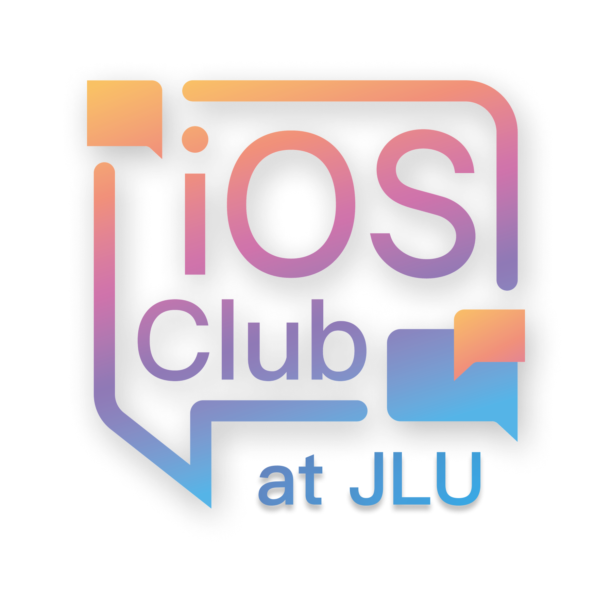

# JLU iOS Club 官网

官网地址：<https://jluios.club>



## 项目概览

这是 JLU iOS Club 的静态官网仓库，基于 **VitePress** 构建，主要用于：

- 展示社团介绍、新闻、活动、竞赛与学习资源；
- 承载长期沉淀型讲义（如 Winter Swift 系列）；
- 提供可维护的内容站点工作流（Markdown + Vue 组件）。

## 技术栈

- 框架：`vitepress`（本地搜索、静态构建）
- 主题增强：`medium-zoom`、自定义主题样式（`/.vitepress/theme`）
- 图表：`mermaid` + `vitepress-plugin-mermaid`
- UI 组件：`element-plus`、`@element-plus/icons-vue`
- Markdown 能力：`markdown-it-implicit-figures`

## 快速开始

### 1) 安装依赖

推荐使用 pnpm：

```bash
pnpm install
```

如你使用 npm：

```bash
npm install
```

### 2) 本地开发

```bash
pnpm dev
```

启动后默认由 VitePress 提供本地站点（配置里使用 `--host 0.0.0.0`）。

### 3) 构建与预览

```bash
pnpm build
pnpm preview
```

## 目录结构（核心）

```text
.
├─ .vitepress/
│  ├─ config.mts              # 站点配置（导航、搜索、Mermaid、Sitemap）
│  ├─ sidebar.ts              # 侧边栏与栏目路由组织
│  └─ theme/
│     ├─ index.ts             # 主题增强（图片缩放等）
│     ├─ style.css
│     └─ custom.css
├─ docs/
│  ├─ index.md                # 首页
│  ├─ about-us/               # 关于我们
│  ├─ activities/             # 活动（含历次活动与专题课程）
│  ├─ competitions/           # 竞赛导航与子页面
│  ├─ news/                   # 新闻
│  ├─ resources/              # 学习资源
│  ├─ join-us/                # 加入我们
│  ├─ components/             # Markdown 中复用的 Vue 组件
│  └─ public/                 # 静态资源（logo/favicon/二维码等）
└─ README.md
```

## 内容维护指南

### A. 新增普通内容页

1. 在 `docs/` 对应栏目下创建 `index.md` 或新页面；
2. 在 `/.vitepress/sidebar.ts` 对应路径下补充 `link`；
3. 若需要导航入口，再更新 `/.vitepress/config.mts` 的 `nav`。

### B. 新增活动专题（建议流程）

以 `docs/activities/260209-winter-swift/` 这种专题目录为例：

1. 新建专题目录与页面（如 `index.md`、`first.md`、`second.md`）；
2. 图片放入专题下 `imgs/` 或 `shots/`，避免跨目录引用；
3. 在 `/.vitepress/sidebar.ts` 增加专题侧栏分组；
4. 在 `docs/activities/index.md` 或首页入口增加跳转。

### C. Winter Swift 专题当前组织

- 主线讲义：`first.md`、`second.md`
- 补充讲义：`bonus-ai-programming.md`
- 专题导航：`docs/activities/260209-winter-swift/index.md`

这种“主线 / 补充”分组方式，适合后续持续追加扩展内容。

## 编写约定（建议）

- 页面建议使用 Frontmatter 标注：`title`、`description`、`date`；
- 复杂讲义页面可使用 `<style scoped>` + 语义化区块；
- 需要交互时可在 Markdown 使用 `<script setup>` + Vue 组件；
- 图示类内容优先 `mermaid`，截图类内容统一放专题子目录；
- 链接尽量使用站内绝对路径（如 `/activities/xxx/`），保证部署一致性。

## 已启用站点能力

- 本地全文搜索（`themeConfig.search.provider = 'local'`）
- 图片点击缩放（`medium-zoom`）
- Mermaid 流程图渲染
- 清爽链接（`cleanUrls: true`）
- sitemap 自动生成（域名 `https://jluios.club`）

## 部署说明

当前站点可直接使用 VitePress 静态产物部署到任意静态托管平台（如 Cloudflare Pages）。

- 构建命令：`pnpm build`
- 输出目录：VitePress 默认输出目录（`.vitepress/dist`）

## 维护建议

- 定期清理无效资源（如 macOS 产生的 `._*` 文件、`.DS_Store`）；
- 新增活动时同步更新首页推荐入口与活动聚合页；
- 大型讲义建议统一 UI 模板（banner/info-card/step-container），保持站内体验一致。

## License

本项目基于 [MIT License](./LICENSE) 开源。
