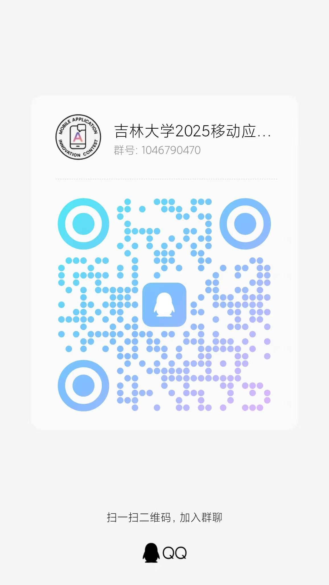

# 移动应用创新赛——宣讲会来啦！

> 🗓️ 日期：2025年**05月11日**
>
> 🕜 时间：晚 19:00
>
> 🏢 地点：南区计算机楼 B110
>
> 👩🏻‍💻 主讲人：吉林大学MAIC的指导教师谷方明
> 
> ✋ 竞赛官网：[竞赛官网](https://www.appcontext.net)

## 活动亮点

{style="width:auto; height:auto;"}

“移动应用创新赛”是 “中国高校计算机大赛” 所设立的四个竞赛模块之一，是由 Apple 与浙江大学联合举办、面向高校学员、供应链员工、K12 组别学生推出的基于 iOS/iPadOS 平台设计开发应用的竞赛。

为了更好地组织推广移动应用创新赛，JLUiOSClub安排了一场宣讲会，选址在吉林大学前卫南区。

## 竞赛亮点

- **Apple 中国官方支持**，连续多年入选全国普通高校大学生竞赛排行榜
- 获奖作品有机会直通“互联网+”、大创等创新创意赛，推荐进入**全国总决赛**
- 2022年起列入吉林大学 **B* 类竞赛**，享有加分和推免等政策
- 参赛全程**完全免费**，奖励丰厚

## 活动流程

1️⃣吉林大学MAIC的指导教师谷方明老师进行有关移动应用创新赛的讲解和指导🎉🎉🎉

2️⃣上届获奖同学关于比赛经验的分享🎉🎉🎉

🌈竞赛介绍
移动应用创新赛，是2017年中国高校计算机大赛( China Collegiate Computing Contest)所设立的四个竞赛模块之一，本届大赛由浙江大学与苹果公司承办。

## 🔥 加入2024-MAIC竞赛群

{style="width:auto; height:auto;"}

