<style scoped>
/* 全局变量 - 统一配色方案 */
:root {
  --primary-gradient: linear-gradient(135deg, #667eea 0%, #764ba2 100%);
  --secondary-gradient: linear-gradient(135deg, #f093fb 0%, #f5576c 100%);
  --success-gradient: linear-gradient(135deg, #4facfe 0%, #00f2fe 100%);
  --warning-gradient: linear-gradient(135deg, #fa709a 0%, #fee140 100%);
  --card-shadow: 0 10px 40px rgba(0, 0, 0, 0.1);
  --card-shadow-hover: 0 20px 60px rgba(0, 0, 0, 0.2);
  
  /* 深色模式变量 */
  --dark-bg: #1a1a1a;
  --dark-card-bg: #2d2d2d;
  --dark-border: #404040;
  --dark-text: #e0e0e0;
  --dark-text-secondary: #b0b0b0;
}

/* 主横幅 - 增强视觉冲击 */
.vibe-banner {
  background: linear-gradient(135deg, #5568d3 0%, #6b3fa0 100%);
  border-radius: 24px;
  padding: 4rem 2rem;
  color: white;
  text-align: center;
  margin: 2rem 0;
  box-shadow: var(--card-shadow);
  position: relative;
  overflow: hidden;
  animation: bannerFadeIn 1s ease-out;
  border: 3px solid rgba(255, 255, 255, 0.2);
}

/* 深色模式下的横幅 */
.dark .vibe-banner {
  background: linear-gradient(135deg, #7c8ff5 0%, #9d6dd1 100%);
  border-color: rgba(255, 255, 255, 0.3);
  box-shadow: 0 10px 40px rgba(124, 143, 245, 0.3);
}

.vibe-banner::before {
  content: '';
  position: absolute;
  top: -50%;
  right: -50%;
  width: 200%;
  height: 200%;
  background: radial-gradient(circle, rgba(255,255,255,0.15) 0%, transparent 70%);
  animation: rotate 20s linear infinite;
}

@keyframes rotate {
  from { transform: rotate(0deg); }
  to { transform: rotate(360deg); }
}

@keyframes bannerFadeIn {
  from {
    opacity: 0;
    transform: translateY(-30px);
  }
  to {
    opacity: 1;
    transform: translateY(0);
  }
}

.vibe-banner h1 {
  font-size: 3rem;
  margin-bottom: 1rem;
  text-shadow: 0 4px 20px rgba(0,0,0,0.5), 0 2px 10px rgba(0,0,0,0.3);
  border: none;
  color: white;
  position: relative;
  z-index: 1;
  font-weight: 800;
  letter-spacing: -1px;
  background: linear-gradient(180deg, #ffffff 0%, #f0f0ff 100%);
  -webkit-background-clip: text;
  -webkit-text-fill-color: transparent;
  background-clip: text;
}

.vibe-banner p {
  font-size: 1.3rem;
  opacity: 0.98;
  position: relative;
  z-index: 1;
  font-weight: 300;
  color: rgba(255, 255, 255, 0.95);
  text-shadow: 0 2px 8px rgba(0,0,0,0.3);
}

/* 信息卡片网格 - 更现代的设计 */
.info-grid {
  display: grid;
  grid-template-columns: repeat(auto-fit, minmax(250px, 1fr));
  gap: 1.5rem;
  margin: 3rem 0;
}

.info-card {
  background: white;
  border-radius: 16px;
  padding: 2rem 1.5rem;
  text-align: center;
  transition: all 0.4s cubic-bezier(0.175, 0.885, 0.32, 1.275);
  border: 2px solid #f0f0f0;
  box-shadow: 0 4px 15px rgba(0,0,0,0.05);
  position: relative;
  overflow: hidden;
}

/* 深色模式 - 信息卡片 */
.dark .info-card {
  background: var(--dark-card-bg);
  border-color: var(--dark-border);
  box-shadow: 0 4px 15px rgba(0,0,0,0.3);
}

.dark .info-card h3 {
  color: var(--dark-text);
}

.dark .info-card p {
  color: var(--dark-text-secondary);
}

.dark .info-card:hover {
  border-color: #7c8ff5;
  box-shadow: 0 20px 60px rgba(124, 143, 245, 0.3);
}

.info-card::before {
  content: '';
  position: absolute;
  top: 0;
  left: 0;
  width: 100%;
  height: 4px;
  background: var(--primary-gradient);
  transform: scaleX(0);
  transition: transform 0.4s ease;
}

.info-card:hover {
  transform: translateY(-10px) scale(1.02);
  box-shadow: var(--card-shadow-hover);
  border-color: #667eea;
}

.info-card:hover::before {
  transform: scaleX(1);
}

.info-card-icon {
  font-size: 3rem;
  margin-bottom: 1rem;
  display: inline-block;
  animation: float 3s ease-in-out infinite;
}

@keyframes float {
  0%, 100% { transform: translateY(0); }
  50% { transform: translateY(-10px); }
}

.info-card h3 {
  color: #2c3e50;
  margin-bottom: 0.5rem;
  border: none;
  font-weight: 700;
  font-size: 1.2rem;
}

.info-card p {
  color: #5a6c7d;
  margin: 0;
  font-size: 0.95rem;
  line-height: 1.6;
}

/* 章节标题 - 更时尚的设计 */
.section-header {
  text-align: center;
  margin: 4rem 0 2rem 0;
  position: relative;
}

.section-header h2 {
  display: inline-block;
  padding: 0.8rem 3rem;
  background: white;
  color: #1e293b;
  border-radius: 50px;
  font-size: 2rem;
  border: 3px solid #667eea;
  box-shadow: 0 8px 25px rgba(102, 126, 234, 0.2);
  position: relative;
  overflow: hidden;
  font-weight: 700;
  transition: all 0.3s ease;
}

/* 深色模式 - 章节标题 */
.dark .section-header h2 {
  background: var(--dark-card-bg);
  color: var(--dark-text);
  border-color: #7c8ff5;
  box-shadow: 0 8px 25px rgba(124, 143, 245, 0.3);
}

.dark .section-header h2:hover {
  background: linear-gradient(135deg, #7c8ff5 0%, #9d6dd1 100%);
  color: white;
}

.section-header h2::before {
  content: '';
  position: absolute;
  top: 0;
  left: 0;
  width: 100%;
  height: 100%;
  background: var(--primary-gradient);
  opacity: 0;
  transition: opacity 0.3s ease;
  z-index: -1;
}

.section-header h2:hover {
  color: white;
  transform: translateY(-2px);
  box-shadow: 0 12px 35px rgba(102, 126, 234, 0.4);
}

.section-header h2:hover::before {
  opacity: 1;
}

/* 图片容器 - 增强交互 */
.image-container {
  margin: 2rem 0;
  border-radius: 16px;
  overflow: hidden;
  box-shadow: 0 10px 30px rgba(0,0,0,0.08);
  transition: all 0.4s cubic-bezier(0.175, 0.885, 0.32, 1.275);
  border: 3px solid transparent;
}

/* 深色模式 - 图片容器 */
.dark .image-container {
  box-shadow: 0 10px 30px rgba(0,0,0,0.4);
  border-color: transparent;
}

.dark .image-container:hover {
  box-shadow: 0 20px 50px rgba(0,0,0,0.6);
  border-color: #a78bfa;
}

.image-container:hover {
  transform: scale(1.03) translateY(-5px);
  box-shadow: 0 20px 50px rgba(0,0,0,0.15);
  border-color: #667eea;
}

.image-container img {
  width: 100%;
  display: block;
  transition: transform 0.4s ease;
}

.image-container:hover img {
  transform: scale(1.05);
}

/* 提示框 - 更现代的风格 */
.tip-box {
  background: linear-gradient(135deg, #fff3cd 0%, #ffe69c 100%);
  border-left: 5px solid #ffc107;
  padding: 2rem;
  border-radius: 12px;
  margin: 2rem 0;
  box-shadow: 0 5px 20px rgba(255, 193, 7, 0.15);
  transition: all 0.3s ease;
}

/* 深色模式 - 提示框 */
.dark .tip-box {
  background: linear-gradient(135deg, #3d3416 0%, #4a3f1a 100%);
  border-left-color: #d4a017;
  box-shadow: 0 5px 20px rgba(212, 160, 23, 0.2);
}

.dark .tip-box h3 {
  color: #fbbf24;
}

.dark .tip-box p,
.dark .tip-box ul,
.dark .tip-box li {
  color: #d4d4d8;
}

.tip-box:hover {
  transform: translateX(5px);
  box-shadow: 0 8px 30px rgba(255, 193, 7, 0.25);
}

.dark .tip-box:hover {
  box-shadow: 0 8px 30px rgba(212, 160, 23, 0.3);
}

.tip-box h3 {
  color: #b45309;
  margin-top: 0;
  border: none;
  font-weight: 700;
}

.tip-box p,
.tip-box ul,
.tip-box li {
  color: #422006;
}

/* 步骤容器 - 更清晰的层次 */
.step-container {
  background: #ffffff;
  border-radius: 16px;
  padding: 2rem;
  margin: 2rem 0;
  border: 2px solid #e2e8f0;
  box-shadow: 0 5px 15px rgba(0,0,0,0.05);
  transition: all 0.3s ease;
}

/* 深色模式 - 步骤容器 */
.dark .step-container {
  background: var(--dark-card-bg);
  border-color: var(--dark-border);
  box-shadow: 0 5px 15px rgba(0,0,0,0.3);
}

.dark .step-container:hover {
  border-color: #7c8ff5;
  box-shadow: 0 8px 25px rgba(124, 143, 245, 0.3);
  background: #353535;
}

.dark .step-container p,
.dark .step-container h4 {
  color: var(--dark-text-secondary);
}

.step-container:hover {
  border-color: #667eea;
  box-shadow: 0 8px 25px rgba(102, 126, 234, 0.15);
  background: #fafbfc;
}

.step-container p {
  color: #475569;
}

.step-number {
  display: inline-block;
  width: 50px;
  height: 50px;
  line-height: 50px;
  text-align: center;
  background: white;
  color: #667eea;
  border: 3px solid #667eea;
  border-radius: 50%;
  font-weight: 800;
  margin-right: 1rem;
  font-size: 1.4rem;
  box-shadow: 0 4px 15px rgba(102, 126, 234, 0.2);
  transition: all 0.3s ease;
  position: relative;
  z-index: 1;
}

/* 深色模式 - 步骤数字 */
.dark .step-number {
  background: var(--dark-card-bg);
  color: #7c8ff5;
  border-color: #7c8ff5;
}

.step-container:hover .step-number {
  transform: scale(1.1) rotate(5deg);
  background: linear-gradient(135deg, #667eea 0%, #764ba2 100%);
  color: white;
  border-color: transparent;
  box-shadow: 0 6px 20px rgba(102, 126, 234, 0.5);
}

.dark .step-container:hover .step-number {
  background: linear-gradient(135deg, #7c8ff5 0%, #9d6dd1 100%);
}

.step-container h4 {
  color: #2c3e50;
  font-weight: 700;
}

/* 高亮框 - 渐变优化 */
.highlight-box {
  background: linear-gradient(135deg, #f0f9ff 0%, #fef3f9 100%);
  border-radius: 16px;
  padding: 2rem;
  margin: 2rem 0;
  border: 2px solid #bae6fd;
  box-shadow: 0 5px 20px rgba(0, 188, 212, 0.1);
  transition: all 0.3s ease;
}

/* 深色模式 - 高亮框 */
.dark .highlight-box {
  background: linear-gradient(135deg, #1e3a4a 0%, #2d2438 100%);
  border-color: #0891b2;
  box-shadow: 0 5px 20px rgba(8, 145, 178, 0.2);
}

.dark .highlight-box h3 {
  color: #22d3ee;
}

.dark .highlight-box p,
.dark .highlight-box ul,
.dark .highlight-box li {
  color: var(--dark-text-secondary);
}

.highlight-box:hover {
  transform: translateY(-3px);
  box-shadow: 0 10px 35px rgba(0, 188, 212, 0.2);
}

.dark .highlight-box:hover {
  box-shadow: 0 10px 35px rgba(8, 145, 178, 0.3);
}

.highlight-box h3 {
  color: #0891b2;
  font-weight: 800;
  border: none;
}

.highlight-box p,
.highlight-box ul,
.highlight-box li {
  color: #334155;
}

/* 项目卡片 - 增强视觉效果 */
.project-grid {
  display: grid;
  grid-template-columns: repeat(auto-fit, minmax(320px, 1fr));
  gap: 2rem;
  margin: 3rem 0;
}

.project-card {
  background: white;
  border-radius: 20px;
  padding: 2.5rem;
  box-shadow: 0 5px 20px rgba(0,0,0,0.08);
  transition: all 0.5s cubic-bezier(0.175, 0.885, 0.32, 1.275);
  border: 2px solid #f0f0f0;
  position: relative;
  overflow: hidden;
}

/* 深色模式 - 项目卡片 */
.dark .project-card {
  background: var(--dark-card-bg);
  border-color: #404040;
  box-shadow: 0 5px 20px rgba(0,0,0,0.3);
}

.dark .project-card h3 {
  color: #a78bfa;
}

.dark .project-card p {
  color: var(--dark-text-secondary);
}

.dark .project-card strong {
  color: var(--dark-text);
}

.dark .project-card:hover {
  box-shadow: 0 25px 50px rgba(139, 92, 246, 0.3);
  border-color: #a78bfa;
}

.project-card::before {
  content: '';
  position: absolute;
  top: 0;
  left: 0;
  width: 100%;
  height: 100%;
  background: var(--primary-gradient);
  opacity: 0;
  transition: opacity 0.4s ease;
  z-index: 0;
}

.project-card:hover::before {
  opacity: 0.05;
}

.project-card:hover {
  transform: translateY(-12px) scale(1.03);
  box-shadow: 0 25px 50px rgba(102, 126, 234, 0.3);
  border-color: #667eea;
}

.project-card h3 {
  color: #667eea;
  border: none;
  margin-bottom: 1rem;
  font-weight: 800;
  font-size: 1.5rem;
  position: relative;
  z-index: 1;
}

.project-card p {
  position: relative;
  z-index: 1;
  color: #475569;
  line-height: 1.7;
}

.project-card strong {
  color: #334155;
  font-weight: 600;
}

/* 响应式设计优化 */
@media (max-width: 768px) {
  .vibe-banner h1 {
    font-size: 2rem;
  }
  
  .vibe-banner {
    padding: 3rem 1.5rem;
  }
  
  .info-grid {
    grid-template-columns: 1fr;
    gap: 1rem;
  }
  
  .project-grid {
    grid-template-columns: 1fr;
  }
  
  .section-header h2 {
    font-size: 1.5rem;
    padding: 0.6rem 2rem;
  }
}

/* 滚动动画 */
@keyframes slideInUp {
  from {
    opacity: 0;
    transform: translateY(30px);
  }
  to {
    opacity: 1;
    transform: translateY(0);
  }
}

.info-card,
.project-card,
.step-container {
  animation: slideInUp 0.6s ease-out;
  animation-fill-mode: both;
}

.info-card:nth-child(1) { animation-delay: 0.1s; }
.info-card:nth-child(2) { animation-delay: 0.2s; }
.info-card:nth-child(3) { animation-delay: 0.3s; }
.info-card:nth-child(4) { animation-delay: 0.4s; }
</style>

<div class="vibe-banner">
  <h1>🚀 Vibe Coding</h1>
  <p>AI时代的开发新方式 - 让AI成为你的编程伙伴</p>
</div>

<div class="info-grid">
  <div class="info-card">
    <div class="info-card-icon">🗓️</div>
    <h3>活动日期</h3>
    <p>2025年10月18日</p>
  </div>
  <div class="info-card">
    <div class="info-card-icon">📍</div>
    <h3>活动地点</h3>
    <p>南区计算机楼 B110苹果机房</p>
  </div>
  <div class="info-card">
    <div class="info-card-icon">👨‍💻</div>
    <h3>主要内容</h3>
    <p>AI辅助开发实战</p>
  </div>
  <div class="info-card">
    <div class="info-card-icon">🎯</div>
    <h3>适合人群</h3>
    <p>所有对编程感兴趣的同学</p>
  </div>
</div>

## 活动概述 <Badge type="tip" text="NEW" />

欢迎来到 **Vibe Coding** 工作坊！在这个AI时代，编程的方式正在发生革命性的变化。本次活动将带你探索如何使用**Qoder**等AI辅助开发工具，让AI成为你的编程伙伴，大幅提升开发效率。

无论你是想开发iOS应用、搭建个人网站，还是创建有趣的小项目，AI都能帮助你快速实现想法。即使是零基础的同学，也能在AI的帮助下完成令人惊叹的作品！

:::tip 💡 你将学到什么？
- ✅ 如何使用Qoder进行AI辅助开发
- ✅ 认识Xcode及其项目结构
- ✅ 如何编写高效的AI提示词（Prompt）
- ✅ iOS应用开发基础流程
- ✅ 静态网页开发与部署
- ✅ API的使用与集成
:::

---

<div class="section-header">
  <h2>🎯 Part 1: 认识Xcode</h2>
</div>

Xcode是苹果官方的集成开发环境（IDE），是iOS开发的核心工具。虽然我们主要使用Qoder进行开发，但了解Xcode的项目结构对于理解iOS开发至关重要。

### 创建你的第一个Xcode项目

<div class="step-container">
  <h4><span class="step-number">1</span>打开Xcode并创建新项目</h4>
</div>

<div class="image-container">
  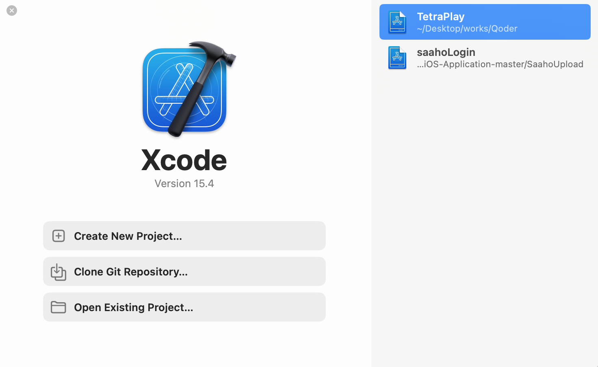
</div>

打开Xcode后，你会看到一个简洁的欢迎界面。点击 **Create New Project** 开始创建你的第一个iOS项目。

<div class="step-container">
  <h4><span class="step-number">2</span>选择项目模板</h4>
</div>

<div class="image-container">
  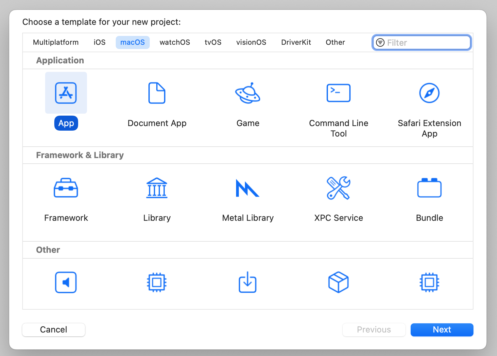
</div>

选择默认的 **App** 模板，这是最基础的iOS应用模板。

<div class="step-container">
  <h4><span class="step-number">3</span>配置项目信息</h4>
</div>

<div class="image-container">
  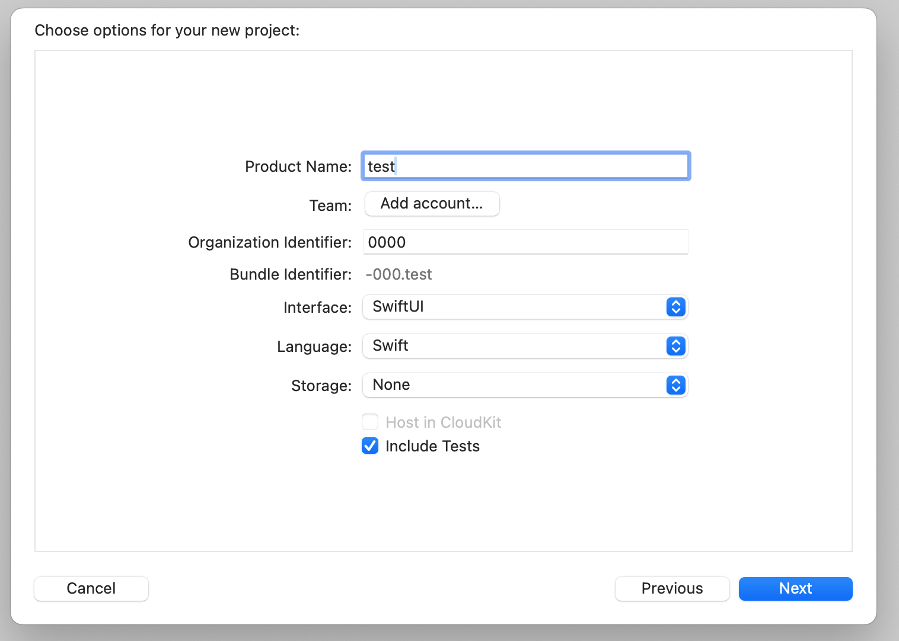
</div>

输入你的项目名称，这里演示使用 `test` 作为项目名。建议使用有意义的英文名称。

<div class="step-container">
  <h4><span class="step-number">4</span>选择保存位置</h4>
</div>

<div class="image-container">
  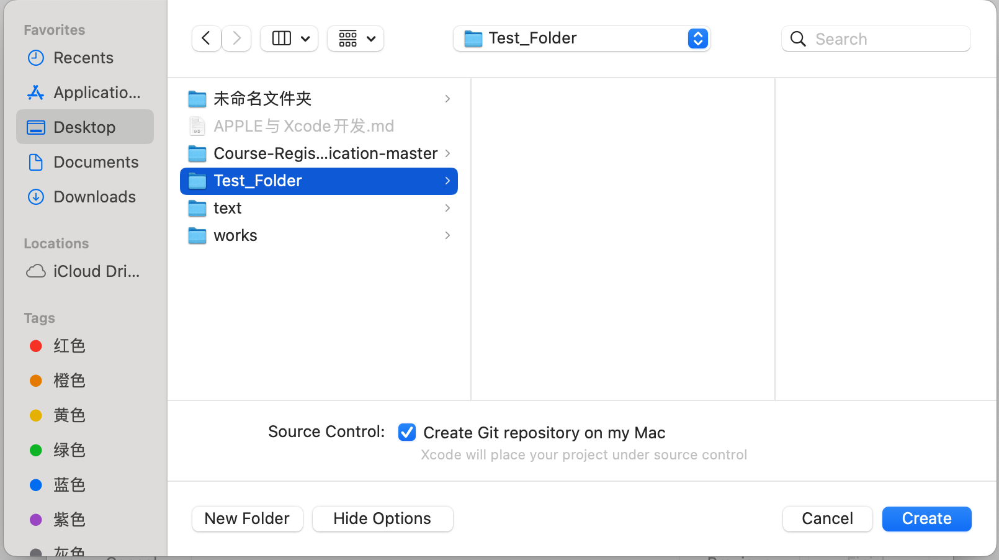
</div>

选择一个合适的文件夹保存项目，也可以点击左下角的 **New Folder** 创建新文件夹。

### 理解Xcode项目结构

<div class="image-container">
  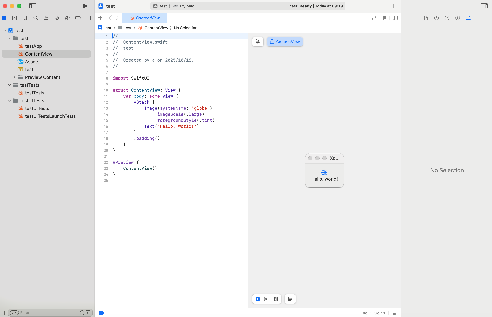
</div>

创建完成后，你会看到Xcode的主界面，包含了许多文件和配置选项。现阶段我们不需要深入了解每个文件的作用，重点是理解项目的整体结构。

<div class="highlight-box">
  <h3>🔍 重要发现：xcodeproj文件</h3>
  
<div class="image-container">
  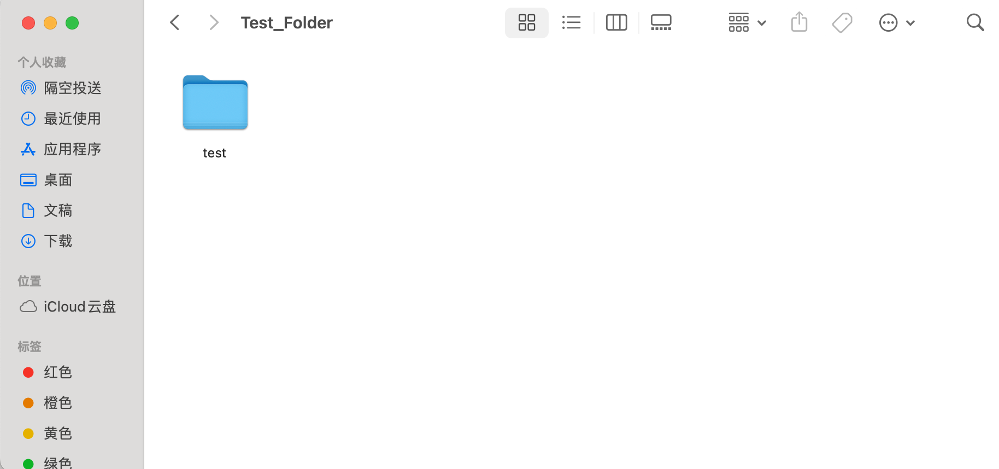
</div>

在Finder中打开项目文件夹，你会发现一个 `.xcodeproj` 文件。这个文件是什么呢？

<div class="image-container">
  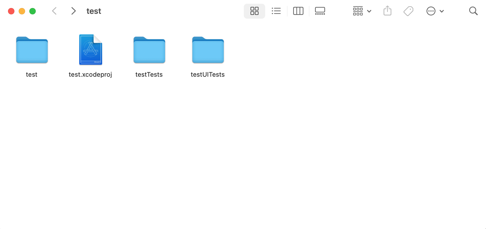
</div>

**xcodeproj文件是Xcode项目的大脑**，它定义了：
- 项目中包含哪些源文件
- 资源文件的位置
- 使用的frameworks
- 编译配置
- 子项目关系

双击这个文件，就能打开Xcode并加载整个项目！
</div>

:::tip 💡 快速定位文件
如果找不到保存的项目位置，按下 **Command + 空格** 打开聚焦搜索，直接搜索项目文件夹名即可！

<div class="image-container">
  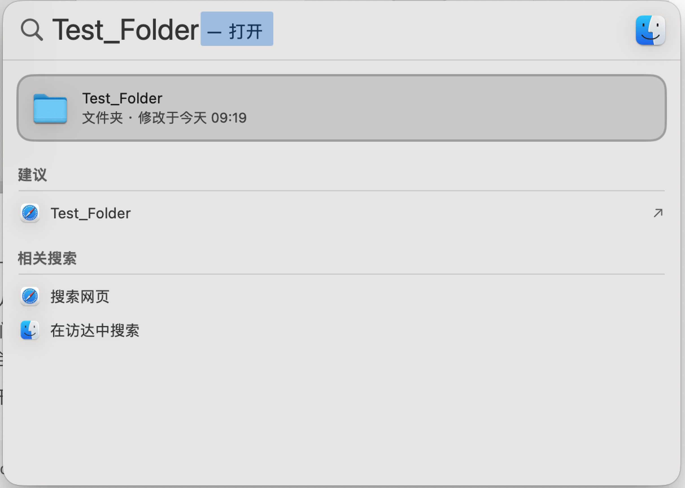
</div>
:::

---

<div class="section-header">
  <h2>🤖 Part 2: AI辅助开发实战</h2>
</div>

### 构思你的项目

在开始动手之前，我们需要明确想要创建什么。但作为初学者，我们可能不清楚需要哪些技术栈、开发流程是怎样的。这时候，**AI就是你最好的老师**！

<div class="tip-box">
  <h3>📝 编写高效的Prompt模板</h3>
  
一个好的Prompt应该包含以下要素：

```text
你现在是[角色/身份]
+ 我现在想要做[目标]
+ 我的想法是[详细描述]
+ 限制条件：[约束]
+ 我需要你[具体要求]
```

**完整模板示例：**

```text
你是一个 [角色/身份]。
你的任务是 [要完成的目标或任务]。

以下是我提供的信息或材料：
[输入内容，例如文本、数据、问题描述等]

请你：
1. [具体要求1]
2. [具体要求2]
3. [具体要求3]

输出时请遵循以下格式/风格：
[输出格式或风格说明]

限制条件：
- [比如：语言简洁、字数不超过××]
- [风格、受众定位等]
```
</div>

:::info 🎓 深入学习Prompt工程
想要系统学习Prompt编写技巧？推荐观看吴恩达的提示词工程教程：
[【吴恩达】2025年公认最好的【提示词工程】教程](https://www.bilibili.com/video/BV1173jzNELG/)
:::

### 使用Qoder开始开发

<div class="step-container">
  <h4><span class="step-number">1</span>打开Qoder并创建项目</h4>
</div>

<div class="image-container">
  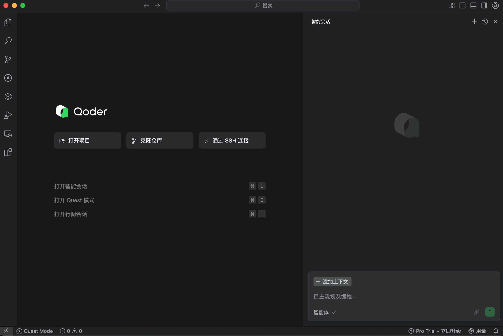
</div>

打开Qoder，选择 **打开项目**，选择一个文件夹作为项目存储位置（建议使用英文命名）。

<div class="step-container">
  <h4><span class="step-number">2</span>信任作者</h4>
</div>

<div class="image-container">
  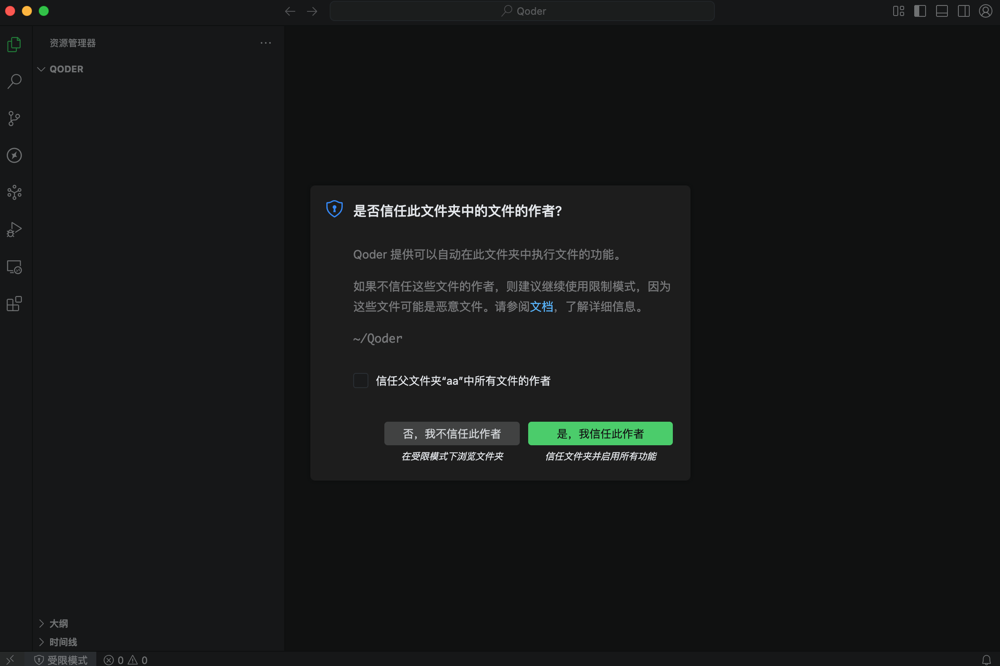
</div>

首次打开时，选择 **信任此作者** 以启用完整功能。

<div class="step-container">
  <h4><span class="step-number">3</span>了解Qoder工作区</h4>
</div>

<div class="image-container">
  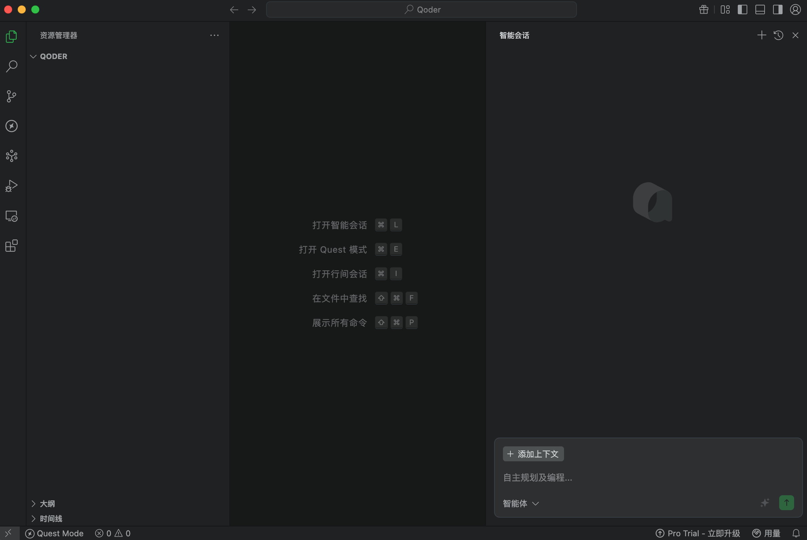
</div>

Qoder的界面分为三个主要区域：
- **左侧**：文件资源管理器
- **中间**：代码预览区域
- **右侧**：AI对话框

:::tip ⚡ 提升效率小技巧
厌倦了每次都要手动点击确认？

<div class="image-container">
  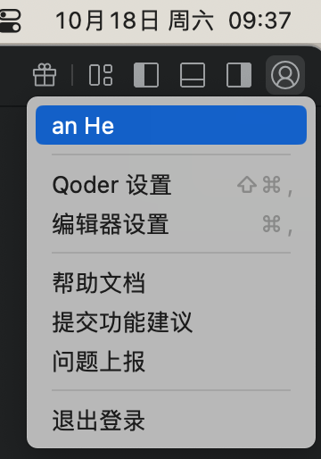
</div>

点击右上角用户头像 → **Qoder设置** → **智能会话** → 将终端和Web工具改为 **自动执行**，让AI帮你自动处理！
:::

<div class="step-container">
  <h4><span class="step-number">4</span>输入Prompt开始创建</h4>
</div>

将你精心准备的Prompt粘贴到对话框中，按Enter发送。接下来，就是见证奇迹的时刻——AI会为你自动生成完整的项目代码！

**示例：创建俄罗斯方块游戏的完整Prompt**

```text
请生成一个完整、可编译的 Xcode iOS/iPadOS（Universal）项目，名为 "TetraPlay"（俄罗斯方块小游戏）。要求如下：

总体与技术栈：
- 使用 Swift 5.9+，Xcode 15+。
- 游戏渲染使用 SpriteKit，主 UI 使用 SwiftUI + 一个承载 SKView 的桥接（或 SwiftUI 的 SpriteKit 支持）。
- 项目应是一个标准 Xcode 项目（.xcodeproj），包含 app target 与 tests target。

核心功能（必做）：
1. 基本俄罗斯方块玩法：
   - 七种标准 Tetrimino（I, O, T, S, Z, J, L），包含旋转与边界检测（SRS 或简化旋转规则均可，但请注明）。
   - 方块自动下落、软降（按住向下增速）、硬降（快速到底）。
   - 左右移动、旋转（顺/逆时针可选），碰撞检测。
   - 检测并消除满行、更新分数并显示行数与等级（level）。
   - 下一块预览（至少显示下 1 个方块）。

2. 控制方法：
   - 触摸控制：左右滑或点击移动，轻扫下落，顶部/右侧按钮用于旋转（请实现触控友好方案）。
   - 键盘支持（在 iPad 上）：左右箭头、上键/空格旋转或硬降、下键软降。
   - 手柄支持（GCController）：左右/按钮映射移动/旋转/下落/暂停。

3. UI：
   - 主菜单（开始、继续、设置、排行榜/最高分）、暂停面板、游戏结束画面。
   - HUD 显示当前分数、最高分、当前等级、下一块。
   - 设置面板（音量开关、振动开关、控制模式选择：触摸/滑动/按钮）。

4. 持久化：
   - 使用 UserDefaults 保存最高分、设置项。
   - README 中注明如何启用 Game Center 排行榜（可选，若实现则加注释说明）。

5. 音效与资源：
   - 提供示例音效（或占位文件）和占位美术资源（Assets.xcassets）。
   - AudioManager 封装播放背景音乐和音效（开启/关闭开关）。

6. 测试：
   - 包含至少 3 个 Unit Test：行消除（Board 的消行函数）、得分计算、方块旋转与边界检测。
   - 测试应使用 XCTest 并能通过 `xcodebuild test` 运行。

工程质量与交付：
- 代码风格清晰、模块化，包含注释与文档注释（重要函数、旋转规则、得分公式）。
- 包含 README.md，写明：运行方法、Xcode 版本、iOS / iPadOS 目标、常用快捷键、项目结构说明、如何运行测试。
- 提供简单的 Git 仓库结构（.gitignore），可选提供 GitHub Actions CI 配置（macos-latest，xcode 15，运行 build & test）。

额外说明（可选实现但需标注）：
- 可选：Game Center 排行榜与成就。
- 可选：iCloud 同步最高分（若实现请说明所用 API）。
- 可选：多语言 (en/zh) 本地化支持（若实现请一并生成 Localizable.strings）。

交付格式：
- 请直接生成完整 Xcode 项目文件与源码（可在 zip 中）。  
- 在 README 里列出"如何在本地编译并运行"的命令（例如：`open TetraPlay.xcodeproj`，然后在 Xcode 选择 target，或使用 `xcodebuild -scheme TetraPlay -destination 'platform=iOS Simulator,name=iPhone 15 Pro,OS=17.5' build`）。
- 在 README 里列出"验收测试步骤"。例如：
  1. 在 iPhone Simulator 运行并验证触摸控制。
  2. 在 iPad Simulator 使用键盘操作验证键盘映射。
  3. 运行 `xcodebuild test` 并确保所有测试通过。

请在实现前先生成一个简短的开发说明（≤ 200 字），说明核心实现思路（例如：方块表示、旋转规则、碰撞检测、渲染更新节奏），接着开始生成代码文件。谢谢。
```

---

<div class="section-header">
  <h2>🔧 Part 3: 调试与完善</h2>
</div>

AI虽然强大，但生成的代码可能存在一些问题。这时候就需要我们进行调试和优化。

### 构建项目

当AI完成代码生成后，直接告诉它：

```text
请你帮我构建这个项目，直到项目构建成功。
```

AI会自动进行编译并修复可能出现的错误。

### 使用Xcode进行微调

有些视觉效果和交互细节，我们可以在Xcode中进行精细调整。

<div class="image-container">
  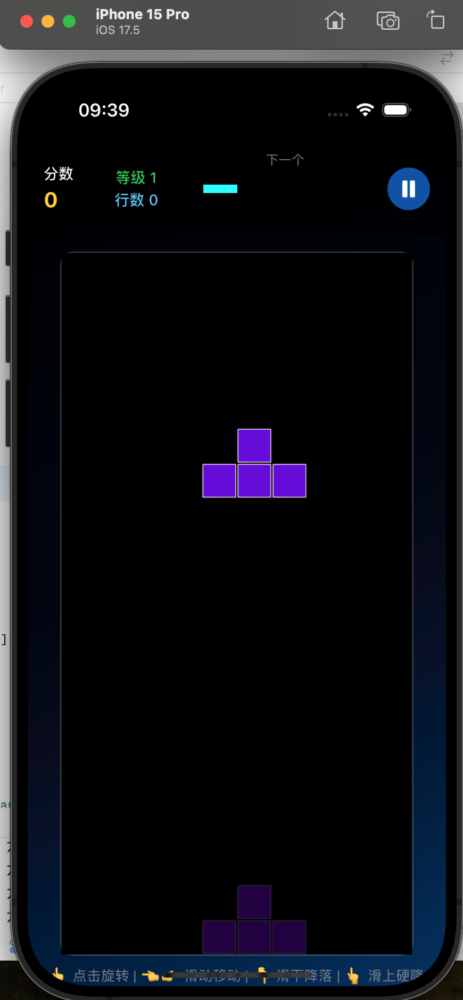
</div>

比如发现了一些UI布局问题：文字位置偏移、大小不合适、颜色不喜欢等。

<div class="step-container">
  <h4><span class="step-number">1</span>定位问题代码</h4>
</div>

<div class="image-container">
  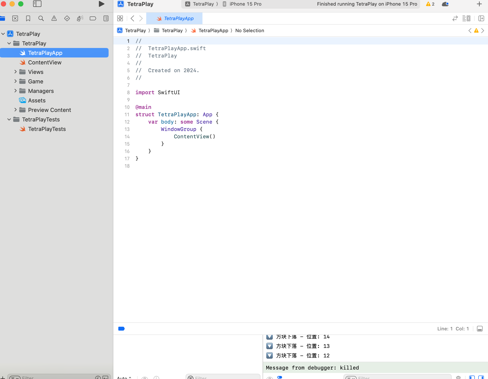
</div>

打开主文件，找到 `ContentView()`，右键选择 **Jump to Definition** 跳转到定义位置。

<div class="step-container">
  <h4><span class="step-number">2</span>使用实时预览</h4>
</div>

<div class="image-container">
  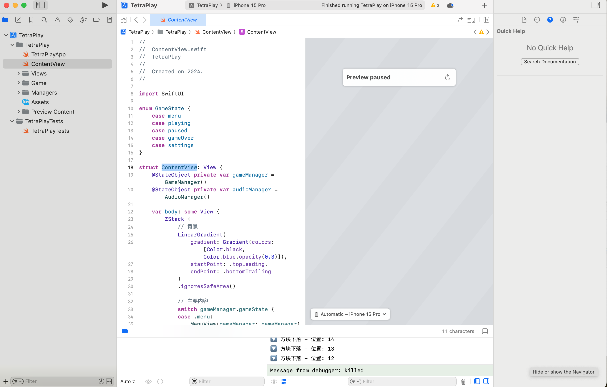
</div>

Xcode的界面分为四个区域：
- **左侧**：文件资源管理器
- **中间**：代码编辑器
- **右侧中**：实时预览
- **右侧右**：属性面板

<div class="image-container">
  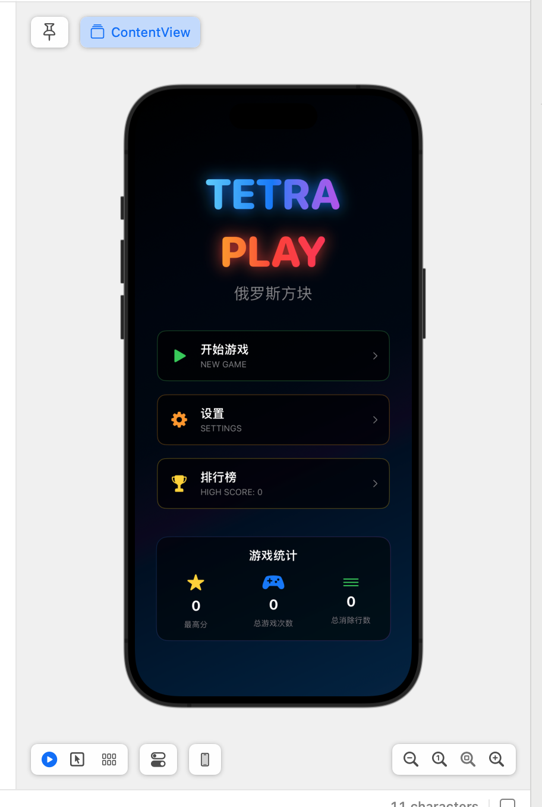
</div>

点击重试按钮启动实时预览，可以实时看到UI效果。

<div class="step-container">
  <h4><span class="step-number">3</span>使用选择工具定位组件</h4>
</div>

左下角有三个工具按钮：
1. **交互模式**：直接与UI交互
2. **选择模式**：点击组件查看对应代码
3. **更多选项**

使用选择模式点击有问题的UI元素，代码编辑器会自动高亮对应代码。

<div class="image-container">
  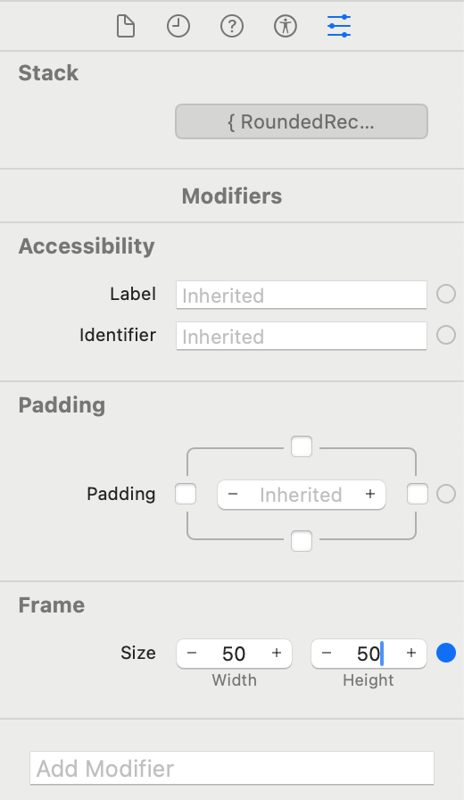
</div>

在右侧属性面板中可以直接调整大小、颜色、字体等属性，代码会自动更新！

<div class="highlight-box">
  <h3>🎨 Xcode界面微调教程</h3>

以下是完整的SwiftUI界面调整方法和示例，让你轻松掌握Xcode的界面微调技巧。

#### 🟢 1. 控件的基本组成：View + 修饰符

SwiftUI 里的界面控件都以 `View` 为单位，例如：

```swift
Text("分数")
```

这是一个文字控件。在 SwiftUI 里，我们不会去拖"按钮"或"文本框"，而是直接用代码堆积"积木"，每个积木都有外观修饰语句，叫做 **修饰符（Modifier）**。

例如：

```swift
Text("分数")
    .font(.system(size: 14, weight: .medium)) // 字体大小 + 粗细
    .foregroundColor(.white)                  // 字体颜色
```

---

#### 🔠 2. 修改字体大小与粗细

Xcode 中修改字体有三种常见方法：

| 写法 | 效果 |
|------|------|
| `.font(.title)` | 使用系统预设的大号标题 |
| `.font(.system(size: 20))` | 手动设置字体大小 |
| `.font(.system(size: 20, weight: .bold))` | 同时设置字体粗细（bold / medium / light） |

举例：

```swift
Text("分数")
    .font(.system(size: 14, weight: .medium))
```

---

#### 🎨 3. 设置文字或图形颜色

使用 `.foregroundColor()` 或 `.fill()`：

```swift
Text("分数")
    .foregroundColor(.white)

Rectangle()
    .fill(Color.blue)
```

如果希望颜色透明一点，可以加 `.opacity(0.5)`：

```swift
Color.blue.opacity(0.5)
```

---

#### 🟧 4. 设置背景色和圆角

任何 View 都可以加背景：

```swift
Text("继续游戏")
    .padding()
    .background(Color.blue)      // 背景颜色
    .foregroundColor(.white)     // 前景色（文字颜色）
    .cornerRadius(10)            // 圆角
```

也可以用 `RoundedRectangle` 更精细控制：

```swift
RoundedRectangle(cornerRadius: 10)
    .fill(Color.black.opacity(0.6))
```

---

#### 📏 5. 设置控件的大小与位置

##### （1）固定尺寸：

```swift
.frame(width: 100, height: 50)
```

##### （2）相对布局（固定比例）：

使用 `GeometryReader` 可以获取屏幕的宽高，然后根据比例设置大小：

```swift
GeometryReader { geometry in
    let width = geometry.size.width * 0.5 // 宽度占屏幕一半
    Rectangle()
        .frame(width: width, height: width)
}
```

##### （3）用坐标（x, y）指定位置：

```swift
.position(x: 100, y: 200)
```

:::warning 📍 注意
坐标是相对于父容器左上角计算的。例如 `.position(x: 100, y: 200)` 表示距离左边 100 像素、上边 200 像素的位置。

在俄罗斯方块项目的 `NextTetriminoView` 中就是这么用的：

```swift
.position(
    x: centerOffset + CGFloat(position.x) * blockSize,
    y: centerOffset - CGFloat(position.y) * blockSize
)
```

这代表每个俄罗斯方块小格子的位置是通过计算出来的。
:::

---

#### 💠 6. 布局容器：VStack / HStack / ZStack

SwiftUI 通过"堆叠"控件来决定排版：

- `VStack { ... }`：竖着排
- `HStack { ... }`：横着排
- `ZStack { ... }`：叠放（上下一层层堆）

示例：

```swift
ZStack {
    Color.black                // 最底层背景
    VStack {
        Text("分数")
        Text("1000")
    }
}
```

这表示有一个黑色背景，然后在上面放了两行文字。

---

#### 📱 7. 在 Xcode 预览中实时调整

在 Xcode 右上角点击 **Canvas（画布）**，你会看到代码右侧出现"实时预览"。任何修改（字体、颜色、位置）都会立即更新。

例如：

```swift
#Preview {
    GameView(gameManager: GameManager())
}
```

如果你想改颜色或字体，只需要改代码，右边的预览马上变化。

---

#### 🧭 8. 常用控件与修饰符速查表

| 功能 | 修饰符 | 示例 |
|------|--------|------|
| 字体大小 | `.font(.system(size:))` | `.font(.system(size:18))` |
| 字体粗细 | `.fontWeight(.bold)` | `.fontWeight(.semibold)` |
| 字体颜色 | `.foregroundColor()` | `.foregroundColor(.white)` |
| 背景颜色 | `.background()` | `.background(Color.blue)` |
| 圆角 | `.cornerRadius()` | `.cornerRadius(10)` |
| 宽高 | `.frame(width:height:)` | `.frame(width:100,height:50)` |
| 透明度 | `.opacity()` | `.opacity(0.5)` |
| 位置 | `.position(x:y:)` | `.position(x:150,y:200)` |
| 内边距 | `.padding()` | `.padding(10)` |
| 边框 | `.border(Color,width:)` | `.border(.white,width:2)` |

</div>

---

<div class="section-header">
  <h2>🌐 Part 4: 静态网页开发与部署</h2>
</div>

除了iOS开发，我们还可以创建静态网页项目。这对于不熟悉Mac或想要快速搭建个人主页的同学特别友好！

<div class="project-grid">
  <div class="project-card">
    <h3>💼 项目一：个人主页</h3>
    <p>创建一个炫酷的个人主页，展示你的作品集、技能和联系方式。</p>
    <p><strong>技术栈：</strong>HTML + CSS + JavaScript</p>
    <p><strong>部署平台：</strong>GitHub Pages（免费！）</p>
  </div>
  
  <div class="project-card">
    <h3>🎯 项目二：AI Quiz</h3>
    <p>基于AI的智能问答系统，可以上传PDF/PPT自动生成测验题目。</p>
    <p><strong>技术栈：</strong>Next.js + TypeScript + AI API</p>
    <p><strong>特色：</strong>集成智谱AI API</p>
  </div>
</div>

### 使用GitHub Pages部署网站

<div class="step-container">
  <h4><span class="step-number">1</span>创建GitHub仓库</h4>
</div>

<div class="image-container">
  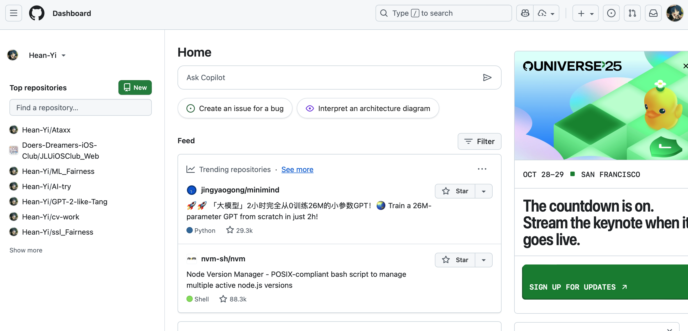
</div>

登录GitHub，点击 **new** 创建新仓库。

<div class="image-container">
  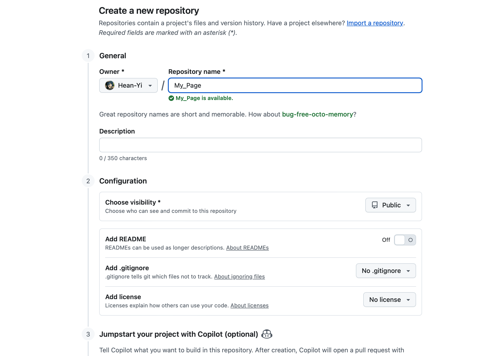
</div>

输入仓库名称，点击 **Create repository** 创建。

<div class="step-container">
  <h4><span class="step-number">2</span>上传项目文件</h4>
</div>

<div class="image-container">
  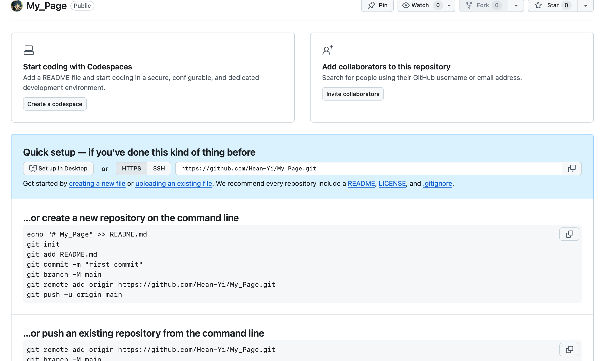
</div>

点击 **uploading an existing file** 上传现有文件。

<div class="image-container">
  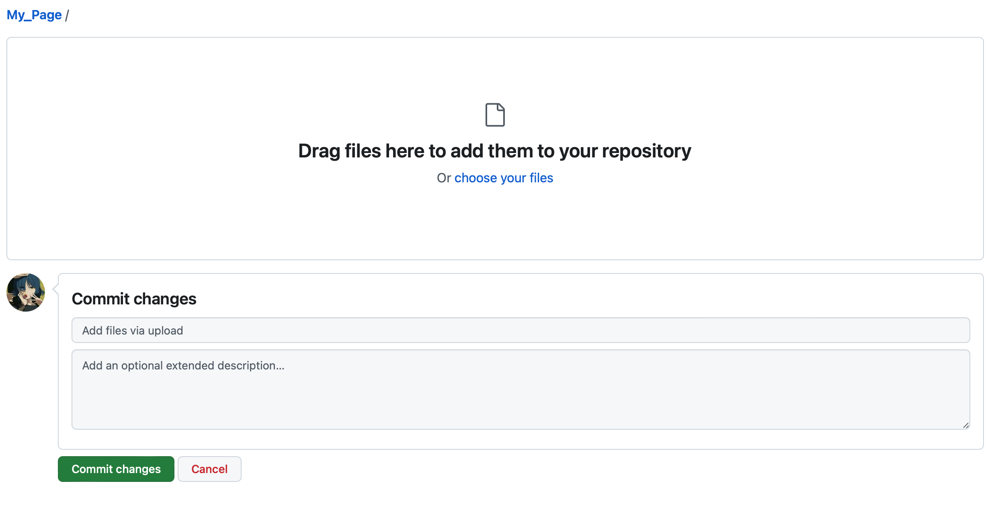
</div>

将项目文件拖入上传区域。**重要：确保包含 `index.html` 文件！**

<div class="image-container">
  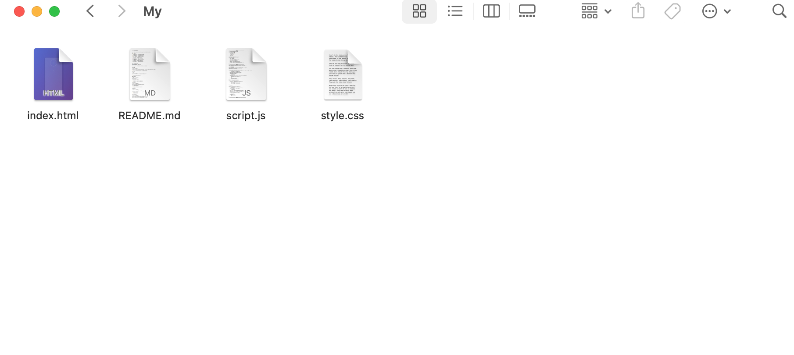
</div>

:::warning ⚠️ 必须包含的文件
- `index.html` - 网站入口文件（**必须**）
- `README.md` - 项目说明（推荐）
- 其他CSS、JS、图片等资源文件
:::

<div class="step-container">
  <h4><span class="step-number">3</span>配置GitHub Pages</h4>
</div>

<div class="image-container">
  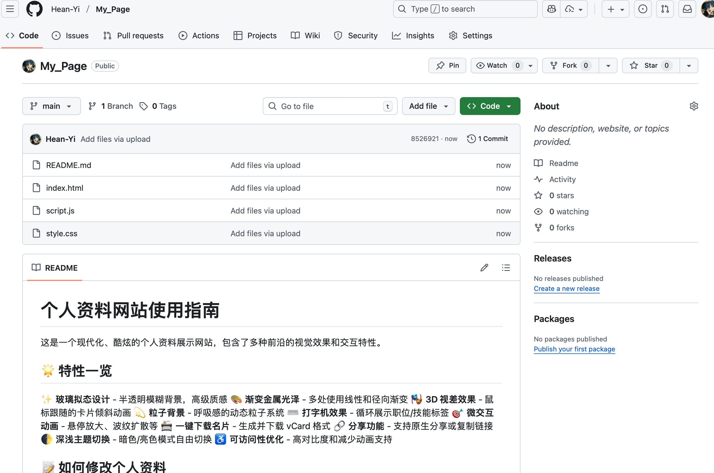
</div>

上传完成后，点击 **Settings** 进入设置页面。

<div class="image-container">
  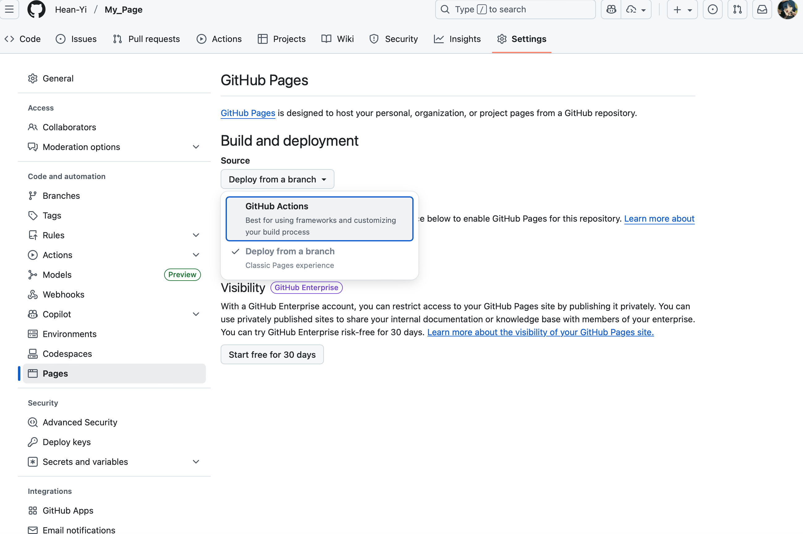
</div>

在左侧菜单找到 **Pages**，选择 **GitHub Actions** 作为部署方式。

<div class="image-container">
  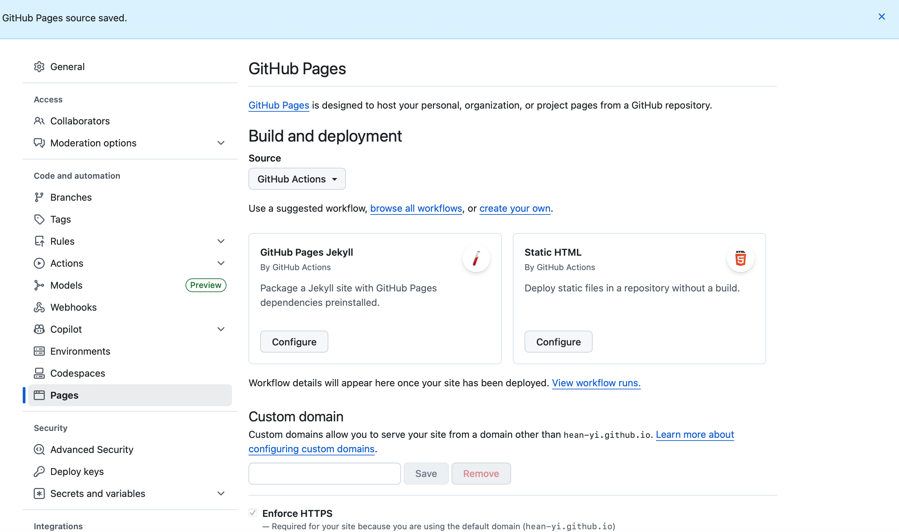
</div>

选择 **Static HTML** 模板，点击 **Configure**。

<div class="image-container">
  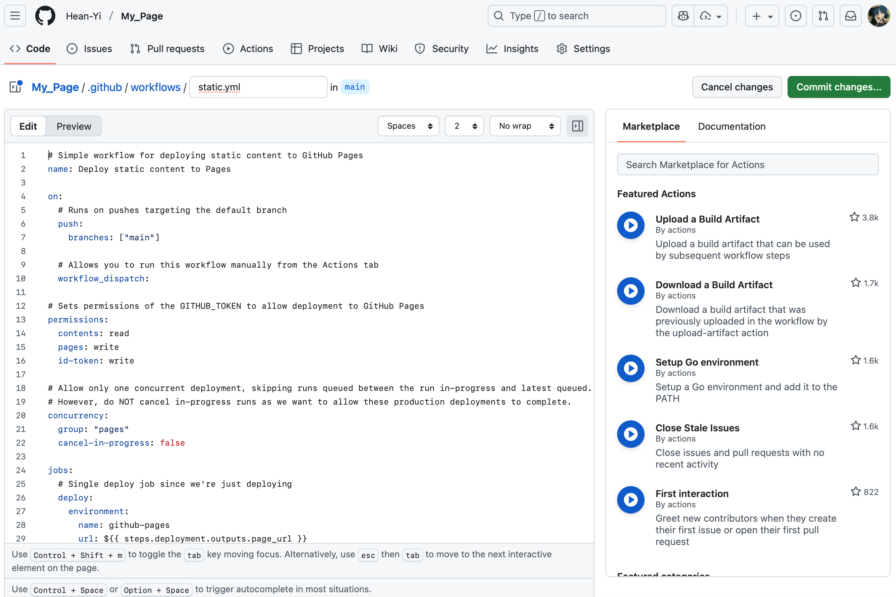
</div>

直接点击 **Commit changes** 保存配置。

<div class="step-container">
  <h4><span class="step-number">4</span>访问你的网站</h4>
</div>

<div class="image-container">
  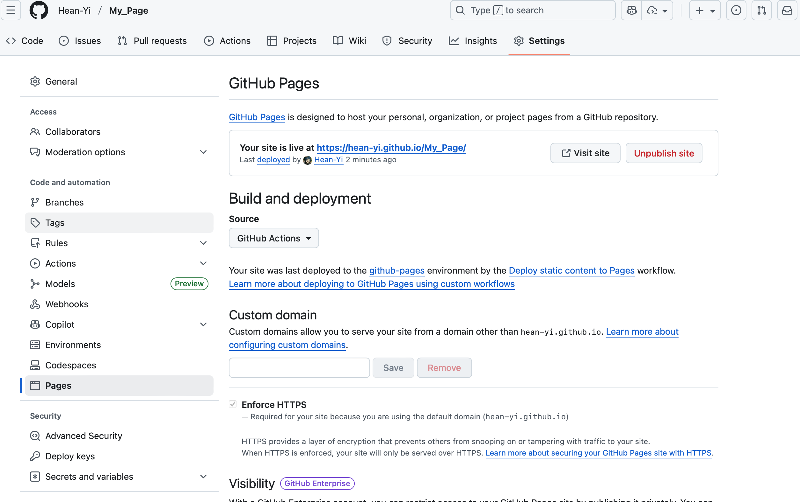
</div>

等待几分钟后，你的网站就部署成功了！点击 **Visit site** 访问，分享给朋友吧！🎉

---

<div class="section-header">
  <h2>🔑 Part 5: API使用指南</h2>
</div>

对于AI Quiz等需要调用AI服务的项目，我们需要获取API密钥。这里以智谱AI为例。

### 获取智谱AI API密钥

<div class="step-container">
  <h4><span class="step-number">1</span>注册并登录</h4>
</div>

访问 [智谱AI开放平台](https://open.bigmodel.cn)，注册并登录账号。

<div class="image-container">
  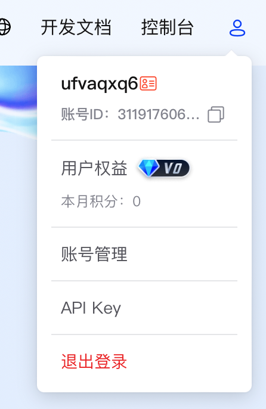
</div>

鼠标移动到右上角头像，选择 **API Key**。

<div class="step-container">
  <h4><span class="step-number">2</span>创建API Key</h4>
</div>

<div class="image-container">
  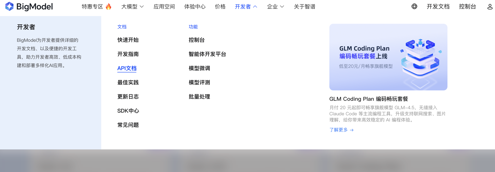
</div>

点击 **添加新的API Key**，给密钥取个名字，然后复制生成的API Key。

<div class="step-container">
  <h4><span class="step-number">3</span>查看API文档</h4>
</div>

<div class="image-container">
  
</div>

在主页的 **开发者** 部分可以找到详细的API调用文档。

:::tip 💡 让AI帮你调用API
你不需要自己编写API调用代码！只需要：
1. 将API密钥提供给AI
2. 告诉AI你想实现什么功能
3. AI会自动生成完整的API调用代码

<div class="image-container">
  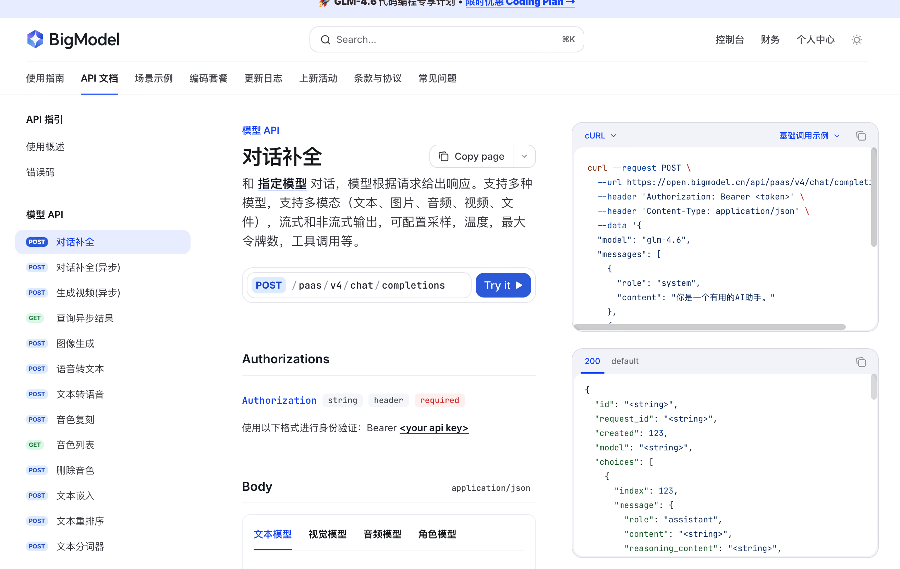
</div>
:::

### AI Quiz项目完整Prompt示例

以下是创建AI Quiz项目的完整prompt，你可以直接复制使用：

```text
系统角色说明（给 Qoder 的指令）：

你是负责实现「基于上传的 PDF/PPT 自动生成测验(Quiz)」功能的后端/逻辑组件。请严格按下列规范工作 —— 所有题目与答案**必须**以用户上传的文件内容为准，不得加入文件外的假设或通用常识。生成的项目需包含前端 (Next.js App Router + TypeScript + Tailwind) 与后端 API 路由（Next.js route handlers），并可直接运行。

***项目必须同时生成一个 run.sh 脚本，用户在 macOS 上执行 `chmod +x run.sh && ./run.sh` 即可安装依赖并启动开发服务器。***

---

## 智谱 API (Zhipu) 配置（已为你填入 Key）
在生成的 `.env.local` 中请包含以下内容（Qoder 代为生成）：

ZHIPU_API_KEY=你的API密钥
ZHIPU_API_URL=https://open.bigmodel.cn/api/paas/v4/chat/completions

> 如果你希望不把 key 明文放在仓库，请在生产说明中写明如何通过环境变量注入（例如 CI / Docker secrets）。

---

## 功能要点（必实现）

1. 文件解析：
   - 接收用户上传的 PDF/PPT（多页、多幻灯片）。
   - 将文件切分为页/幻灯片单元，提取每页纯文本及文字位置信息（用于前端高亮/预览）。对扫描件执行 OCR，并返回 `is_ocr` 与 `ocr_confidence`。
   - 若某页解析失败，返回 `parse_error` 并列出失败页码与错误原因，前端显示可重试提示。

2. 题目生成：
   - 可按指定页范围或整份文件生成题目。
   - 题型：多项选择题（MCQ）与开放式问答题（Short/Long answer）。
   - 可配置题量与难度（例如 5/10/20，simple/medium/hard），可配置 MCQ 比例。
   - 每题必须返回：题干、题型、（MCQ）选项列表（≥3）、正确答案（选项 key）、正确答案的**精确摘录**（来自文件）、答案页码、页内字符起止位置或坐标、用于高亮的短片段（≤200 字）。

3. 答题反馈（选择题）：
   - 用户答题后即时返回 `is_correct`。
   - 若错误：返回 `correct`、基于文件的 AI 解析（逐句/逐点说明并引用文件句子或段落）、以及"定位信息"（页码 + 用于高亮的文本片段，包含前后 30–80 字）。
   - 返回 `preview_html` 或 `preview_text` 字段用于前端高亮展示。

4. 问答题处理：
   - 后端不自动判分（除非选择人工审核或特殊配置），用户提交后显示"参考答案"。
   - 参考答案必须为文件摘录或严格基于文件的摘要，并标注页码与片段。
   - 若问题在文件中对应多个相关段落，返回所有段落与页码。

5. 可审核与可溯源：
   - 每题和每条解析都必须包含溯源字段：`page`, `char_start`, `char_end`, `snippet`（≤200 字），方便管理员核对与编辑。

6. 安全与边界：
   - 对 OCR 置信度低的页标注 `ocr_low_confidence` 并建议人工校验。
   - 若源信息不足以生成唯一正确答案，响应 `insufficient_source`，切勿编造答案。

---

## API/路由与数据契约（Qoder 请按此实现）

### 1) `/api/upload` （前端 -> 后端 文件上传，后端负责解析/OCR）
Request: multipart/form-data 包含文件与选项
Response:
{
  "status":"ok",
  "pages":[
    {"page":1,"text":"...","text_snippets":[{"start":100,"end":180,"text":"..."}],"is_ocr":false},
    {"page":2,"parse_error": "图片解析失败或OCR低置信度", "is_ocr": true, "ocr_confidence": 0.62}
  ]
}

### 2) `/api/generate` （前端 -> 后端 -> 智谱 API ）

Request:
{
  "pages":[1,2,3],
  "num_questions":10,
  "mcq_ratio":0.6,
  "difficulty":"medium",
  "format":"strict_source_based"
}

后端实现须：
- 将被请求页的纯文本（含每段字符索引）传入智谱模型输入，并在 system/user 指令中**严格限定"仅可使用所提供文本作为知识源"**。
- 要求智谱返回 JSON 严格按照指定模式。

### 3) `/api/verify` （前端 -> 后端，用于 MCQ 即时判分）

Request:
{ "question_id":"q_001", "selected":"A", "user_id":"stu_123" }

Response:
{
  "is_correct": false,
  "correct":"B",
  "explanation":"引用页5，句子：\"...\"，说明为什么B对A错",
  "source":{"page":5,"snippet":"...", "char_start":..., "char_end":...}
}

---

## 错误码与边界返回（后端必实现）

- `insufficient_source` — 指定页信息不足以生成唯一答案
- `parse_error` — 智谱返回无法解析或后端 JSON 解析失败
- `ocr_low_confidence` — OCR 置信度低，需人工校验
- `quota_exceeded` — 智谱/网络调用返回配额错误

---

## 前端 UI 建议（Qoder 请生成页面）

- `/` 上传页面：文件缩略预览、OCR 标识、选择页码范围、题量、难度、MCQ 比例、生成按钮
- `/quiz` 题目页：显示题目列表，MCQ 选择后即时显示结果与解析折叠面板（包含"查看原文"高亮功能）；问答题提交后显示参考答案卡片
- 审核模式页面：管理员可以查看每题的原文引用并编辑修正题干/选项

---

## run.sh 要求（Qoder 必须生成）

生成一个 `run.sh`，内容如下（在项目根）：

#!/bin/bash
set -e
echo "🚀 Installing dependencies..."
npm install
echo "✅ Dependencies installed."
echo "🔁 Building..."
npm run build || true
echo "🌐 Starting Next.js dev server..."
npm run dev

并在生成说明里写明：
- 运行前请执行 `chmod +x run.sh`
- 或者直接：`bash run.sh`

---

## 输出要求（Qoder 返回给我）

1. 项目文件树（主要文件与目录）
2. 主要文件代码（至少包含：`app/page.tsx`, `app/quiz/page.tsx`, `app/api/upload/route.ts`, `app/api/generate/route.ts`, `app/api/verify/route.ts`, `run.sh`, `.env.local` 样例）
3. 运行说明（如何启动、如何替换 Key、如何切换模型名）
4. 简短的调试建议（如何查看智谱返回的原始响应、如何在本地 mock 智谱返回用于调试）

---

## 其他实现细节（给后端/工程师的提示）

- 给智谱的请求尽量把 `temperature: 0.0`，并强制要求 JSON 输出，以便保证可重复性与易解析性。
- 对于长文档，采用"检索 + 片段摘要 + 题目生成"流程：先检索最相关段落，再让智谱基于这些段落生成题目并返回引用。
- 所有返回必须包含字符级位置或坐标，便于前端精确高亮。
- 对智谱返回做严格的 JSON schema 校验；若不合法返回 `parse_error` 并记录原始响应以备审计。

---

请基于以上完整 prompt 为我生成项目骨架与文件内容（Qoder 执行端）。谢谢。
```

### AI Quiz项目特别说明

这个项目需要本地服务器运行，建议让Qoder生成启动脚本：

```text
请为这个项目生成一个 run.sh 启动脚本，
并告诉我如何在 macOS/Windows 上运行这个项目。
```

<div class="highlight-box">
  <h3>📦 安装Node.js (macOS)</h3>

如果你的电脑还没有安装Node.js，可以使用以下命令安装：

```bash
# 安装Homebrew
/bin/bash -c "$(curl -fsSL https://raw.githubusercontent.com/Homebrew/install/HEAD/install.sh)"

# 配置Homebrew环境
echo 'eval "$(/opt/homebrew/bin/brew shellenv)"' >> ~/.zprofile
eval "$(/opt/homebrew/bin/brew shellenv)"

# 安装Node.js
brew install node

# 验证安装
node -v
npm -v
```

当看到版本号输出时，说明安装成功！
</div>

<div class="highlight-box">
  <h3>📦 安装Node.js (Windows)</h3>

Windows用户推荐直接下载安装包：

1. 访问 [Node.js官网](https://nodejs.org/)
2. 下载 **LTS版本** 的 `.msi` 安装包
3. 运行安装向导（确保勾选 `Add to PATH`）
4. 打开PowerShell验证安装：

```powershell
node -v
npm -v
```
</div>

---

<div class="section-header">
  <h2>🎓 总结与思考</h2>
</div>

<div class="tip-box">
  <h3>🤔 AI能否完全替代程序员？</h3>
  
通过这次活动，你可能会产生一个疑问：既然AI这么强大，我们还需要学习编程吗？

**答案是：AI是工具，不是替代品。**

AI确实能够：
- ✅ 快速生成基础代码
- ✅ 帮助理解技术文档
- ✅ 提供实现思路和建议
- ✅ 加速开发流程

但AI目前还无法：
- ❌ 理解复杂的业务逻辑
- ❌ 进行创新性的架构设计
- ❌ 保证代码的最优性和安全性
- ❌ 完全按照你的审美偏好设计UI

**AI是你的助手，而不是你的老板。** 你需要：
- 📚 掌握基础的编程知识，才能判断AI生成的代码是否正确
- 🎨 具备设计思维，才能指导AI创造出符合需求的作品
- 🔍 培养问题分析能力，才能提出准确的需求
- 💡 保持创新精神，AI只能辅助，创意来源于你
</div>

<div class="highlight-box">
  <h3>🚀 下一步学习建议</h3>

**如果你对iOS开发感兴趣：**
- 学习Swift语言基础
- 掌握SwiftUI框架
- 了解iOS人机界面设计规范
- 参加移动应用创新赛（MAIC）

**如果你对Web开发感兴趣：**
- 学习HTML/CSS/JavaScript基础
- 尝试React、Vue等现代框架
- 了解API调用与后端交互
- 部署更多个人项目

**如果你对AI应用感兴趣：**
- 学习Prompt工程技巧
- 了解常见AI模型的能力边界
- 尝试集成多种AI服务
- 探索AI在不同领域的应用

记住：**AI是放大器，它会放大你的能力。** 你懂得越多，AI能帮你实现的就越多！
</div>

---

<div class="section-header">
  <h2>📚 相关资源</h2>
</div>

<div class="info-grid">
  <div class="info-card">
    <div class="info-card-icon">📖</div>
    <h3>学习资源</h3>
    <p><a href="/resources/">查看完整学习资源库</a></p>
  </div>
  <div class="info-card">
    <div class="info-card-icon">🏆</div>
    <h3>竞赛信息</h3>
    <p><a href="/competitions/">了解MAIC等竞赛</a></p>
  </div>
  <div class="info-card">
    <div class="info-card-icon">👥</div>
    <h3>加入我们</h3>
    <p><a href="/join-us/">成为iOS Club成员</a></p>
  </div>
  <div class="info-card">
    <div class="info-card-icon">💬</div>
    <h3>问题求助</h3>
    <p><a href="/questions/">访问问答社区</a></p>
  </div>
</div>

---

<div class="vibe-banner">
  <h1>🎉 期待你的作品！</h1>
  <p>用AI赋能你的创意，让想法变为现实</p>
  <p style="margin-top: 1rem; font-size: 1rem;">有任何问题？欢迎在活动群或社团群内讨论～</p>
</div>

<script setup>
import { ElButton } from 'element-plus'
</script>
