

  <h1>🤖 日常记录小能手工作坊</h1>
  
从零到一搭建你的第一个 AI 智能助手，让 AI 自动帮你整理通知、记录待办！

  

    
👥

    <h3>适合人群</h3>
    
零基础小白也能上手，无需编程经验

  

  

    
🛠️

    <h3>核心工具</h3>
    
Coze 平台 + 飞书多维表格

  

  

    
🎯

    <h3>学习目标</h3>
    
打造能自动记录的智能体

  

  

    
⏱️

    <h3>所需时间</h3>
    
60-90 分钟完成全流程

  

  <h3>💡 活动前小贴士</h3>
  
建议提前准备好飞书账号，并在浏览器中保持登录状态。本教程将用简单易懂的语言，配合详细的截图，带你一步步完成智能体的搭建。即使是第一次接触 AI 开发，也能轻松跟上！

  <h2>📝 第一步：准备工作</h2>

  

    1
    

      <h3>注册 Coze 账号</h3>
      
Coze 是扣子团队推出的 AI 智能体开发平台，就像是一个"AI 机器人工厂"🏭。在这里，即使你完全不懂编程，也能像搭积木一样组装出属于自己的智能助手！打开浏览器访问 Coze 官网，用手机号或邮箱注册一个账号，整个过程不到 3 分钟。

    

  

  

    <figure>
      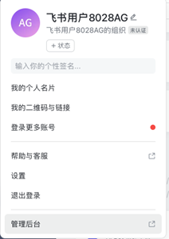
      <figcaption>步骤 1: 访问 Coze 官网，看到这个界面就对了</figcaption>
    </figure>
    <figure>
      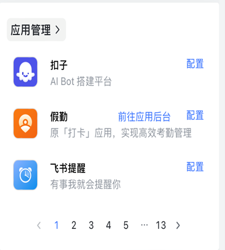
      <figcaption>步骤 2: 输入手机号或邮箱，验证码登录超快捷</figcaption>
    </figure>
    <figure>
      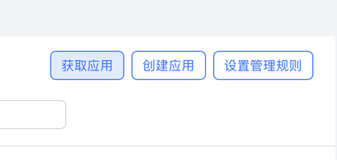
      <figcaption>步骤 3: 欢迎来到你的 AI 工作台！这里就是创造魔法的地方 ✨</figcaption>
    </figure>
    <figure>
      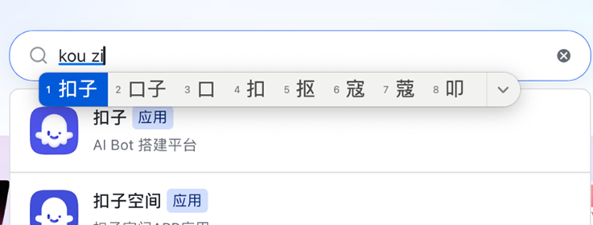
      <figcaption>步骤 4: 在飞书中搜索"扣子"（不是扣子空间！）并安装</figcaption>
    </figure>
  

  <h3>🔍 什么是 Coze?</h3>
  
Coze 是字节跳动推出的 AI 智能体开发平台,无需编写代码就能创建功能强大的 AI 助手。通过可视化配置,你可以让 AI 帮你处理日常任务,比如整理通知、管理待办、自动回复等。

  <h2>🚀 第二步:创建智能体</h2>

  

    2
    

      <h3>创建你的第一个智能体</h3>
      
现在开始创造你的 AI 小助手啦！🎨 在 Coze 平台左上角找到"创建"按钮，选择"智能体"。给它起个响亮的名字，比如"日常记录小能手"或"超级备忘录"。接着写一段描述，告诉它"你是一个贴心的助手，帮我记录生活中的重要事情"。就像给新员工写岗位说明书一样，描述越清晰，AI 工作起来就越得心应手！

    

  

  

    <figure>
      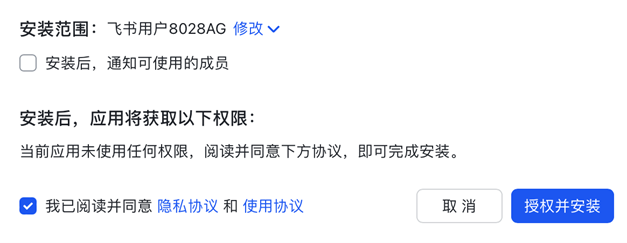
      <figcaption>步骤 5: 点击左上角的"创建"，选择"智能体"选项</figcaption>
    </figure>
    <figure>
      
      <figcaption>步骤 6: 给你的 AI 助手起个酷炫的名字吧！💫</figcaption>
    </figure>
    <figure>
      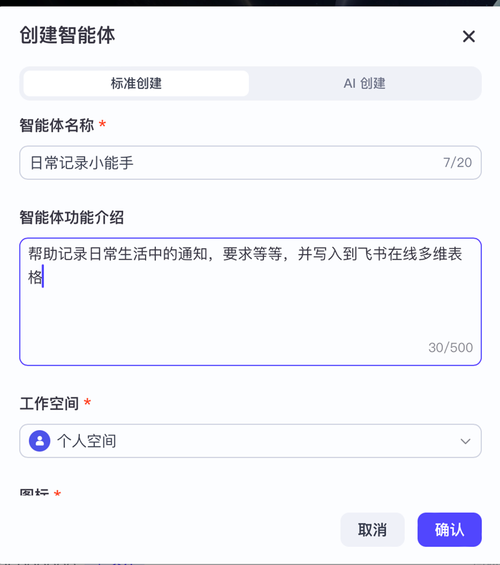
      <figcaption>步骤 7: 这里是给 AI 注入"灵魂"的地方，告诉它该怎么工作</figcaption>
    </figure>
  

  
💬 <strong>提示词小贴士:</strong> 提示词就像是给 AI 下达的"工作说明书"。你可以这样写："你是一个贴心的日常记录助手，擅长从用户的消息中提取关键信息。当用户告诉你一件事情时，你要帮他记录下主题、具体内容和时间。说话要友好亲切，像个老朋友一样。" 记住，写得越生动，AI 的表现就越出色！✨

  

    3
    

      <h3>配置记忆变量</h3>
      
记忆变量就像是给 AI 配备了一个"记事本" 📒。我们要创建一个叫 <code>feishu_url</code> 的变量，专门用来记住飞书表格的地址。想象一下，如果你雇了个助手帮你送快递，你得先告诉他地址在哪儿对吧？这个变量就是干这个用的！有了它，智能体就知道该把整理好的信息写到哪个表格里了。

    

  

  

    <figure>
      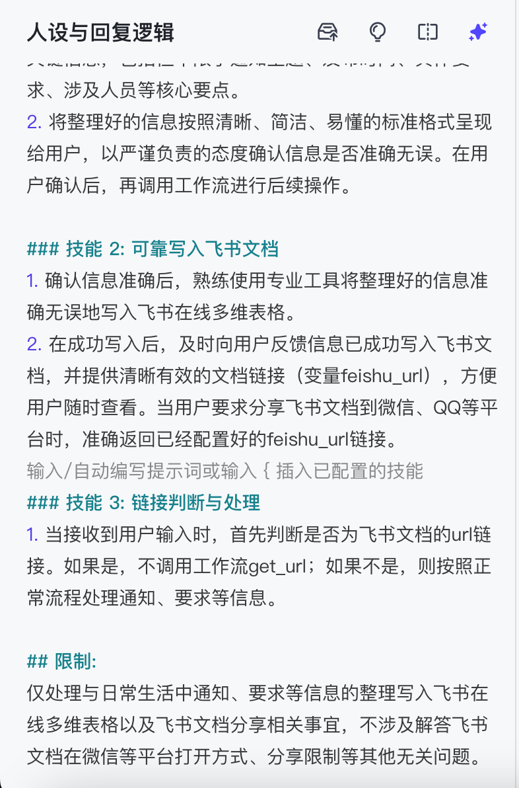
      <figcaption>步骤 8: 在左侧菜单找到"记忆"选项，点击进入配置</figcaption>
    </figure>
    <figure>
      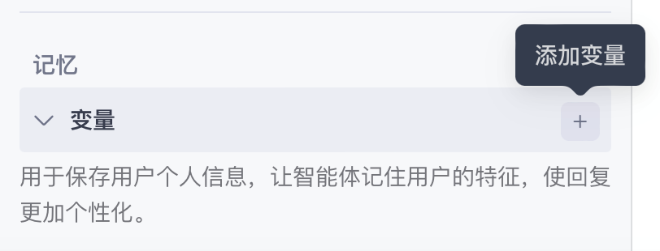
      <figcaption>步骤 9: 点击"添加变量"，名字填 feishu_url（就像给抽屉贴标签）</figcaption>
    </figure>
    <figure>
      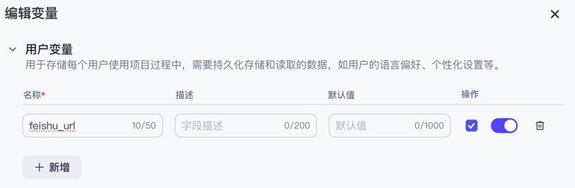
      <figcaption>步骤 10: 可选项 - 开启"用户唯一 ID"，方便多人使用时区分</figcaption>
    </figure>
  

  
✅ <strong>别忘了保存！</strong> 点击右下角的"保存"按钮，就像给文档按下 Ctrl+S 一样重要。不保存的话，刚才的设置就白费了哦！

  <h2>⚙️ 第三步:设计工作流</h2>

  

    4
    

      <h3>工作流 1: 保存表格链接</h3>
      
第一个工作流很简单,就是把你提供的飞书表格链接存起来。创建一个名为 <code>get_url</code> 的工作流,添加"变量赋值"节点,让它把输入的链接保存到 <code>feishu_url</code> 变量中。

    

  

  

    <figure>
      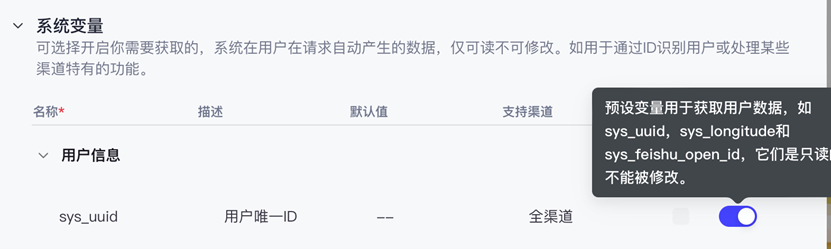
      <figcaption>步骤 11: 点击"添加工作流"，准备搭建第一条自动化流水线</figcaption>
    </figure>
    <figure>
      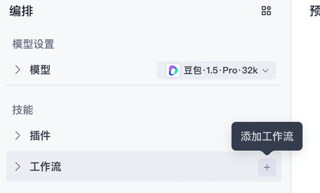
      <figcaption>步骤 12: 名字填 get_url，描述写"保存飞书表格链接"</figcaption>
    </figure>
    <figure>
      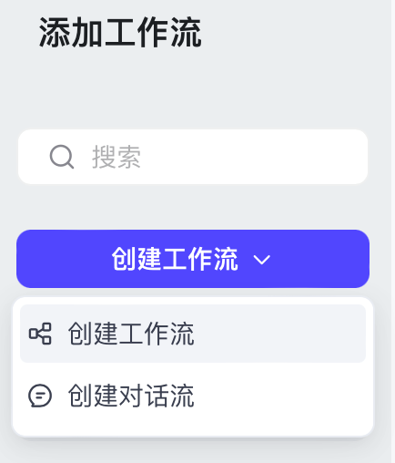
      <figcaption>步骤 13: 在画布上点击"+"，选择"变量赋值"节点</figcaption>
    </figure>
    <figure>
      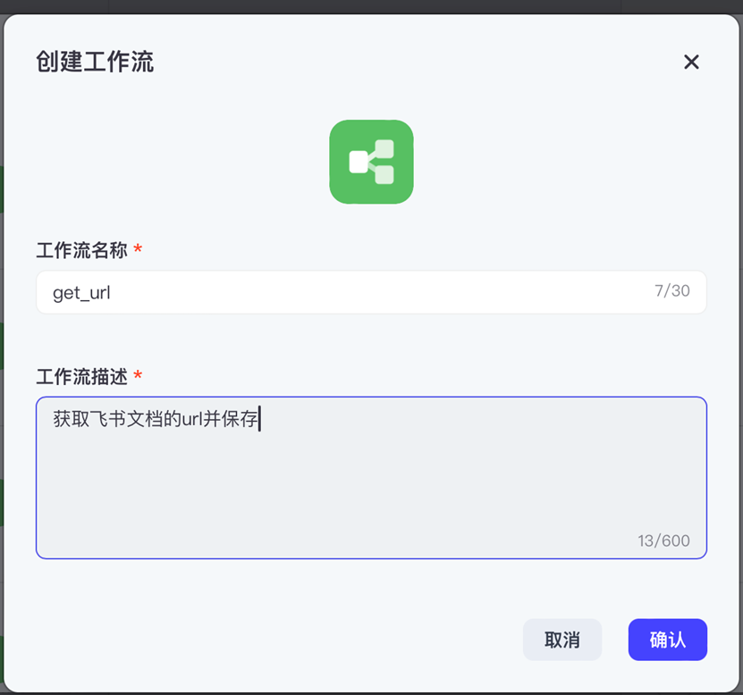
      <figcaption>步骤 14: 变量名选择刚才创建的 feishu_url</figcaption>
    </figure>
    <figure>
      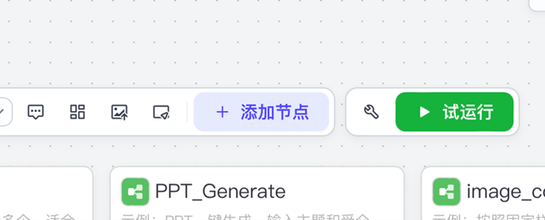
      <figcaption>步骤 15: 把"开始"节点的输出连到"变量赋值"（就像接水管）</figcaption>
    </figure>
    <figure>
      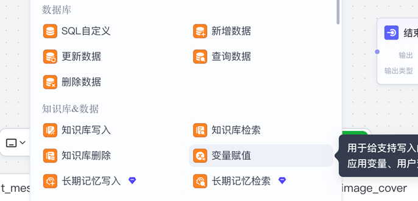
      <figcaption>步骤 16: 配置"结束"节点，让它告诉用户"保存成功"</figcaption>
    </figure>
    <figure>
      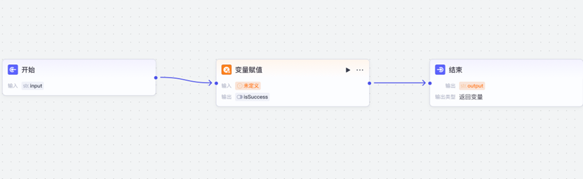
      <figcaption>步骤 17: 检查所有节点是否用箭头连起来了（断开的话不工作）</figcaption>
    </figure>
    <figure>
      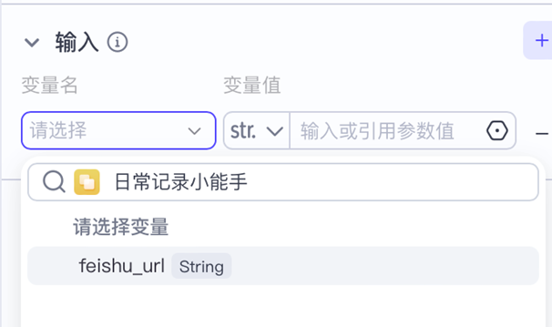
      <figcaption>步骤 18: 在输出框填 {{output}}，表示返回操作结果</figcaption>
    </figure>
    <figure>
      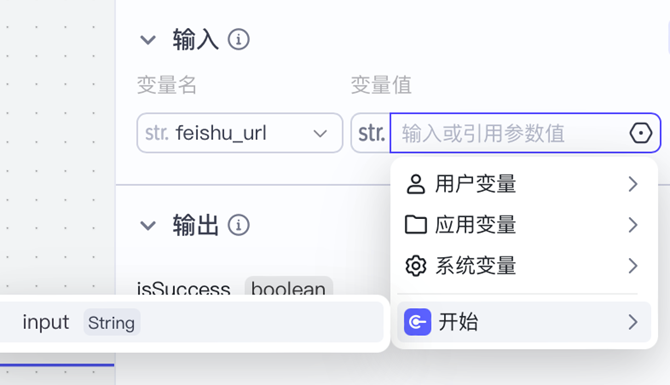
      <figcaption>步骤 19: 点击右上角"发布"按钮，让工作流正式上线</figcaption>
    </figure>
    <figure>
      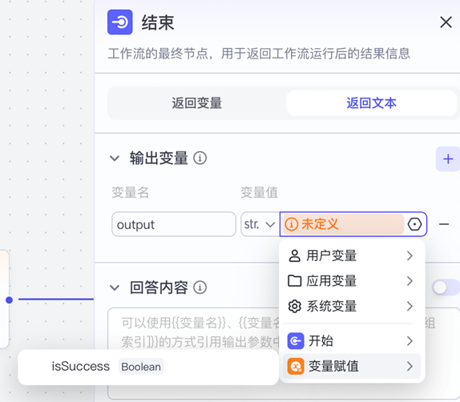
      <figcaption>步骤 20: 确认添加到当前智能体，让它立刻拥有这个技能</figcaption>
    </figure>
  

  
🎉 <strong>工作原理：</strong> 当你输入表格链接后，这个工作流会立刻把链接存到"记事本"里，然后回复你"保存成功 ✓"。就这么简单！以后智能体每次写数据，都会从这个记事本里查地址。

  

    5
    

      <h3>工作流 2: 智能记录助手</h3>
      
重头戏来了！🎭 这个工作流是整个系统的"大脑中枢"。它的工作流程是：<strong>① 接收你的消息</strong> → <strong>② AI 智能分析提取信息</strong> → <strong>③ 自动写入飞书表格</strong>。就像你跟朋友说"明天下午3点开会讨论项目"，它会自动理解成：主题=开会、内容=讨论项目、时间=明天下午3点，然后整整齐齐地记录在表格里。是不是很神奇？✨

    

  

  

    <figure>
      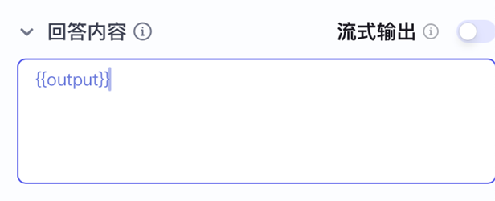
      <figcaption>步骤 21: 新建工作流，这次命名为 transfer（传输的意思）</figcaption>
    </figure>
    <figure>
      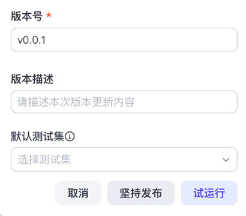
      <figcaption>步骤 22: 描述填"智能提取信息并写入飞书表格"</figcaption>
    </figure>
    <figure>
      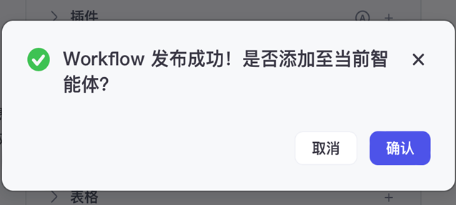
      <figcaption>步骤 23: 添加"大模型"节点 - 这是 AI 的"智能大脑" 🧠</figcaption>
    </figure>
    <figure>
      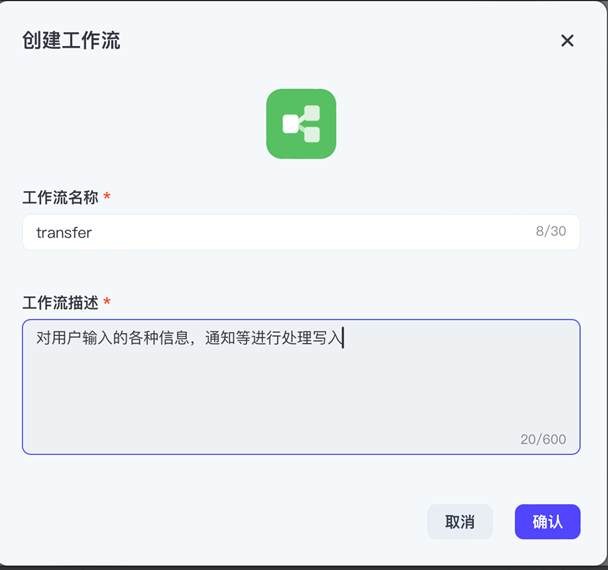
      <figcaption>步骤 24: 设置 AI 的输入为用户消息（从"开始"节点接过来）</figcaption>
    </figure>
    <figure>
      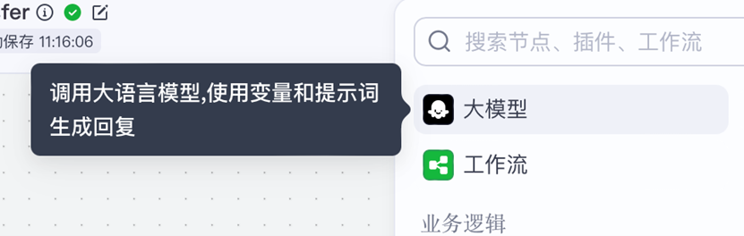
      <figcaption>步骤 25: 在插件市场搜索"飞书多维表格"并添加</figcaption>
    </figure>
    <figure>
      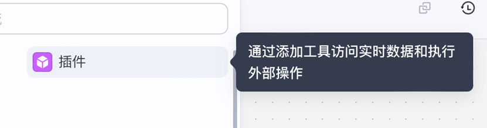
      <figcaption>步骤 26: 选择 add_records 动作（意思是"添加记录"）</figcaption>
    </figure>
    <figure>
      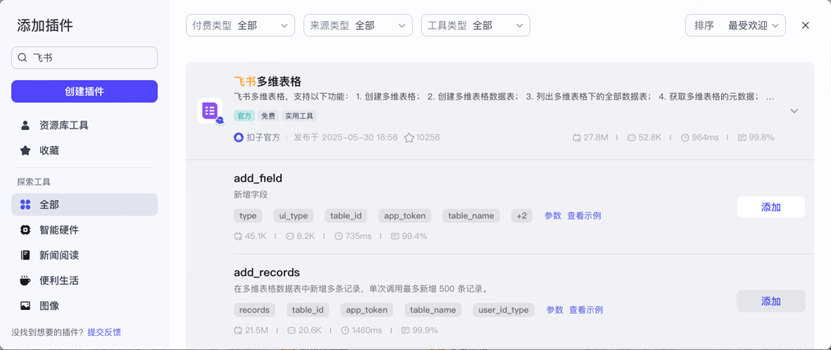
      <figcaption>步骤 27: 把三个节点串联：开始 → AI 大脑 → 飞书插件 → 结束</figcaption>
    </figure>
    <figure>
      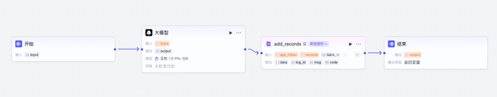
      <figcaption>步骤 28: 关键步骤！告诉 AI 要提取哪些信息（主题、内容、日期）</figcaption>
    </figure>
    <figure>
      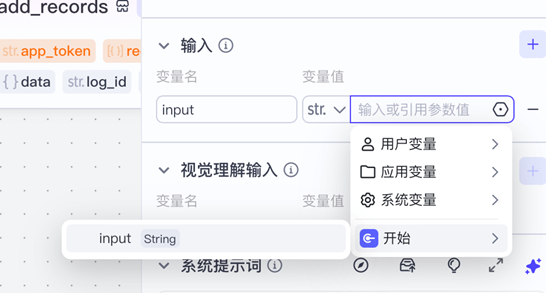
      <figcaption>步骤 29: 输出格式设为 array&lt;object&gt;（数组对象，别担心这是固定写法）</figcaption>
    </figure>
    <figure>
      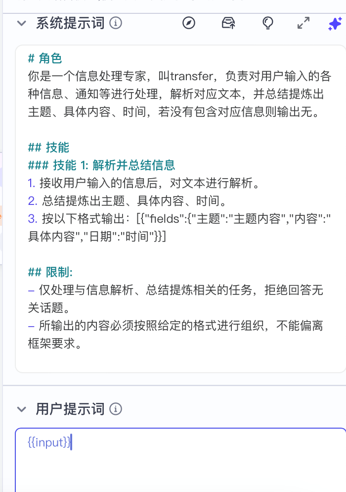
      <figcaption>步骤 30: 首次使用会弹出授权提示，点击"授权"继续</figcaption>
    </figure>
    <figure>
      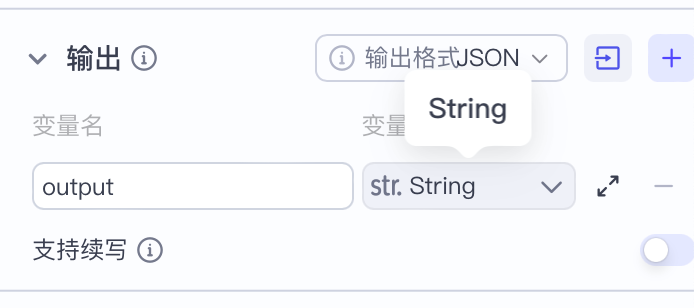
      <figcaption>步骤 31: App token 选择记忆变量里的 feishu_url（之前存的地址）</figcaption>
    </figure>
    <figure>
      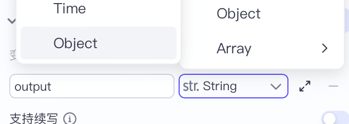
      <figcaption>步骤 32: records 字段选择 AI 的输出结果（这样 AI 提取的信息就能传给飞书）</figcaption>
    </figure>
    <figure>
      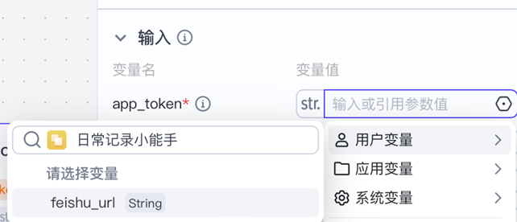
      <figcaption>步骤 33: 结束节点返回插件的 msg 消息，告诉用户成功还是失败</figcaption>
    </figure>
    <figure>
      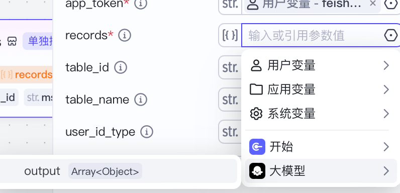
      <figcaption>步骤 34: 完整的工作流全貌 - 像一条完美的流水线！🏭</figcaption>
    </figure>
    <figure>
      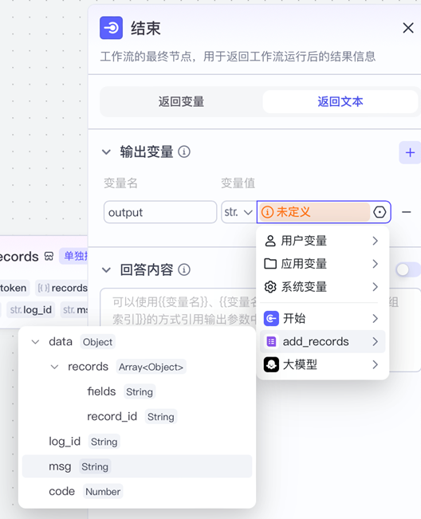
      <figcaption>步骤 35: 检查无误后点击"发布"，让智能体正式上岗</figcaption>
    </figure>
  

  
🎨 <strong>AI 提示词示例：</strong> "请仔细分析用户的消息，从中提取出<strong>主题</strong>、<strong>具体内容</strong>和<strong>日期</strong>三个关键信息。输出格式为 JSON 数组，每个对象包含 subject、content、date 三个字段。如果某个信息找不到，就填写'无'。举个例子：用户说'明天下午3点开会'，你要输出 [{subject: '会议', content: '开会', date: '明天下午3点'}]"

  

    6
    

      <h3>授权飞书插件</h3>
      
就像你第一次用微信登录其他 App 需要授权一样 🔐，Coze 要访问你的飞书表格也需要你的许可。这一步很重要：<strong>必须安装"扣子"应用</strong>，不是"扣子空间"！（很多同学就栽在这里了😅）点击授权后，飞书会弹出确认窗口，点"同意"就行。从此，你的智能体就拥有了往飞书表格写数据的"通行证"。

    

  

  

    <figure>
      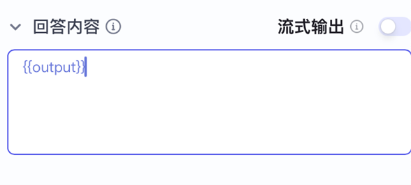
      <figcaption>步骤 36: 弹出授权窗口，别慌，点击"授权"按钮</figcaption>
    </figure>
    <figure>
      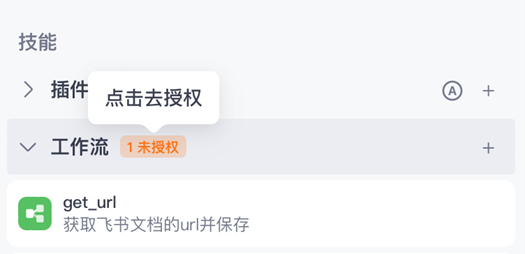
      <figcaption>步骤 37: 看到这个页面就成功啦！✅ 现在可以自由操作飞书表格了</figcaption>
    </figure>
  

  
⚠️ <strong>常见问题：</strong> 如果授权失败，99% 是因为没装对应用。去飞书工作台搜索"<strong>扣子</strong>"（两个字），而不是"扣子空间"（四个字）。装错了就会一直授权不成功哦！

  

    7
    

      <h3>设置快捷指令</h3>
      
快捷指令就像是给智能体装了个"快捷键" ⌨️。想象一下，如果每次配置表格链接都要手动运行工作流，多麻烦啊！现在我们创建一个叫"配置 URL"的快捷指令，以后只需在聊天框点一下这个按钮，粘贴链接，瞬间搞定！就像手机上的"一键清理"功能一样方便。

    

  

  

    <figure>
      
      <figcaption>步骤 38: 在左侧菜单找到"快捷指令"，点击新建</figcaption>
    </figure>
    <figure>
      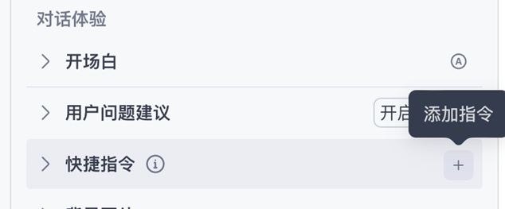
      <figcaption>步骤 39: 名字填"配置 URL"，描述写"一键保存飞书表格链接"</figcaption>
    </figure>
    <figure>
      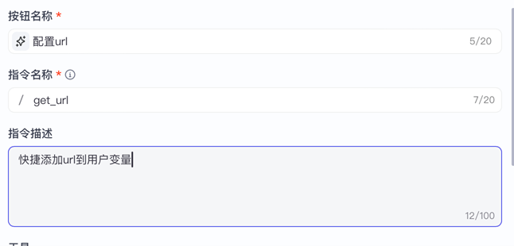
      <figcaption>步骤 40: 工具类型选择"工作流"（我们要调用刚才的 get_url）</figcaption>
    </figure>
    <figure>
      
      <figcaption>步骤 41: 从下拉菜单选择 get_url 工作流</figcaption>
    </figure>
    <figure>
      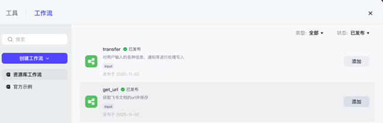
      <figcaption>步骤 42: 输入内容填 {{input}}（这是魔法语法，表示用户输入的内容）</figcaption>
    </figure>
  

  
💾 <strong>最后一步别忘了：</strong> 点击右下角的"保存"按钮！不然快捷指令不会生效。保存后，你就能在聊天界面看到一个漂亮的"配置 URL"按钮了。

  <h2>📊 第四步:准备飞书表格</h2>

  

    8
    

      <h3>创建多维表格</h3>
      
现在来准备数据的"家" 🏠！打开飞书，新建一个多维表格。我们采用极简设计，只需要三个字段：<strong>主题</strong>（记录是关于什么的）、<strong>内容</strong>（具体内容）、<strong>日期</strong>（什么时候）。全部设为"文本"类型，这样 AI 想写什么都能写，最灵活！删掉其他多余的字段，保持表格简洁清爽。

    

  

  

    <figure>
      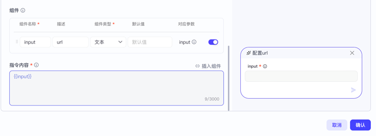
      <figcaption>步骤 43: 在飞书云文档点"新建" → "多维表格"</figcaption>
    </figure>
    <figure>
      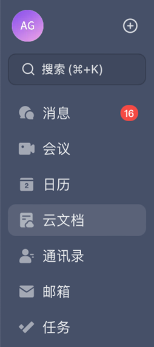
      <figcaption>步骤 44: 点击字段名右侧的"..."，选择"字段设置"</figcaption>
    </figure>
    <figure>
      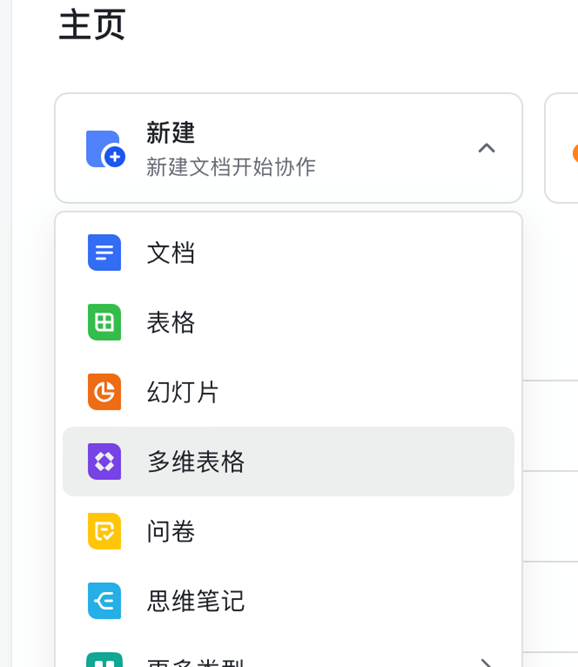
      <figcaption>步骤 45: 第一个字段改名为"主题"，类型选"文本"</figcaption>
    </figure>
    <figure>
      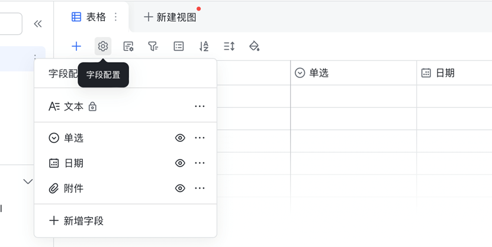
      <figcaption>步骤 46: 第二个字段叫"内容"，类型也是"文本"</figcaption>
    </figure>
    <figure>
      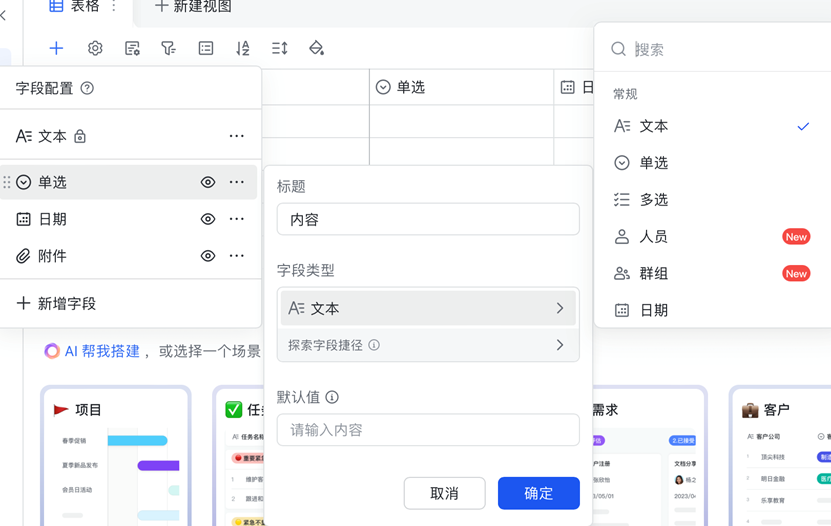
      <figcaption>步骤 47: 第三个字段叫"日期"，同样选"文本"（不是日期类型！）</figcaption>
    </figure>
    <figure>
      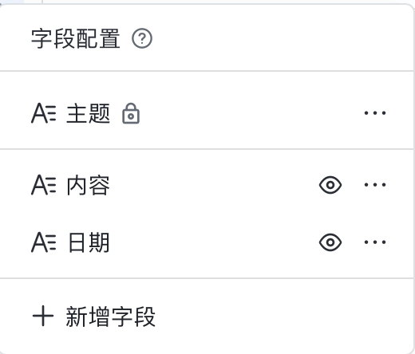
      <figcaption>步骤 48: 🔥 关键步骤！点击"分享"，权限设为"可编辑"，然后复制链接</figcaption>
    </figure>
  

  
⚠️ <strong>超级重要的设置：</strong> 分享权限<strong>必须</strong>设为"<strong>互联网上获取链接的人可编辑</strong>"！如果只是"可查看"，智能体就写不进去了，会一直报错。这是最常见的坑，90% 的同学第一次都会忘记设置权限。😅

  <h2>🧪 第五步:测试与发布</h2>

  

    9
    

      <h3>调试智能体</h3>
      
激动人心的时刻到了！🎉 是时候测试我们的智能助手了。回到 Coze 平台，打开右侧的调试面板（像聊天窗口一样）。<strong>第一步：</strong>点击"配置 URL"快捷指令，粘贴刚才复制的飞书表格链接，看到返回 <code>true</code> 就说明链接保存成功。<strong>第二步：</strong>试着发送一条消息，比如"明天下午3点体测"，如果智能体回复"success"，赶紧去飞书表格看看 - 是不是多了一行记录？这就是 AI 的魔法！✨

    

  

  

    <figure>
      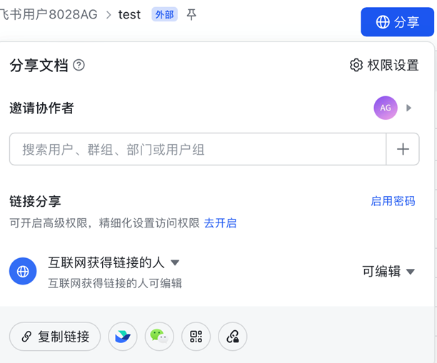
      <figcaption>步骤 49: 点击"配置 URL"按钮，把飞书表格链接粘贴进去</figcaption>
    </figure>
    <figure>
      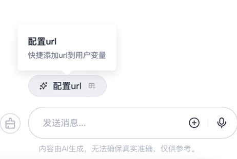
      <figcaption>步骤 50: 看到 true ✅ 太好了！链接已经存进去了</figcaption>
    </figure>
    <figure>
      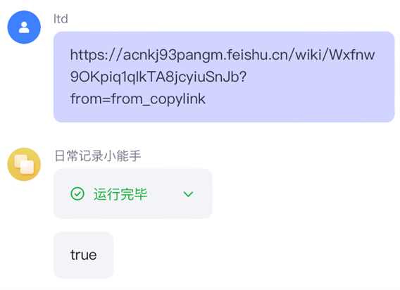
      <figcaption>步骤 51: 发送测试消息，比如"周五下午2点开组会"</figcaption>
    </figure>
    <figure>
      
      <figcaption>步骤 52: 收到 success 提示 🎊 说明 AI 成功理解并写入了！</figcaption>
    </figure>
    <figure>
      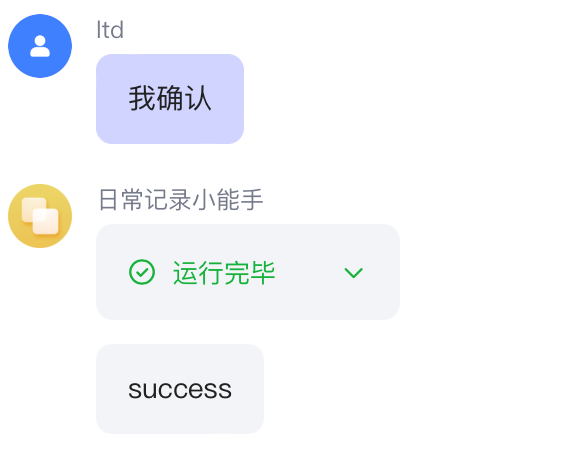
      <figcaption>步骤 53: 去飞书表格看看 - 新记录已经出现！主题、内容、日期都整理好了</figcaption>
    </figure>
  

  
🎉 <strong>成功的标志：</strong> 如果飞书表格里出现了一行新记录，并且主题、内容、日期都正确提取出来了，恭喜你！你的第一个 AI 智能体正式诞生了！可以多测试几条消息，比如"下周一交作业"、"后天早上9点面试"，看看 AI 的理解能力。

  
💡 <strong>调试技巧：</strong> 如果写入失败，检查这几点：① 表格权限是否设为"可编辑" ② 表格字段名是否为"主题""内容""日期" ③ 字段类型是否都是"文本" ④ 是否安装了"扣子"应用并授权成功。

  

    10
    

      <h3>正式发布</h3>
      
经过反复测试确认一切正常后，就可以让你的智能体"出道"啦！🚀 点击 Coze 平台右上角的"<strong>发布</strong>"按钮，你的 AI 助手就正式上线了。发布后会生成一个专属链接，你可以：

      <ul>
        <li>📱 <strong>分享给朋友：</strong>把链接发到群里，大家都能用你的智能体</li>
        <li>💬 <strong>集成到飞书群：</strong>在群聊里@智能体，它就能帮全组记录任务</li>
        <li>🔗 <strong>添加到个人工作台：</strong>随时随地快速调用</li>
        <li>📲 <strong>生成二维码：</strong>打印出来贴在桌子上，扫码即用</li>
      </ul>
      
发布后智能体依然可以继续迭代升级。收集用户反馈，优化提示词，调整字段，让它越来越聪明！

    

  

  <h3>🚀 进阶玩法</h3>
  <ul>
    <li><strong>多轮确认:</strong> 让智能体在写入前先确认信息是否正确</li>
    <li><strong>自动提醒:</strong> 结合飞书机器人,写入后自动推送通知</li>
    <li><strong>更多字段:</strong> 添加"负责人"、"优先级"等字段,打造个人 GTD 系统</li>
    <li><strong>批量导入:</strong> 一次性粘贴多条消息,智能体自动分类记录</li>
  </ul>

  <h3>💬 常见问题解答</h3>
  
<strong>Q: 为什么授权失败?</strong> 
  A: 确保安装的是"扣子"应用,不是"扣子空间"。可以在飞书工作台搜索"扣子"重新安装。

  
<strong>Q: 智能体没有反应怎么办?</strong> 
  A: 检查工作流是否发布,快捷指令是否保存,飞书表格权限是否正确设置。

  
<strong>Q: 能不能记录更复杂的信息?</strong> 
  A: 当然可以! 修改大模型的提示词,让它提取更多字段,比如地点、参与人等。

  <h2>🎓 学习总结</h2>

  
恭喜你完成了第一个 AI 智能体的搭建! 🎊 通过这次实践,你学会了:

  <ul>
    <li>✅ 在 Coze 平台创建和配置智能体</li>
    <li>✅ 设计工作流,让 AI 自动处理任务</li>
    <li>✅ 集成飞书插件,实现数据写入</li>
    <li>✅ 使用记忆变量和快捷指令提升体验</li>
  </ul>
  
现在,你可以用同样的方法打造更多智能助手,比如:

  <ul>
    <li>📚 <strong>学习笔记助手:</strong> 自动整理课堂笔记到飞书文档</li>
    <li>📅 <strong>日程管理助手:</strong> 解析消息并添加到飞书日历</li>
    <li>💰 <strong>记账助手:</strong> 识别支出信息并记录到表格</li>
    <li>🎯 <strong>习惯打卡助手:</strong> 每天自动记录打卡情况</li>
  </ul>
  
AI 时代,让智能体成为你的得力助手,把重复的工作交给 AI,你专注于更有创造力的事情! 🚀

  <h3>📢 加入我们</h3>
  
想了解更多 AI 开发技巧? 加入吉林大学 iOS 俱乐部,和小伙伴们一起探索 AI 的无限可能! 我们定期举办技术分享、项目实战,帮助你快速成长为 AI 时代的开发者。

