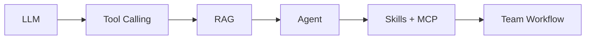
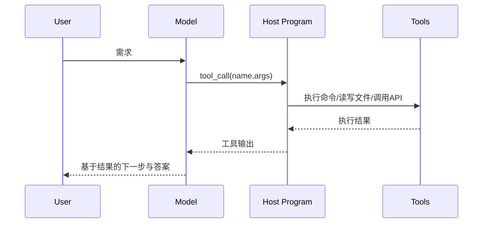
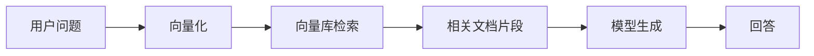
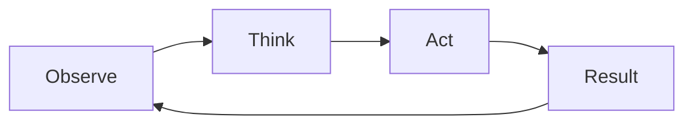

<style scoped>
:root {
  --mag-bg: #f6f7f9;
  --mag-card: #ffffff;
  --mag-text: #1f2a37;
  --mag-subtext: #5b6676;
  --mag-border: #d8dde6;
  --mag-accent: #2f5d8a;
  --mag-accent-soft: #e8eff7;
  --mag-shadow: 0 10px 30px rgba(20, 32, 53, 0.08);
}

.dark {
  --mag-bg: #11161d;
  --mag-card: #1a212b;
  --mag-text: #e5eaf2;
  --mag-subtext: #aeb8c6;
  --mag-border: #2d3948;
  --mag-accent: #8ab4e1;
  --mag-accent-soft: #223246;
  --mag-shadow: 0 14px 36px rgba(0, 0, 0, 0.32);
}

@keyframes bannerShift {
  0% {
    transform: translateX(-12%);
    opacity: 0.3;
  }
  50% {
    opacity: 0.7;
  }
  100% {
    transform: translateX(12%);
    opacity: 0.3;
  }
}

@keyframes riseIn {
  from {
    opacity: 0;
    transform: translateY(8px);
  }
  to {
    opacity: 1;
    transform: translateY(0);
  }
}

.vibe-banner {
  margin: 2rem 0;
  padding: 2.8rem 2rem;
  border-radius: 20px;
  border: 1px solid var(--mag-border);
  background: linear-gradient(145deg, var(--mag-card) 0%, var(--mag-accent-soft) 100%);
  box-shadow: var(--mag-shadow);
  position: relative;
  overflow: hidden;
}

.vibe-banner::after {
  content: "";
  position: absolute;
  top: -10%;
  left: -18%;
  width: 40%;
  height: 130%;
  background: linear-gradient(110deg, transparent, rgba(47, 93, 138, 0.14), transparent);
  transform: skewX(-20deg);
  animation: bannerShift 9s ease-in-out infinite alternate;
  pointer-events: none;
}

.vibe-banner h1 {
  margin: 0;
  border: 0;
  color: var(--mag-text);
  font-family: "Noto Serif SC", "Source Han Serif SC", "Songti SC", serif;
  font-size: clamp(1.85rem, 3.6vw, 2.9rem);
  letter-spacing: 0.02em;
  position: relative;
  z-index: 1;
}

.vibe-banner p {
  margin: 0.9rem 0 0;
  color: var(--mag-subtext);
  font-size: 1.05rem;
  line-height: 1.8;
  position: relative;
  z-index: 1;
}

.badge-row {
  display: flex;
  flex-wrap: wrap;
  gap: 0.6rem;
  margin-top: 1rem;
  position: relative;
  z-index: 1;
}

.badge-pill {
  padding: 0.36rem 0.72rem;
  border-radius: 999px;
  border: 1px solid var(--mag-border);
  background: var(--mag-card);
  color: var(--mag-subtext);
  font-size: 0.86rem;
}

.info-grid {
  display: grid;
  grid-template-columns: repeat(4, minmax(0, 1fr));
  gap: 1rem;
  margin: 2.2rem 0;
}

.info-card {
  background: var(--mag-card);
  border: 1px solid var(--mag-border);
  border-radius: 14px;
  padding: 1.2rem;
  box-shadow: 0 4px 14px rgba(20, 32, 53, 0.05);
  transition: transform 0.25s ease, border-color 0.25s ease;
  animation: riseIn 0.45s ease both;
}

.info-card:hover {
  transform: translateY(-3px);
  border-color: var(--mag-accent);
}

.info-card h3 {
  margin: 0;
  border: 0;
  color: var(--mag-text);
  font-size: 1.02rem;
  font-family: "Noto Serif SC", "Source Han Serif SC", "Songti SC", serif;
}

.info-card p {
  margin: 0.45rem 0 0;
  color: var(--mag-subtext);
  line-height: 1.7;
}

.tip-box,
.highlight-box {
  margin: 1.4rem 0;
  padding: 1rem 1.05rem;
  border-radius: 10px;
  border: 1px solid var(--mag-border);
  background: var(--mag-card);
  color: var(--mag-subtext);
  line-height: 1.8;
}

.tip-box {
  border-left: 3px solid var(--mag-accent);
}

.highlight-box {
  background: linear-gradient(145deg, var(--mag-card), var(--mag-accent-soft));
}

.vp-doc h2 {
  margin: 3rem 0 1.2rem;
  padding-top: 0.2rem;
  border-top: 1px solid var(--mag-border);
  color: var(--mag-text);
  font-family: "Noto Serif SC", "Source Han Serif SC", "Songti SC", serif;
  font-size: clamp(1.45rem, 2.6vw, 2rem);
  letter-spacing: 0.01em;
}

.step-container {
  margin: 1rem 0 1.6rem;
  padding: 1.3rem 1.1rem;
  border-left: 3px solid var(--mag-accent);
  background: var(--mag-card);
  border-radius: 10px;
  box-shadow: 0 4px 14px rgba(20, 32, 53, 0.05);
}

.step-header {
  display: flex;
  align-items: flex-start;
  gap: 0.7rem;
  margin-bottom: 0.55rem;
}

.step-container h4 {
  margin: 0;
  border: 0;
  color: var(--mag-text);
  font-size: 1.1rem;
  line-height: 1.5;
  font-family: "Noto Serif SC", "Source Han Serif SC", "Songti SC", serif;
}

.step-number {
  width: 1.8rem;
  height: 1.8rem;
  border-radius: 999px;
  display: inline-flex;
  align-items: center;
  justify-content: center;
  color: #fff;
  background: var(--mag-accent);
  font-size: 0.95rem;
  flex-shrink: 0;
}

.step-container p,
.step-container li,
.project-card,
.timeline-card {
  color: var(--mag-subtext);
  line-height: 1.8;
}

.step-container ul,
.project-card ul {
  margin: 0.55rem 0 0;
  padding-left: 1.2rem;
}

.roadmap-grid {
  display: grid;
  grid-template-columns: repeat(5, minmax(0, 1fr));
  gap: 0.8rem;
  margin-top: 0.9rem;
}

.roadmap-card {
  border: 1px solid var(--mag-border);
  background: var(--mag-card);
  border-radius: 12px;
  padding: 0.8rem;
  position: relative;
  transition: transform 0.2s ease;
}

.roadmap-card:hover {
  transform: translateY(-2px);
}

.roadmap-card strong {
  display: block;
  color: var(--mag-text);
  margin-bottom: 0.25rem;
}

.roadmap-card span {
  font-size: 0.86rem;
}

.roadmap-card:not(:last-child)::after {
  content: "→";
  position: absolute;
  right: -0.63rem;
  top: 50%;
  transform: translateY(-50%);
  color: var(--mag-accent);
  font-weight: 700;
}

.compare-grid {
  display: grid;
  grid-template-columns: repeat(2, minmax(0, 1fr));
  gap: 1rem;
  margin: 1rem 0;
}

.compare-card,
.timeline-card,
.project-card {
  border: 1px solid var(--mag-border);
  border-radius: 12px;
  background: var(--mag-card);
  padding: 1rem;
}

.compare-card h4,
.timeline-card h4,
.project-card h4,
.project-card h3 {
  margin: 0;
  border: 0;
  color: var(--mag-text);
  font-family: "Noto Serif SC", "Source Han Serif SC", "Songti SC", serif;
}

.compare-card p,
.timeline-card p,
.project-card p {
  margin: 0.5rem 0 0;
}

.project-grid {
  display: grid;
  grid-template-columns: repeat(2, minmax(0, 1fr));
  gap: 1rem;
  margin: 1.1rem 0;
}

.timeline-stack {
  display: grid;
  grid-template-columns: 1fr;
  gap: 0.9rem;
  margin: 1rem 0;
}

.timeline-card {
  position: relative;
  overflow: hidden;
}

.timeline-card::after {
  content: "";
  position: absolute;
  inset: 0;
  border-left: 2px solid rgba(47, 93, 138, 0.18);
  pointer-events: none;
}

.tag {
  display: inline-flex;
  align-items: center;
  border: 1px solid var(--mag-border);
  border-radius: 999px;
  padding: 0.14rem 0.62rem;
  font-size: 0.8rem;
  color: var(--mag-subtext);
  margin-bottom: 0.55rem;
  background: var(--mag-accent-soft);
}

:deep(.mermaid-container) {
  margin: 1rem 0;
  padding: 0.9rem;
  border-radius: 12px;
  border: 1px solid var(--mag-border);
  background: var(--mag-card);
  overflow: auto;
}

@media (max-width: 1200px) {
  .roadmap-grid {
    grid-template-columns: repeat(3, minmax(0, 1fr));
  }

  .roadmap-card::after {
    display: none;
  }
}

@media (max-width: 1020px) {
  .info-grid,
  .project-grid,
  .compare-grid {
    grid-template-columns: 1fr;
  }
}

@media (max-width: 780px) {
  .vibe-banner {
    padding: 1.8rem 1.2rem;
    border-radius: 14px;
  }

  .roadmap-grid {
    grid-template-columns: 1fr;
  }

  .step-container {
    padding: 1rem 0.9rem;
  }

  .vp-doc h2 {
    margin-top: 2.3rem;
  }
}
</style>

<div class="vibe-banner">
  <h1>主线之外 · 现代 AI 编程全景</h1>
  <p>这份讲义是主线之外的补充版本，目标不是“再背几个名词”，而是建立一张能直接指导你做项目的 AI 编程路线图。</p>
  <div class="badge-row">
    <span class="badge-pill">LLM</span>
    <span class="badge-pill">Tool Calling</span>
    <span class="badge-pill">RAG</span>
    <span class="badge-pill">Agent</span>
    <span class="badge-pill">Skills + MCP</span>
    <span class="badge-pill">iOS 落地路径</span>
  </div>
</div>

<div class="info-grid">
  <div class="info-card">
    <h3>你会得到什么</h3>
    <p>一张分层概念地图，知道每个词解决什么问题，不再“术语堆砌”。</p>
  </div>
  <div class="info-card">
    <h3>核心思维</h3>
    <p>从“写 prompt”升级到“定义规范、构建闭环、评估结果”。</p>
  </div>
  <div class="info-card">
    <h3>工程目标</h3>
    <p>把 AI 从一次性回答器，变成能持续完成任务的系统。</p>
  </div>
  <div class="info-card">
    <h3>适配对象</h3>
    <p>面向 iOS/Apple 开发者，覆盖课堂项目与团队协作场景。</p>
  </div>
</div>

<div class="tip-box">
  <strong>阅读建议：</strong> 先看第 2 节路线图和第 12 节总结，再按 3~11 节逐步补细节。每节都带了“能落地”的判断标准。
</div>

## 目录

1. 这节课想解决什么问题
2. 整体路线图：五个台阶
3. 第一阶：LLM
4. 第二阶：Tool Calling
5. 第三阶：RAG
6. 第四阶：Agent
7. 第五阶（上）：Skills
8. 第五阶（下）：MCP
9. vibe coding：一种工作方式
10. vibe coding 实战：六条对抗熵增的机制
11. 现代编程范式的四个转变
12. 面向 iOS/Apple 的成长路径
13. 总结：完整概念地图

## 1) 这节课想解决什么问题

<div class="step-container">
  <div class="step-header">
    <span class="step-number">1</span>
    <h4>把“会用 AI”升级为“会设计 AI 工作流”</h4>
  </div>
  <p>很多同学已经会用 ChatGPT / Claude / Cursor 写代码，但在工程层面还会卡在三个关键问题：能不能验证、能不能复用、能不能团队协作。</p>
  <ul>
    <li>为什么有时编译通过，有时出现不存在的 API？</li>
    <li>Agent 和普通对话到底差在哪？</li>
    <li>RAG / Tool Calling / MCP 是并列概念还是上下层关系？</li>
  </ul>
  <p>本讲义目标就是把这些问题压缩成一套可执行框架。</p>
</div>

## 2) 整体路线图：五个台阶

<div class="step-container">
  <div class="step-header">
    <span class="step-number">2</span>
    <h4>五层不是替代关系，而是叠加关系</h4>
  </div>
  <div class="roadmap-grid">
    <div class="roadmap-card"><strong>第 1 阶 LLM</strong><span>会生成，但没手没眼没记忆</span></div>
    <div class="roadmap-card"><strong>第 2 阶 Tool Calling</strong><span>可执行、可验证</span></div>
    <div class="roadmap-card"><strong>第 3 阶 RAG</strong><span>检索真实知识</span></div>
    <div class="roadmap-card"><strong>第 4 阶 Agent</strong><span>多步计划与闭环</span></div>
    <div class="roadmap-card"><strong>第 5 阶 Skills + MCP</strong><span>团队复用与标准化接入</span></div>
  </div>
</div>



## 3) 第一阶：LLM

<div class="step-container">
  <div class="step-header">
    <span class="step-number">3</span>
    <h4>LLM 是聪明的大脑，但天生“孤立”</h4>
  </div>
  <ul>
    <li><strong>断网：</strong>知识冻结在训练截止日。</li>
    <li><strong>没手：</strong>不能直接运行 `xcodebuild` 或改你项目文件。</li>
    <li><strong>没记忆：</strong>超出上下文窗口后不会自动保留长期经验。</li>
  </ul>
  <p>“幻觉”不是偶然 bug，而是概率生成机制导致的结构性风险：它会优先生成“像答案”的文本，而不是“被验证的事实”。</p>
</div>

<div class="highlight-box">
  <strong>工程结论：</strong> 只用 LLM 写代码，最多是“高效草稿”；要变成“可靠交付”，必须引入执行与检索能力。
</div>

## 4) 第二阶：Tool Calling

<div class="step-container">
  <div class="step-header">
    <span class="step-number">4</span>
    <h4>给模型一双手：从“能写”到“能验证”</h4>
  </div>
  <p>Tool Calling 的核心是：模型声明要调用什么工具，外部程序实际执行，再把结果回传给模型继续推理。</p>
</div>



<div class="compare-grid">
  <div class="compare-card">
    <h4>常见工具类型</h4>
    <p>终端编译、测试执行、文件系统、数据库查询、HTTP 请求、搜索引擎。</p>
  </div>
  <div class="compare-card">
    <h4>带来的质变</h4>
    <p>把“文本建议”升级为“工程闭环”：写完即跑、失败即修、可追踪可复现。</p>
  </div>
</div>

## 5) 第三阶：RAG

<div class="step-container">
  <div class="step-header">
    <span class="step-number">5</span>
    <h4>给模型一双眼：先查证再回答</h4>
  </div>
  <p>RAG（检索增强生成）解决的是“知识来源不可信”的问题。模型先检索你的知识库，再基于检索片段生成回答。</p>
  <ul>
    <li>可放入 README、架构约定、API 文档、历史踩坑记录。</li>
    <li>可显著减少“风格漂移”和“项目内 API 幻觉”。</li>
  </ul>
</div>



<div class="compare-grid">
  <div class="compare-card">
    <h4>Tool Calling 关注什么</h4>
    <p>执行动作与实时结果，例如编译、测试、调用 API。</p>
  </div>
  <div class="compare-card">
    <h4>RAG 关注什么</h4>
    <p>回答依据与知识正确性，例如规范、设计决策、接口约束。</p>
  </div>
</div>

## 6) 第四阶：Agent

<div class="step-container">
  <div class="step-header">
    <span class="step-number">6</span>
    <h4>从“一问一答”到“持续做事”</h4>
  </div>
  <p>Agent 的关键不是“会说话”，而是能在多步任务里持续循环：观察、思考、行动、再观察。</p>
</div>



<div class="project-grid">
  <div class="project-card">
    <h3>四大组件</h3>
    <ul>
      <li>Planning &amp; Reasoning：任务拆解和动态调整</li>
      <li>Memory：情节/语义/程序记忆</li>
      <li>Tools：能操作真实环境</li>
      <li>Environment：文件、Git、CI、外部服务</li>
    </ul>
  </div>
  <div class="project-card">
    <h3>真实局限</h3>
    <ul>
      <li>长链路任务易跑偏</li>
      <li>早期误判会在后续放大</li>
      <li>幻觉触发错误行动链</li>
      <li>需要人工设置关键检查点</li>
    </ul>
  </div>
</div>

## 7) 第五阶（上）：Skills

<div class="step-container">
  <div class="step-header">
    <span class="step-number">7</span>
    <h4>把“会做”变成“稳定可复现地做”</h4>
  </div>
  <p>Skills 的价值是把团队隐性经验固化为可执行规则，避免同类任务每次都凭个人习惯随机发挥。</p>

```text
my-skill/
  SKILL.md
  scripts/
  templates/
  assets/
```
</div>

<div class="project-grid">
  <div class="project-card">
    <h3>模块创建 Skill</h3>
    <p>自动生成 Model / ViewModel / View / Tests，强制 MVVM 约束。</p>
  </div>
  <div class="project-card">
    <h3>质量检查 Skill</h3>
    <p>统一跑 SwiftLint、格式化、测试，并输出质量摘要。</p>
  </div>
  <div class="project-card">
    <h3>PR 生成 Skill</h3>
    <p>自动产出改动说明、风险点、review 重点和变更记录。</p>
  </div>
  <div class="project-card">
    <h3>团队收益</h3>
    <p>新成员直接复用流程，减少“靠口传”的培训成本。</p>
  </div>
</div>

## 8) 第五阶（下）：MCP

<div class="step-container">
  <div class="step-header">
    <span class="step-number">8</span>
    <h4>工具接入标准化：统一插头，而非重复造轮子</h4>
  </div>
  <p>MCP（Model Context Protocol）解决的是“工具集成碎片化”：同一工具接入一次，多个 AI 应用可复用。</p>
</div>

<div class="compare-grid">
  <div class="compare-card">
    <h4>MCP Server</h4>
    <p>工具提供方，封装认证、权限和数据转换，并暴露标准能力。</p>
  </div>
  <div class="compare-card">
    <h4>MCP Client</h4>
    <p>AI 应用侧，发现并连接 Server，给模型暴露可用能力并回传结果。</p>
  </div>
</div>

<div class="highlight-box">
  <strong>区分关系：</strong>
  <ul>
    <li>`Tool Calling` 是“模型如何调用工具”的机制层。</li>
    <li>`MCP` 是“工具如何标准化接入与复用”的协议层。</li>
    <li>`RAG` 主要负责“读取可靠知识”，MCP 还能执行写操作。</li>
  </ul>
</div>

## 9) vibe coding：一种工作方式

<div class="step-container">
  <div class="step-header">
    <span class="step-number">9</span>
    <h4>它是交互范式，不是单一技术</h4>
  </div>
  <p>vibe coding 的本质是“意图驱动 + 快速迭代”，你描述目标感觉，AI 产出代码，然后根据运行结果继续对话修正。</p>
</div>

<div class="compare-grid">
  <div class="compare-card">
    <h4>适合场景</h4>
    <p>Demo、PoC、学习探索、hackathon、小工具。</p>
  </div>
  <div class="compare-card">
    <h4>高风险场景</h4>
    <p>长期维护核心模块、性能敏感路径、安全敏感逻辑、多人共享代码。</p>
  </div>
</div>

<div class="tip-box">
  <strong>实践建议：</strong> vibe coding 要配护栏，最低要求是 `看 diff + 跑测试 + 做代码审查`，否则技术债会非常快地累积。
</div>

## 10) vibe coding 实战：六条对抗熵增的机制

<div class="highlight-box">
  <p>以下六条机制，说来说去对抗的都是同一个东西——<strong>上下文的熵增</strong>。你不治这个，迭代越快，崩得越快。每一条都是可以立即落地的工程手段，而不是"写在 prompt 里祈祷 AI 听话"。</p>
</div>

<div class="step-container">
  <div class="step-header">
    <span class="step-number">①</span>
    <h4>多模型对审：Plan 阶段就把坑填完</h4>
  </div>
  <p>用 Opencode 的 plan mode 生成方案文档，再把文档交给另一个高能力模型做评审。每一个需求点都要经过五六个来回的质疑和补全，这样打磨出来的 plan 交给执行模型，几乎一次性通过，不用返工。</p>
  <p><strong>核心逻辑：</strong>写代码的成本远高于审方案的成本，把反复修改的循环前移到纯文本阶段，是最划算的投资。讨论一个普通的需求，都可以把上下文几乎吃光——把这些消耗花在 plan 阶段而不是代码阶段，性价比最高。</p>
</div>

<div class="step-container">
  <div class="step-header">
    <span class="step-number">②</span>
    <h4>分形文档 + 强制同构</h4>
  </div>
  <p>根目录放一份全局地图，每个模块放一份成员清单和接口说明，每个文件头部声明依赖和职责。三层是折叠关系，AI 从任意文件进入，三次 Read 就能拿到完整上下文。</p>
  <p>这个思路的本质是<strong>利用 Opencode 的 instructions 文件强制加载机制，播种一套文档</strong>。但光有文档不够——每次代码变更后必须强制回环检查：文件头的依赖声明还对不对，模块文档的成员清单要不要更新。文档和代码是同一事物的两个相，任何一相变了另一相没跟上，三轮会话后 AI 就在错误上下文上越写越离谱。</p>
</div>

<div class="step-container">
  <div class="step-header">
    <span class="step-number">③</span>
    <h4>Hook 自动拦截，别靠 prompt 约束</h4>
  </div>
  <p>把项目规范写成自动检查脚本挂在 hook 里，AI 写出违规代码时写入瞬间被拦截打回。你在 system prompt 里写一百遍"不要这样做"，不如工程化拦它一次。<strong>AI 没有记忆力，但 hook 有。</strong></p>
  <p>举个例子，利用 Hook 机制强制规范了需要使用特定 UI 组件库，结果整个项目生成的任何页面，完全没有逃逸。Opencode 支持自定义 hooks，在 <code>.opencode</code> 配置中设置 pre-commit、post-edit 等钩子脚本，实现同样的拦截效果。</p>
</div>

<div class="step-container">
  <div class="step-header">
    <span class="step-number">④</span>
    <h4>Plan 文件持久化，别信对话记忆</h4>
  </div>
  <p>Opencode 的 plan mode 生成的 plan 文档，默认可能散落在系统文件夹下。通过配置 plan 的存储路径，就能让每个项目的 plan 落在每个项目的文件夹内。</p>
  <p>另外 plan 文档默认是不带 checklist 的，在默认的 plan 中加入 checklist 跟踪进度，完成一项就回写文件。<strong>会话中断后，新会话读文件从断点恢复。文件系统才是唯一可靠的状态源。</strong>这点非常重要。</p>
</div>

<div class="step-container">
  <div class="step-header">
    <span class="step-number">⑤</span>
    <h4>质量红线必须量化</h4>
  </div>
  <p>单文件 ≤ 800 行，单函数 ≤ 30 行，嵌套 ≤ 3 层，分支 ≤ 3 个。<strong>不是建议，是硬阈值。</strong>AI 对"函数要短"的理解飘忽不定，但对"不超过 30 行"执行得非常稳定。</p>
  <p>所有审美判断都要降维成可判定谓词，这是跟 AI 协作的基本功。要有架构洁癖、代码洁癖——让 AI 有洁癖是一件几乎没有成本的事情。</p>
</div>

<div class="step-container">
  <div class="step-header">
    <span class="step-number">⑥</span>
    <h4>渐进式上下文加载</h4>
  </div>
  <p>别每次把所有文档一股脑灌进去。改 bug 只加载目标模块文档，做架构决策才加载全局地图。上下文窗口是稀缺资源，信息过载和信息不足一样有害。</p>
  <p>像设计数据库索引一样设计 AI 的信息检索路径——<strong>命中率比覆盖率重要</strong>。就算有了大上下文窗口，熵增问题可以缓解，但仍然不能根除，所以还是需要掌握渐进式加载的技巧。</p>
</div>

<div class="highlight-box">
  <strong>总结：</strong> 这六条机制的共同敌人是"上下文熵增"。vibe coding 的速度越快，不加治理就崩得越快。用工程手段（文档、hook、持久化、量化指标、分层加载）替代"写 prompt 祈祷"，才是让 AI 协作可持续的关键。
</div>

## 11) 现代编程范式的四个转变

<div class="project-grid">
  <div class="project-card">
    <h3>1. Code-first → Spec-first</h3>
    <p>先定义验收标准与边界，再让 AI 实现，不要让 AI 猜需求。</p>
  </div>
  <div class="project-card">
    <h3>2. 文件生成 → 系统编排</h3>
    <p>关注完整交付链：检索、生成、验证、修复、文档、PR。</p>
  </div>
  <div class="project-card">
    <h3>3. 一次性 Prompt → 可复用资产</h3>
    <p>把高频流程沉淀成 Skills，把工具接入标准化为 MCP。</p>
  </div>
  <div class="project-card">
    <h3>4. 能跑就行 → 持续评估</h3>
    <p>持续检查覆盖率、性能、可维护性与边界行为，不只看“当前通过”。</p>
  </div>
</div>

## 12) 面向 iOS/Apple 的成长路径

<div class="timeline-stack">
  <div class="timeline-card">
    <span class="tag">Step 0</span>
    <h4>把 LLM 用好（基础）</h4>
    <p>你要能清晰描述输入/输出/边界，并能审查和手改 AI 代码。</p>
  </div>
  <div class="timeline-card">
    <span class="tag">Step 1</span>
    <h4>接入 Tool Calling（验证闭环）</h4>
    <p>每次生成后都跑编译与测试，养成“先验证再接受”的习惯。</p>
  </div>
  <div class="timeline-card">
    <span class="tag">Step 2</span>
    <h4>建设 RAG（项目知识）</h4>
    <p>把架构约定、API 说明、命名规范和历史坑文档化并可检索。</p>
  </div>
  <div class="timeline-card">
    <span class="tag">Step 3</span>
    <h4>升级 Agent（多步任务）</h4>
    <p>给出完整目标，设置关键检查点，让 Agent 做执行与反馈闭环。</p>
  </div>
  <div class="timeline-card">
    <span class="tag">Step 4</span>
    <h4>沉淀 Skills（团队规范）</h4>
    <p>把高频流程和质量要求固化为技能包，降低团队协作波动。</p>
  </div>
  <div class="timeline-card">
    <span class="tag">Step 5</span>
    <h4>标准化 MCP（统一工具接入）</h4>
    <p>把个人“本机可用”升级为团队“可复用、可维护、可扩展”。</p>
  </div>
</div>

## 13) 总结：完整概念地图

<div class="highlight-box">
  <p><strong>一句话总览：</strong> 现代 AI 编程不是“让 AI 帮你写几段代码”，而是构建一个可计划、可执行、可验证、可复用的工程系统。</p>
  <ul>
    <li>LLM 决定“生成能力”。</li>
    <li>Tool Calling 决定“执行与验证能力”。</li>
    <li>RAG 决定“知识可靠性”。</li>
    <li>Agent 决定“多步任务完成能力”。</li>
    <li>Skills + MCP 决定“团队级复用与治理能力”。</li>
  </ul>
</div>

<div class="vibe-banner">
  <h1>这份补充讲座真正要你带走的能力</h1>
  <p>你不是“接受 AI 输出的人”，而是“定义目标、设计约束、评估结果、沉淀流程的人”。当你做到这一点，AI 才会成为稳定的工程增幅器。</p>
</div>
