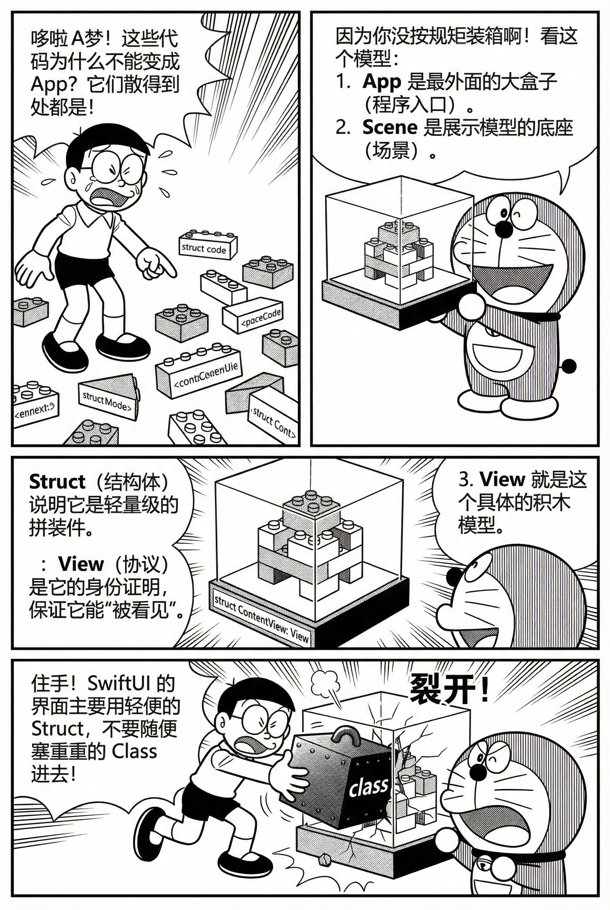
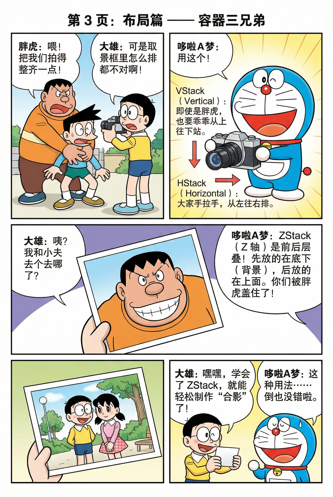
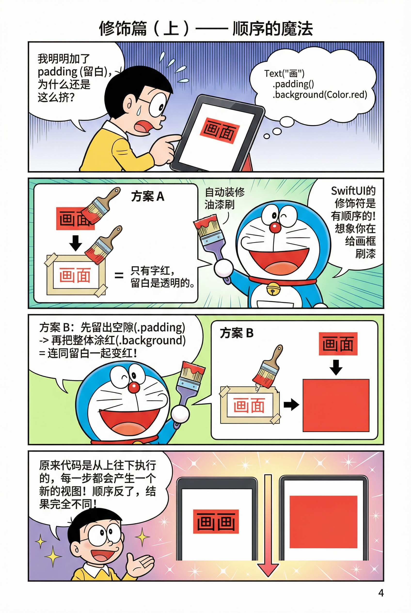
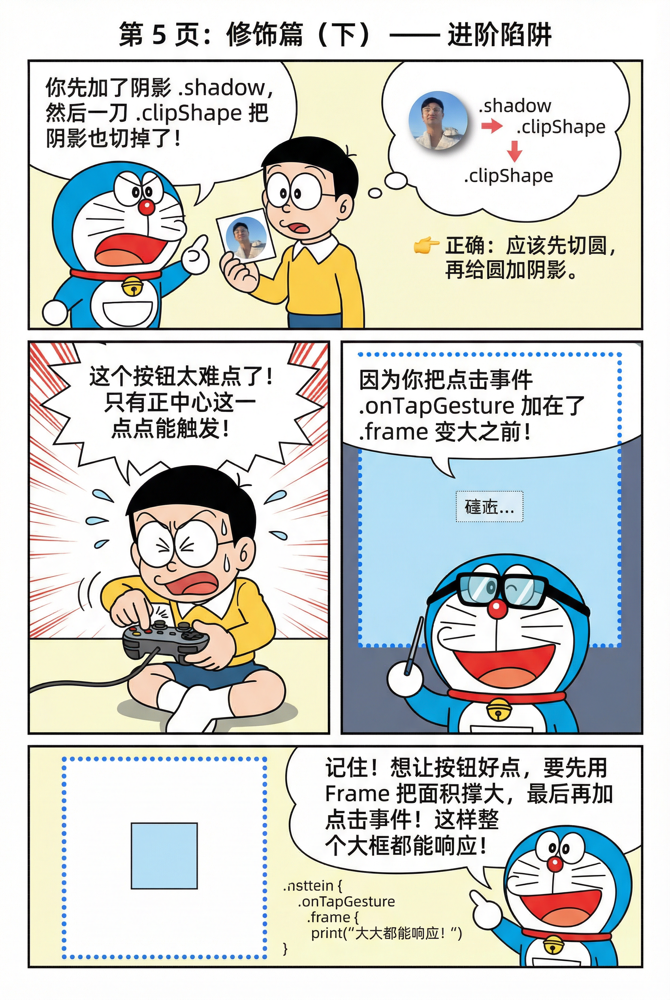
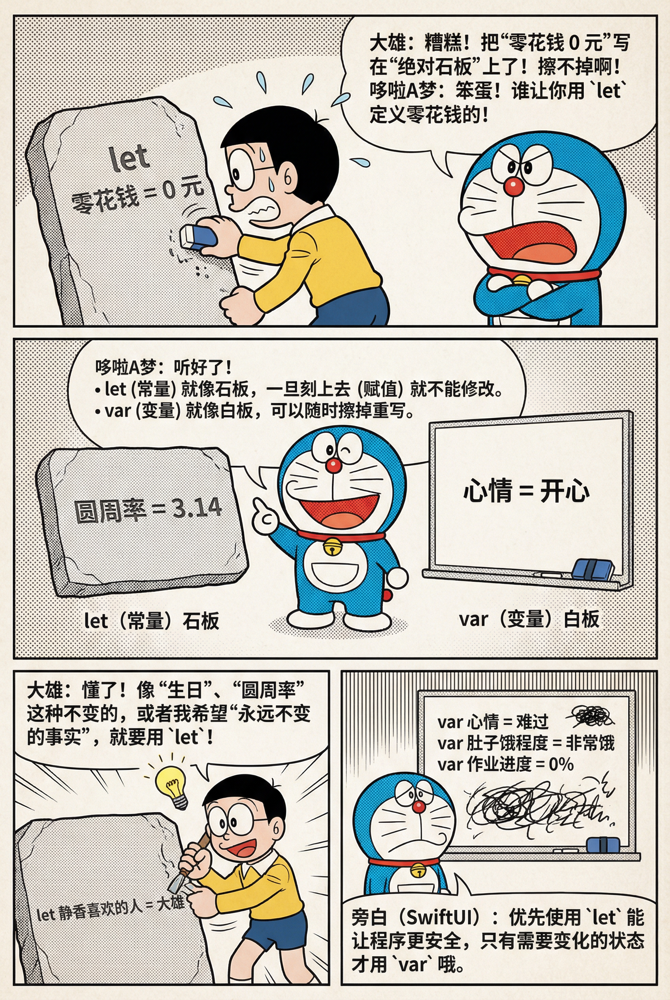
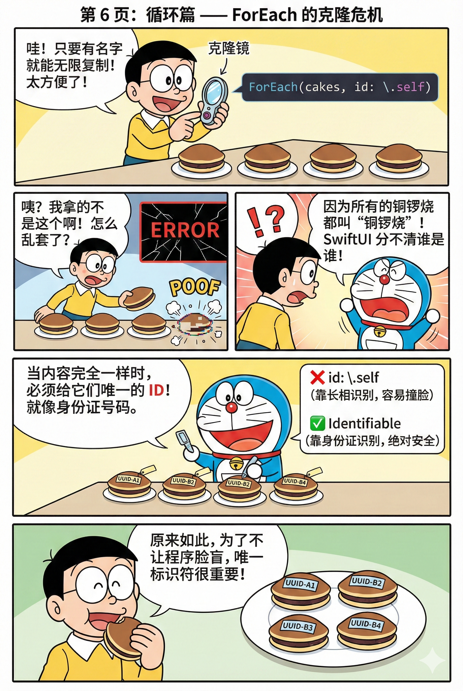
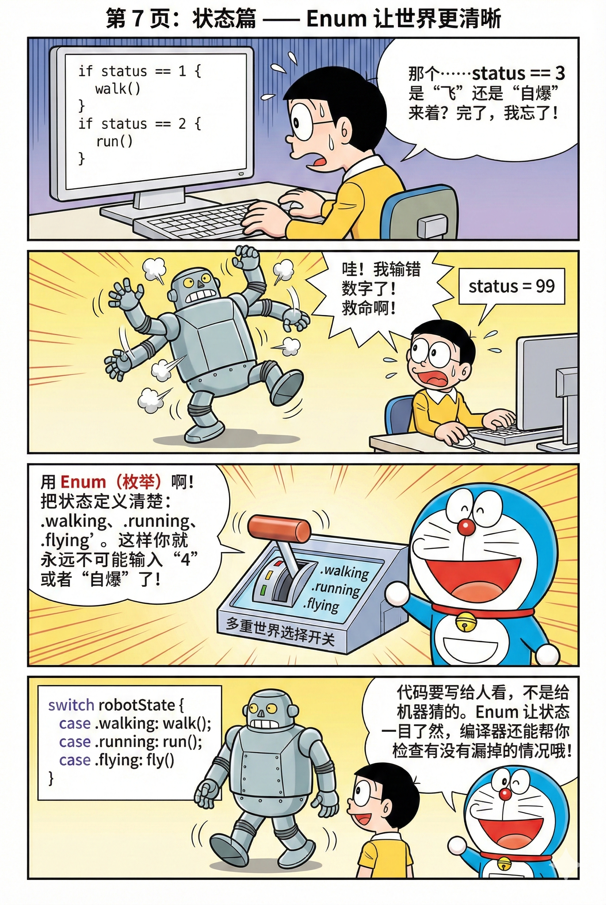

<style scoped>
:root {
  --mag-bg: #f6f7f9;
  --mag-card: #ffffff;
  --mag-text: #1f2a37;
  --mag-subtext: #5b6676;
  --mag-border: #d8dde6;
  --mag-accent: #2f5d8a;
  --mag-accent-soft: #e8eff7;
  --mag-shadow: 0 10px 30px rgba(20, 32, 53, 0.08);
}

.dark {
  --mag-bg: #11161d;
  --mag-card: #1a212b;
  --mag-text: #e5eaf2;
  --mag-subtext: #aeb8c6;
  --mag-border: #2d3948;
  --mag-accent: #8ab4e1;
  --mag-accent-soft: #223246;
  --mag-shadow: 0 14px 36px rgba(0, 0, 0, 0.32);
}

.vibe-banner {
  margin: 2rem 0;
  padding: 2.6rem 2rem;
  border-radius: 20px;
  border: 1px solid var(--mag-border);
  background: linear-gradient(145deg, var(--mag-card) 0%, var(--mag-accent-soft) 100%);
  box-shadow: var(--mag-shadow);
  position: relative;
  overflow: hidden;
}

.vibe-banner::after {
  content: "";
  position: absolute;
  inset: 0;
  background: linear-gradient(120deg, transparent 0 70%, rgba(47, 93, 138, 0.08) 100%);
  pointer-events: none;
}

.vibe-banner h1 {
  margin: 0;
  border: 0;
  color: var(--mag-text);
  font-family: "Noto Serif SC", "Source Han Serif SC", "Songti SC", serif;
  font-weight: 700;
  font-size: clamp(1.8rem, 3.4vw, 2.8rem);
  letter-spacing: 0.02em;
  position: relative;
  z-index: 1;
}

.vibe-banner p {
  margin: 0.9rem 0 0;
  color: var(--mag-subtext);
  font-size: 1.05rem;
  line-height: 1.8;
  position: relative;
  z-index: 1;
}

.info-grid {
  display: grid;
  grid-template-columns: repeat(4, minmax(0, 1fr));
  gap: 1rem;
  margin: 2.2rem 0;
}

.info-card {
  background: var(--mag-card);
  border: 1px solid var(--mag-border);
  border-radius: 14px;
  padding: 1.2rem;
  box-shadow: 0 4px 14px rgba(20, 32, 53, 0.05);
  transition: transform 0.25s ease, border-color 0.25s ease;
}

.info-card:hover {
  transform: translateY(-2px);
  border-color: var(--mag-accent);
}

.info-card-icon {
  font-size: 1.5rem;
  margin-bottom: 0.5rem;
}

.info-card h3 {
  margin: 0;
  border: 0;
  color: var(--mag-text);
  font-size: 1.02rem;
  font-family: "Noto Serif SC", "Source Han Serif SC", "Songti SC", serif;
}

.info-card p {
  margin: 0.45rem 0 0;
  color: var(--mag-subtext);
  line-height: 1.7;
}

.section-header {
  margin: 3rem 0 1.2rem;
  padding-top: 0.2rem;
  border-top: 1px solid var(--mag-border);
}

.section-header h2 {
  margin: 1rem 0 0;
  border: 0;
  color: var(--mag-text);
  font-family: "Noto Serif SC", "Source Han Serif SC", "Songti SC", serif;
  font-size: clamp(1.45rem, 2.6vw, 2rem);
  letter-spacing: 0.01em;
}

.step-container {
  margin: 1rem 0 1.6rem;
  padding: 1.3rem 1.1rem;
  border-left: 3px solid var(--mag-accent);
  background: var(--mag-card);
  border-radius: 10px;
  box-shadow: 0 4px 14px rgba(20, 32, 53, 0.05);
}

.step-header {
  display: flex;
  align-items: flex-start;
  gap: 0.7rem;
  margin-bottom: 0.55rem;
}

.step-container h4 {
  margin: 0;
  border: 0;
  color: var(--mag-text);
  font-size: 1.1rem;
  line-height: 1.5;
  font-family: "Noto Serif SC", "Source Han Serif SC", "Songti SC", serif;
  display: flex;
  align-items: center;
  gap: 0.6rem;
}

.step-number {
  width: 1.8rem;
  height: 1.8rem;
  border-radius: 999px;
  display: inline-flex;
  align-items: center;
  justify-content: center;
  color: #fff;
  background: var(--mag-accent);
  font-size: 0.95rem;
  flex-shrink: 0;
}

.step-container p,
.step-container li,
.tip-box,
.highlight-box {
  color: var(--mag-subtext);
  line-height: 1.8;
}

.step-container ul,
.tip-box ul,
.highlight-box ul {
  margin: 0.55rem 0 0;
  padding-left: 1.2rem;
}

.tip-box,
.highlight-box {
  margin: 1.4rem 0;
  padding: 1rem 1.05rem;
  border-radius: 10px;
  border: 1px solid var(--mag-border);
  background: var(--mag-card);
}

.tip-box {
  border-left: 3px solid var(--mag-accent);
}

.highlight-box {
  background: linear-gradient(145deg, var(--mag-card), var(--mag-accent-soft));
}

.project-grid {
  display: grid;
  grid-template-columns: repeat(2, minmax(0, 1fr));
  gap: 1rem;
  margin: 1.2rem 0;
}

.project-card {
  padding: 1rem;
  border-radius: 12px;
  border: 1px solid var(--mag-border);
  background: var(--mag-card);
}

.project-card h3,
.project-card h4 {
  margin-top: 0;
  border: 0;
  color: var(--mag-text);
  font-family: "Noto Serif SC", "Source Han Serif SC", "Songti SC", serif;
}

.image-container {
  margin: 1rem 0;
  background: var(--mag-card);
  border: 1px solid var(--mag-border);
  border-radius: 12px;
  overflow: hidden;
}

.image-container img {
  display: block;
  width: 100%;
  height: auto;
}

.image-container em {
  display: block;
  padding: 0.65rem 0.85rem;
  color: var(--mag-subtext);
  font-size: 0.95rem;
  font-style: normal;
  border-top: 1px solid var(--mag-border);
}

@media (max-width: 1100px) {
  .info-grid {
    grid-template-columns: repeat(2, minmax(0, 1fr));
  }
}

@media (max-width: 780px) {
  .vibe-banner {
    padding: 1.8rem 1.2rem;
    border-radius: 14px;
  }

  .info-grid,
  .project-grid {
    grid-template-columns: 1fr;
  }

  .step-container {
    padding: 1rem 0.9rem;
  }

  .section-header {
    margin-top: 2.3rem;
  }
}
</style>

<div class="vibe-banner">
  <h1>SwiftUI 入门讲义 · CodeBreaker UI 从 0 到 1</h1>
  <p>这份讲义对应本次冬季 SwiftUI 课程，重点建立「结构化思维 + 可扩展实现」：先搭框架，再写细节。</p>
</div>

<div class="info-grid">
  <div class="info-card">
    <div class="info-card-icon">🧭</div>
    <h3>学习目标</h3>
    <p>理解 SwiftUI 的声明式与状态驱动模型</p>
  </div>
  <div class="info-card">
    <div class="info-card-icon">🧱</div>
    <h3>核心能力</h3>
    <p>布局容器、修饰符顺序、组件封装、枚举建模</p>
  </div>
  <div class="info-card">
    <div class="info-card-icon">🧪</div>
    <h3>实践方式</h3>
    <p>以 CodeBreaker UI 为主线，边讲边改边预览</p>
  </div>
  <div class="info-card">
    <div class="info-card-icon">📱</div>
    <h3>适配要求</h3>
    <p>iPhone 运行正常，Light / Dark Mode 都可读</p>
  </div>
</div>

<div class="tip-box">
  <strong>阅读建议：</strong> 按章节顺序走一遍，并在 Xcode 同步跟敲。每一节里都给了最小可运行写法。
  <br />
  <strong>项目 GitHub：</strong>
  <a href="https://github.com/Hean-Yi/CodeBreaker.git" target="_blank" rel="noreferrer">https://github.com/Hean-Yi/CodeBreaker.git</a>
</div>

## 目录

1. Swift 与 SwiftUI 的一句话理解  
2. Xcode 三大区域：左中右怎么用  
3. SwiftUI 核心结构：App / Scene / View / struct / protocol  
4. 布局容器：VStack / HStack / ZStack  
5. modifier 修饰符：顺序为何会改变结果  
6. CodeBreaker 页面拆解  
7. 数据与珠子视图：let/var 与可扩展 Pegs  
8. ForEach：循环与 id 的坑  
9. MatchPegs：黑钉/白钉/空 + 深色模式  
10. enum：让状态表达更清楚  
11. 常见错误清单  
12. 任务与挑战  
13. 实现约束

<div class="section-header">
  <h2>1) Swift 与 SwiftUI 的一句话理解</h2>
</div>

<div class="step-container">
  <p><strong>Swift</strong> 是现代多范式语言，支持面向对象、面向协议和函数式特性。</p>
  <p><strong>SwiftUI</strong> 是声明式、状态驱动的 UI 框架。你描述“当前状态下界面应该是什么样”，状态变了，界面自动同步刷新。</p>
  <p>直观对比：UIKit 更像手工搬砖，SwiftUI 更像配置目标效果。</p>
</div>

<div class="section-header">
  <h2>2) Xcode 三大区域：左中右怎么用</h2>
</div>

<div class="step-container">
  <ul>
    <li><strong>左侧 Project Navigator：</strong> 文件与资源管理，如 `Assets.xcassets` 与 Swift 文件。</li>
    <li><strong>中间 Editor：</strong> 代码编辑与报错定位。</li>
    <li><strong>右侧 Canvas Preview：</strong> 实时预览 UI，学习阶段建议常开。</li>
  </ul>
</div>

<div class="section-header">
  <h2>3) SwiftUI 核心结构：App / Scene / View / struct / protocol</h2>
</div>

<div class="step-container">
  <div class="step-header">
    <span class="step-number">1</span>
    <h4>从入口到视图：先理解“层级关系”</h4>
  </div>
  <p>`@main` 声明应用入口，`App` 提供 `Scene`，`Scene` 承载页面，页面由 `View` 组成，通常以 `struct` 实现。</p>
  <div class="image-container">
    
    <em>图 1：App / Scene / View / Struct 的层级和职责。</em>
  </div>
  <p>关键理解：`some View` / `some Scene` 是不透明返回类型。你返回的是具体类型，但对外隐藏类型细节。</p>
</div>

<div class="section-header">
  <h2>4) 布局容器：VStack / HStack / ZStack</h2>
</div>

<div class="step-container">
  <div class="step-header">
    <span class="step-number">2</span>
    <h4>容器决定方向，修饰符决定观感</h4>
  </div>
  <ul>
    <li>`VStack`：从上到下排。</li>
    <li>`HStack`：从左到右排。</li>
    <li>`ZStack`：前后叠放，后写的盖在前面。</li>
  </ul>
  <div class="image-container">
    
    <em>图 2：容器三兄弟对应三种排布模型。</em>
  </div>
</div>

<div class="section-header">
  <h2>5) modifier 修饰符：顺序为何会改变结果</h2>
</div>

<div class="step-container">
  <div class="step-header">
    <span class="step-number">3</span>
    <h4>修饰符是“逐层包裹”，不是独立开关</h4>
  </div>
  <p>同一组修饰符，顺序不同，最终渲染不同。最常见是 `padding` 与 `background`。</p>
  <div class="image-container">
    
    <em>图 3：`padding` 与 `background` 顺序变化会改变背景覆盖范围。</em>
  </div>
  <p>进阶组合也一样：`clipShape`、`shadow`、`frame`、`onTapGesture` 的先后会影响视觉与交互命中范围。</p>
  <div class="image-container">
    
    <em>图 4：修饰器链路会影响阴影是否可见、点击区域是否正确。</em>
  </div>
</div>

<div class="section-header">
  <h2>6) CodeBreaker 页面拆解</h2>
</div>

<div class="step-container">
  <p>本次课堂先实现基础版 UI，可拆成两块：</p>
  <ul>
    <li>一排猜测珠子（Pegs Row）。</li>
    <li>一组反馈钉子（MatchPegs，2x2 布局）。</li>
  </ul>
</div>

<div class="section-header">
  <h2>7) 数据与珠子视图：let/var 与可扩展 Pegs</h2>
</div>

<div class="step-container">
  <div class="step-header">
    <span class="step-number">4</span>
    <h4>变量语义：优先 let，必要时再 var</h4>
  </div>
  <p>不变数据优先 `let`，变化数据再用 `var`。这会直接减少状态错误和误改。</p>
  <div class="image-container">
    
    <em>图 5：常量与变量职责分离，有助于代码稳定性。</em>
  </div>
  <p>珠子行建议写成可扩展函数或组件，支持 3~6 个甚至更多：</p>

```swift
func pegsView(colors: [Color]) -> some View {
    HStack {
        ForEach(colors.indices, id: \.self) { index in
            RoundedRectangle(cornerRadius: 10)
                .foregroundStyle(colors[index])
                .aspectRatio(1, contentMode: .fit)
        }
    }
}
```
</div>

<div class="section-header">
  <h2>8) ForEach：循环与 id 的坑</h2>
</div>

<div class="step-container">
  <div class="step-header">
    <span class="step-number">5</span>
    <h4>重复元素不要直接用 `id: \.self`</h4>
  </div>
  <p>当数组内元素可能重复（例如两个相同颜色），`id: \.self` 可能导致身份冲突。更稳妥的是用下标或 `Identifiable`。</p>
  <div class="image-container">
    
    <em>图 6：ForEach 的核心不是“循环”，而是“稳定身份识别”。</em>
  </div>
</div>

<div class="section-header">
  <h2>9) MatchPegs：黑钉/白钉/空 + 深色模式</h2>
</div>

<div class="step-container">
  <ul>
    <li>`exact`：黑钉（颜色对、位置对）。</li>
    <li>`inexact`：白钉（颜色对、位置错）。</li>
    <li>`noMatch`：空钉（透明占位，保留布局）。</li>
  </ul>
  <p>配色建议使用语义色（如 `.primary`），让 Light / Dark 自动适配，避免手写颜色在深色模式失真。</p>
</div>

<div class="section-header">
  <h2>10) enum：让状态表达更清楚</h2>
</div>

<div class="step-container">
  <div class="step-header">
    <span class="step-number">6</span>
    <h4>不要用魔法数字表达状态</h4>
  </div>
  <p>用 `enum` 明确状态语义，`switch` 分发行为，可读性和可维护性都更高。</p>
  <div class="image-container">
    
    <em>图 7：枚举能把“看不懂的数字状态”升级为“可读的业务状态”。</em>
  </div>

```swift
enum Match {
    case exact
    case inexact
    case noMatch
}
```
</div>

<div class="section-header">
  <h2>11) 常见错误清单</h2>
</div>

<div class="step-container">
  <ol>
    <li>返回视图的函数请写 `-> some View`，不要写 `-> View`。</li>
    <li>统计计数通常用 `filter { ... }.count`。</li>
    <li>ForEach 的 `id` 要稳定，不要盲目 `\.self`。</li>
    <li>深色模式尽量使用语义色（`.primary`、`.secondary`）。</li>
  </ol>
</div>

<div class="section-header">
  <h2>12) 任务与挑战</h2>
</div>

<div class="project-grid">
  <div class="project-card">
    <h3>任务 1-3（基础必做）</h3>
    <ul>
      <li>完成 CodeBreaker UI 原型：Pegs + MatchMarkers。</li>
      <li>做原生场景 Preview：dummy pegs + MatchMarkers 组合预览。</li>
      <li>让 MatchMarkers 支持 3~6 个结果，不写死 4 个。</li>
    </ul>
  </div>
  <div class="project-card">
    <h3>任务 4-6（验证完整性）</h3>
    <ul>
      <li>Preview 覆盖 3/4/5/6 以及混合状态组合。</li>
      <li>dummy pegs 数量需与 matches 数量一致。</li>
      <li>Light / Dark 都要验证可读性与边界表现。</li>
    </ul>
  </div>
  <div class="project-card">
    <h3>挑战 1-2（组件化）</h3>
    <ul>
      <li>`PegsRow` 与 `MatchMarkers` 组件化，外部只传数据。</li>
      <li>peg 数量参数化（3~6），Preview 里做参数扫描。</li>
    </ul>
  </div>
  <div class="project-card">
    <h3>挑战 3-4（工程化 + 视觉）</h3>
    <ul>
      <li>做异常输入保护（截断/断言/可读 debug 信息）。</li>
      <li>尝试 Material 拟态玻璃效果并保持深浅色可读。</li>
    </ul>
  </div>
</div>

<div class="section-header">
  <h2>13) 实现约束</h2>
</div>

<div class="highlight-box">
  <ul>
    <li>状态表达：`enum Match { case exact, inexact, noMatch }`。</li>
    <li>ForEach：提供稳定 id（下标或 `Identifiable`）。</li>
    <li>允许在 View 里用 `if` 分支处理显示逻辑（`@ViewBuilder` 语义下）。</li>
    <li>项目里至少体现一次“修饰符顺序影响结果”的正确实践。</li>
  </ul>
</div>

<div class="vibe-banner">
  <h1>这节课真正要带走的能力</h1>
  <p>把界面拆成可复用小组件，用数据驱动状态，再用稳定 id 和清晰枚举保证可扩展。学会这套方法，后续任何 SwiftUI 页面都能独立搭起来。</p>
</div>
