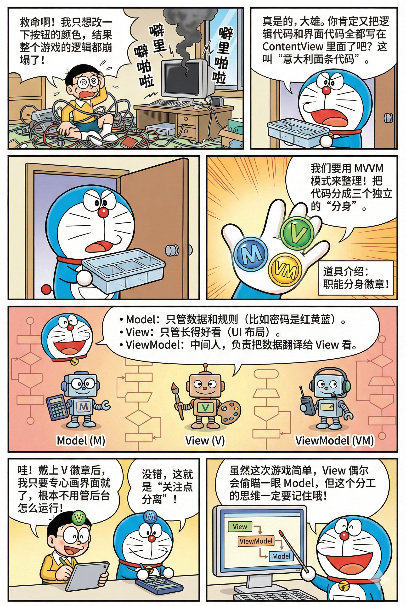
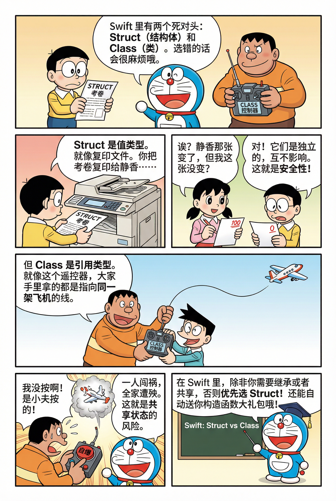
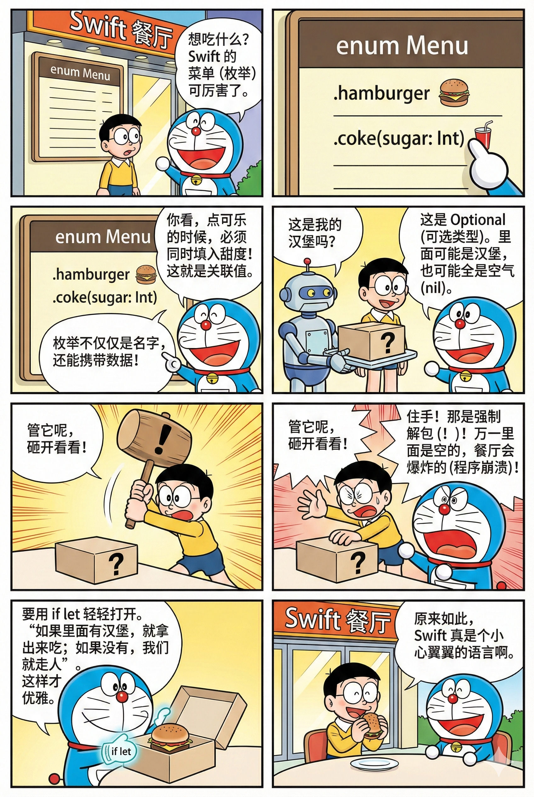
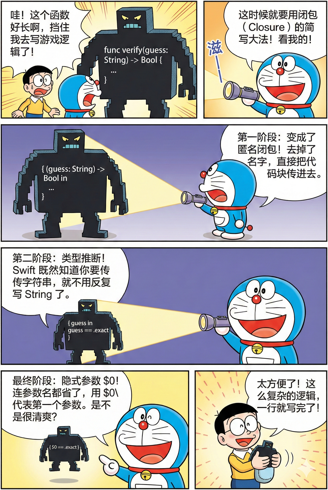
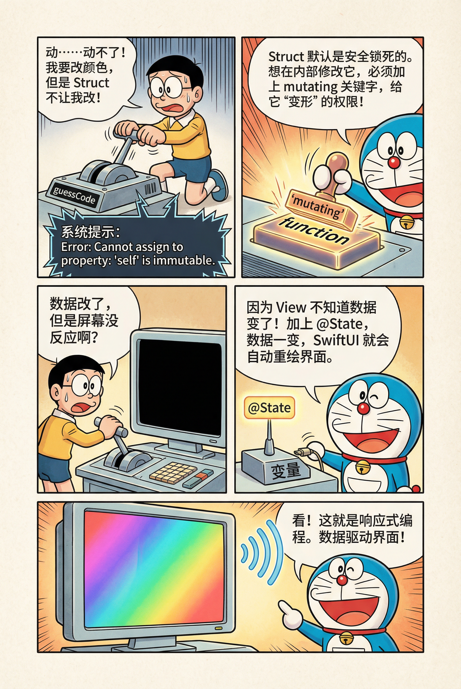
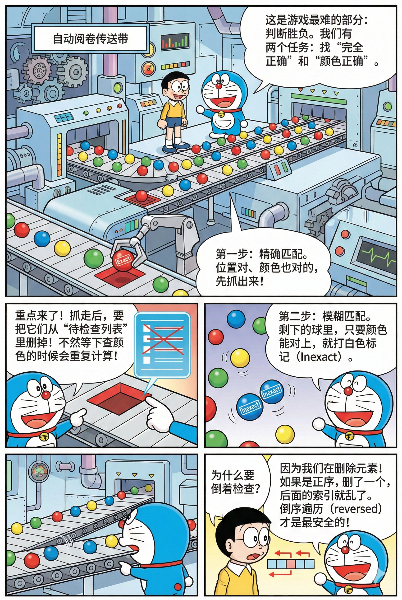

<style scoped>
:root {
  --mag-bg: #f6f7f9;
  --mag-card: #ffffff;
  --mag-text: #1f2a37;
  --mag-subtext: #5b6676;
  --mag-border: #d8dde6;
  --mag-accent: #2f5d8a;
  --mag-accent-soft: #e8eff7;
  --mag-shadow: 0 10px 30px rgba(20, 32, 53, 0.08);
}

.dark {
  --mag-bg: #11161d;
  --mag-card: #1a212b;
  --mag-text: #e5eaf2;
  --mag-subtext: #aeb8c6;
  --mag-border: #2d3948;
  --mag-accent: #8ab4e1;
  --mag-accent-soft: #223246;
  --mag-shadow: 0 14px 36px rgba(0, 0, 0, 0.32);
}

.vibe-banner {
  margin: 2rem 0;
  padding: 2.6rem 2rem;
  border-radius: 20px;
  border: 1px solid var(--mag-border);
  background: linear-gradient(145deg, var(--mag-card) 0%, var(--mag-accent-soft) 100%);
  box-shadow: var(--mag-shadow);
  position: relative;
  overflow: hidden;
}

.vibe-banner::after {
  content: "";
  position: absolute;
  inset: 0;
  background: linear-gradient(120deg, transparent 0 70%, rgba(47, 93, 138, 0.08) 100%);
  pointer-events: none;
}

.vibe-banner h1 {
  margin: 0;
  border: 0;
  color: var(--mag-text);
  font-family: "Noto Serif SC", "Source Han Serif SC", "Songti SC", serif;
  font-weight: 700;
  font-size: clamp(1.8rem, 3.4vw, 2.8rem);
  letter-spacing: 0.02em;
  position: relative;
  z-index: 1;
}

.vibe-banner p {
  margin: 0.9rem 0 0;
  color: var(--mag-subtext);
  font-size: 1.05rem;
  line-height: 1.8;
  position: relative;
  z-index: 1;
}

.info-grid {
  display: grid;
  grid-template-columns: repeat(4, minmax(0, 1fr));
  gap: 1rem;
  margin: 2.2rem 0;
}

.info-card {
  background: var(--mag-card);
  border: 1px solid var(--mag-border);
  border-radius: 14px;
  padding: 1.2rem;
  box-shadow: 0 4px 14px rgba(20, 32, 53, 0.05);
}

.info-card h3 {
  margin: 0;
  border: 0;
  color: var(--mag-text);
  font-size: 1.02rem;
  font-family: "Noto Serif SC", "Source Han Serif SC", "Songti SC", serif;
}

.info-card p {
  margin: 0.45rem 0 0;
  color: var(--mag-subtext);
  line-height: 1.7;
}

.vp-doc h2 {
  margin: 3rem 0 1.2rem;
  padding-top: 0.2rem;
  border-top: 1px solid var(--mag-border);
  color: var(--mag-text);
  font-family: "Noto Serif SC", "Source Han Serif SC", "Songti SC", serif;
  font-size: clamp(1.45rem, 2.6vw, 2rem);
  letter-spacing: 0.01em;
}

.step-container {
  margin: 1rem 0 1.6rem;
  padding: 1.3rem 1.1rem;
  border-left: 3px solid var(--mag-accent);
  background: var(--mag-card);
  border-radius: 10px;
  box-shadow: 0 4px 14px rgba(20, 32, 53, 0.05);
}

.step-header {
  display: flex;
  align-items: flex-start;
  gap: 0.7rem;
  margin-bottom: 0.55rem;
}

.step-container h4 {
  margin: 0;
  border: 0;
  color: var(--mag-text);
  font-size: 1.1rem;
  line-height: 1.5;
  font-family: "Noto Serif SC", "Source Han Serif SC", "Songti SC", serif;
  display: flex;
  align-items: center;
  gap: 0.6rem;
}

.step-number {
  width: 1.8rem;
  height: 1.8rem;
  border-radius: 999px;
  display: inline-flex;
  align-items: center;
  justify-content: center;
  color: #fff;
  background: var(--mag-accent);
  font-size: 0.95rem;
  flex-shrink: 0;
}

.step-container p,
.step-container li,
.tip-box,
.highlight-box {
  color: var(--mag-subtext);
  line-height: 1.8;
}

.step-container ul,
.tip-box ul,
.highlight-box ul {
  margin: 0.55rem 0 0;
  padding-left: 1.2rem;
}

.tip-box,
.highlight-box {
  margin: 1.4rem 0;
  padding: 1rem 1.05rem;
  border-radius: 10px;
  border: 1px solid var(--mag-border);
  background: var(--mag-card);
}

.tip-box {
  border-left: 3px solid var(--mag-accent);
}

.highlight-box {
  background: linear-gradient(145deg, var(--mag-card), var(--mag-accent-soft));
}

.image-container {
  margin: 1rem 0;
  background: var(--mag-card);
  border: 1px solid var(--mag-border);
  border-radius: 12px;
  overflow: hidden;
}

.image-container img {
  display: block;
  width: 100%;
  height: auto;
}

.image-container em {
  display: block;
  padding: 0.65rem 0.85rem;
  color: var(--mag-subtext);
  font-size: 0.95rem;
  font-style: normal;
  border-top: 1px solid var(--mag-border);
}

.project-grid {
  display: grid;
  grid-template-columns: repeat(2, minmax(0, 1fr));
  gap: 1rem;
  margin: 1.2rem 0;
}

.project-card {
  padding: 1rem;
  border-radius: 12px;
  border: 1px solid var(--mag-border);
  background: var(--mag-card);
}

.project-card h3 {
  margin: 0;
  border: 0;
  color: var(--mag-text);
  font-family: "Noto Serif SC", "Source Han Serif SC", "Songti SC", serif;
}

.project-card ul {
  margin: 0.6rem 0 0;
  padding-left: 1.2rem;
}

@media (max-width: 1100px) {
  .info-grid,
  .project-grid {
    grid-template-columns: repeat(2, minmax(0, 1fr));
  }
}

@media (max-width: 780px) {
  .vibe-banner {
    padding: 1.8rem 1.2rem;
    border-radius: 14px;
  }

  .info-grid,
  .project-grid {
    grid-template-columns: 1fr;
  }

  .step-container {
    padding: 1rem 0.9rem;
  }

  .vp-doc h2 {
    margin-top: 2.3rem;
  }
}
</style>

<div class="vibe-banner">
  <h1>第二讲 · Swift 进阶与 CodeBreaker 实战</h1>
  <p>本讲从语言进阶概念出发，串到真实项目代码：MVVM、类型系统、闭包、状态更新与匹配算法。</p>
</div>

<div class="info-grid">
  <div class="info-card">
    <h3>学习重心</h3>
    <p>把“会写代码”升级为“能组织结构并解释设计”。</p>
  </div>
  <div class="info-card">
    <h3>核心能力</h3>
    <p>值类型思维、状态驱动 UI、可维护算法实现。</p>
  </div>
  <div class="info-card">
    <h3>项目主线</h3>
    <p>围绕 CodeBreaker：从 Model 到交互再到反馈计算。</p>
  </div>
  <div class="info-card">
    <h3>课后方向</h3>
    <p>模式扩展、参数化重构、视觉风格升级。</p>
  </div>
</div>

<div class="tip-box">
  <strong>建议阅读方式：</strong> 先看每节“结论”，再看代码与图片。遇到疑问时回到第一讲对照基础概念。
</div>

## 目录

1. 架构设计回顾：MVVM 模式
2. Swift 类型系统复习：Struct / Class、Enum / Optional
3. 从函数到闭包（Closure）
4. CodeBreaker Model 设计
5. 交互逻辑：`mutating` 与 `@State`
6. 核心算法：匹配逻辑（Exact / Inexact）
7. UI 完善与工程化细节
8. 课后任务（必做 + 挑战）
9. 实现约束与检查清单

## 1) 架构设计回顾：MVVM 模式

<div class="step-container">
  <div class="step-header">
    <span class="step-number">1</span>
    <h4>把界面和规则拆开，是可维护性的起点</h4>
  </div>
  <ul>
    <li><strong>Model：</strong> 数据与规则（例如密码、判定逻辑、历史记录）。</li>
    <li><strong>View：</strong> 界面展示（颜色块、按钮、布局）。</li>
    <li><strong>ViewModel：</strong> 连接 View 与 Model，处理“用户操作 -> 状态更新”。</li>
  </ul>
  <p>本项目规模不大，可以简化实现，但思维上仍要坚持关注点分离。</p>
  <div class="image-container">
    
    <em>图 1：MVVM 的关键是职责拆分，不是为了“套模式”而套模式。</em>
  </div>
</div>

## 2) Swift 类型系统复习：Struct / Class、Enum / Optional

<div class="step-container">
  <div class="step-header">
    <span class="step-number">2</span>
    <h4>Struct vs Class：值语义与引用语义</h4>
  </div>
  <p>`struct` 是值类型，赋值时拷贝；`class` 是引用类型，多个变量可指向同一对象。能用 Struct 时优先 Struct，尤其适合状态与数据模型。</p>
  <div class="image-container">
    
    <em>图 2：值类型更安全，引用类型更灵活，关键看是否需要共享可变状态。</em>
  </div>

```swift
struct Resolution {
    var width = 0
    var height = 0
}

class VideoMode {
    var resolution: Resolution
    var interlaced: Bool

    init(resolution: Resolution, interlaced: Bool) {
        self.resolution = resolution
        self.interlaced = interlaced
    }
}
```
</div>

<div class="step-container">
  <div class="step-header">
    <span class="step-number">3</span>
    <h4>Enum 与 Optional：表达状态，不赌运气</h4>
  </div>
  <p>枚举不仅能列选项，还能携带关联值。Optional 代表“可能为空”，请优先 `if let` 安全解包，避免强制解包崩溃。</p>
  <div class="image-container">
    
    <em>图 3：枚举让状态语义化，Optional 让空值处理显式化。</em>
  </div>

```swift
enum Menu {
    case hamburger
    case coke(sugar: Int)
}

if let safeValue = maybeValue {
    print(safeValue)
}
```
</div>

## 3) 从函数到闭包（Closure）

<div class="step-container">
  <div class="step-header">
    <span class="step-number">4</span>
    <h4>闭包简写不是炫技，是降低噪音</h4>
  </div>
  <p>在不损失可读性的前提下，闭包可逐步简化：完整参数写法 -> 类型推断 -> `$0` 隐式参数。</p>
  <div class="image-container">
    
    <em>图 4：闭包演进重点是“保留语义，减少样板代码”。</em>
  </div>

```swift
// 完整写法
let exactCount1 = matches.filter { match in
    match == .exact
}.count

// 简写
let exactCount2 = matches.filter { $0 == .exact }.count
```
</div>

## 4) CodeBreaker Model 设计

<div class="step-container">
  <p>本讲把游戏逻辑收敛到 Model，View 负责展示，避免把业务细节堆到界面层。</p>

```swift
typealias Peg = Color

struct CodeBreaker {
    var masterCode = Code(kind: .master)
    var guessCode = Code(kind: .guess)
    var attempts: [Code] = []
    let pegChoices: [Peg] = [.blue, .red, .green, .yellow]
}

struct Code {
    var pegs: [Peg] = Array(repeating: .clear, count: 4)
    var kind: Kind

    enum Kind: Equatable {
        case master
        case guess
        case attempt(matches: [Match])
    }
}
```
</div>

## 5) 交互逻辑：`mutating` 与 `@State`

<div class="step-container">
  <div class="step-header">
    <span class="step-number">5</span>
    <h4>数据要改得动，界面要跟得上</h4>
  </div>
  <ul>
    <li><code>mutating</code>：允许值类型方法修改自身属性。</li>
    <li><code>@State</code>：告诉 SwiftUI 这是会驱动界面刷新的状态。</li>
  </ul>
  <div class="image-container">
    
    <em>图 5：值类型修改与界面响应要配套，否则会出现“数据变了但UI不刷新”。</em>
  </div>

```swift
mutating func changeGuessPeg(at index: Int) {
    let existingPeg = guessCode.pegs[index]
    if let currentIndex = pegChoices.firstIndex(of: existingPeg) {
        let nextIndex = (currentIndex + 1) % pegChoices.count
        guessCode.pegs[index] = pegChoices[nextIndex]
    } else {
        guessCode.pegs[index] = pegChoices.first ?? .clear
    }
}
```
</div>

## 6) 核心算法：匹配逻辑（Exact / Inexact）

<div class="step-container">
  <div class="step-header">
    <span class="step-number">6</span>
    <h4>两阶段判定：先精确，再模糊</h4>
  </div>
  <p>先处理位置和颜色都正确（Exact），并从待匹配序列中移除；再处理颜色对但位置错（Inexact）。删除元素时使用倒序遍历，避免索引错乱。</p>
  <div class="image-container">
    
    <em>图 6：匹配算法的关键是“先精确扣除，再模糊匹配”。</em>
  </div>

```swift
func match(against otherCode: Code) -> [Match] {
    var results = Array(repeating: Match.noMatch, count: pegs.count)
    var pegsToMatch = otherCode.pegs

    for index in pegs.indices.reversed() {
        if pegsToMatch[index] == pegs[index] {
            results[index] = .exact
            pegsToMatch.remove(at: index)
        }
    }

    // 第二阶段：在剩余元素中处理 inexact
    return results
}
```
</div>

## 7) UI 完善与工程化细节

<div class="step-container">
  <ul>
    <li>历史记录使用 `ScrollView`，避免内容超出屏幕。</li>
    <li>用 `indices.reversed()` 控制最近一次尝试显示顺序。</li>
    <li>提交动作配合 `withAnimation` 提升反馈感。</li>
    <li>透明区域用 `.contentShape(Rectangle())` 提高可点性。</li>
    <li>随机初始化题目，提升重复游玩体验。</li>
  </ul>
</div>

## 8) 课后任务（必做 + 挑战）

<div class="project-grid">
  <div class="project-card">
    <h3>必做任务</h3>
    <ul>
      <li>复现课堂 Lecture 1-4 功能，确保可运行。</li>
      <li>忽略无效猜测（空输入、重复尝试）。</li>
      <li>新增 Restart 并随机 Peg 数量（3~6）。</li>
      <li>支持颜色模式与 Emoji 模式随机切换。</li>
    </ul>
  </div>
  <div class="project-card">
    <h3>界面任务</h3>
    <ul>
      <li>让 Emoji 在不同 Peg 数量下可读（缩放策略）。</li>
      <li>加入 iOS 风格液态玻璃视觉（Material + 高光）。</li>
      <li>深色模式下保持边界与对比度清晰。</li>
    </ul>
  </div>
  <div class="project-card">
    <h3>挑战任务</h3>
    <ul>
      <li>扩展颜色库并做字符串到颜色映射。</li>
      <li>主题系统（车辆 / 脸部 / 大地色等）。</li>
      <li>界面显示当前主题名称。</li>
    </ul>
  </div>
  <div class="project-card">
    <h3>工程要求</h3>
    <ul>
      <li>代码命名清晰、无警告、可读性优先。</li>
      <li>至少使用一次 `static` 成员。</li>
      <li>Model 层保持 UI 无关，减少 `SwiftUI` 依赖。</li>
    </ul>
  </div>
</div>

## 9) 实现约束与检查清单

<div class="highlight-box">
  <ul>
    <li>状态建模优先 `enum`，不要散落魔法数字。</li>
    <li>ForEach 需稳定 id（`indices` 或 `Identifiable`）。</li>
    <li>涉及可变状态时，明确 `mutating` 与 `@State` 边界。</li>
    <li>算法代码先追求正确性，再谈短写法。</li>
  </ul>
</div>

<div class="vibe-banner">
  <h1>第二讲核心收获</h1>
  <p>你需要形成“结构化开发”的习惯：先定职责，再写状态，再落算法，最后打磨交互与视觉。这样项目才会越做越稳。</p>
</div>

<script setup>
import { useData } from 'vitepress'

const { page } = useData()

page.value.headers = [
  { level: 2, title: '1) 架构设计回顾：MVVM 模式', slug: '_1-架构设计回顾-mvvm-模式', children: [] },
  { level: 2, title: '2) Swift 类型系统复习：Struct / Class、Enum / Optional', slug: '_2-swift-类型系统复习-struct-class、enum-optional', children: [] },
  { level: 2, title: '3) 从函数到闭包（Closure）', slug: '_3-从函数到闭包-closure', children: [] },
  { level: 2, title: '4) CodeBreaker Model 设计', slug: '_4-codebreaker-model-设计', children: [] },
  { level: 2, title: '5) 交互逻辑：`mutating` 与 `@State`', slug: '_5-交互逻辑-mutating-与-state', children: [] },
  { level: 2, title: '6) 核心算法：匹配逻辑（Exact / Inexact）', slug: '_6-核心算法-匹配逻辑-exact-inexact', children: [] },
  { level: 2, title: '7) UI 完善与工程化细节', slug: '_7-ui-完善与工程化细节', children: [] },
  { level: 2, title: '8) 课后任务（必做 + 挑战）', slug: '_8-课后任务-必做-挑战', children: [] },
  { level: 2, title: '9) 实现约束与检查清单', slug: '_9-实现约束与检查清单', children: [] }
]
</script>
