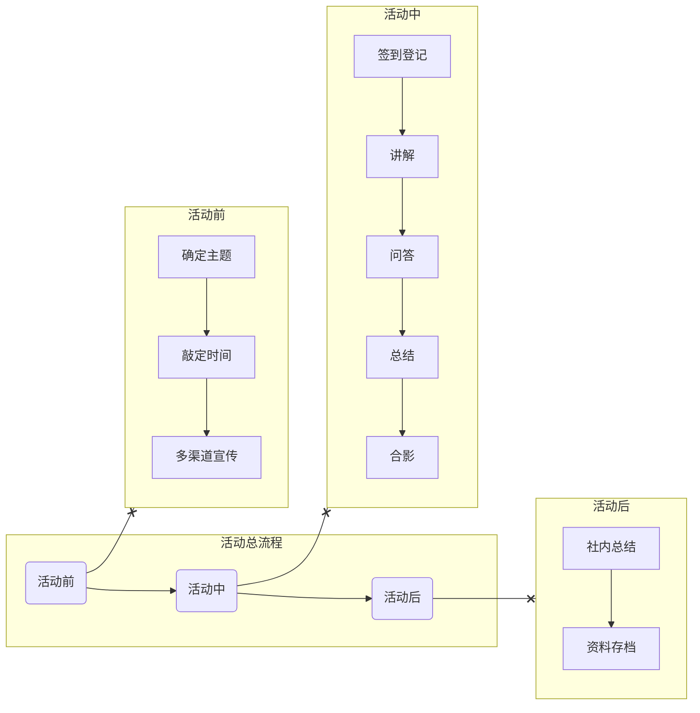

# 一些活动
## 即将推出

- [解锁iPad生产力](/activities/ComingSoon/ExploreiPad)
- [移动应用创新赛宣讲](/activities/ComingSoon/maic_speakers)

## 往期活动

- [百团纳新](/activities/PastEvents/biantuan)
- [macOS初体验](/activities/PastEvents/macos_experience)
- [Apple设备选购建议](/activities/PastEvents/device_suggestion)
- [2023冬季WWDC-Swift特训营](/activities/PastEvents/wwdc_swift2023)

---

