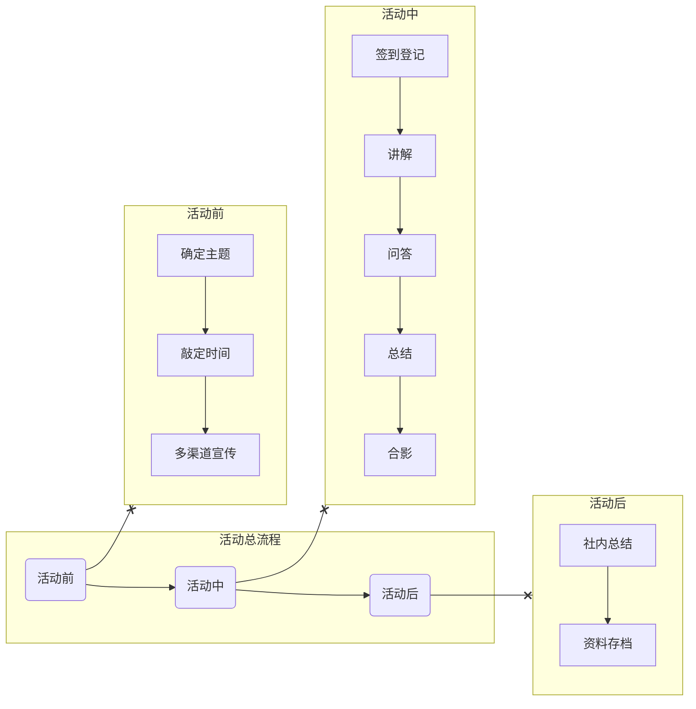

# 一些活动
## 即将推出

[//]: # (- [解锁iPad生产力]&#40;/activities/comingSoon/ExploreiPad&#41;)

[//]: # (- [移动应用创新赛宣讲]&#40;/activities/comingSoon/maic_speakers&#41;)

## 往期活动

[//]: # (- [2023百团纳新]&#40;/activities/pastEvents/biantuan&#41;)

[//]: # (- [macOS初体验]&#40;/activities/pastEvents/macos_experience&#41;)

[//]: # (- [Apple设备选购建议]&#40;/activities/pastEvents/device_suggestion&#41;)

[//]: # (- [2023冬季WWDC-Swift特训营]&#40;/activities/pastEvents/wwdc_swift2023&#41;)

---

