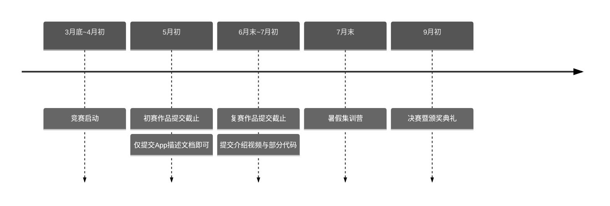

# 中国高校计算机大赛——移动应用创新赛

::: warning 🔥 2024-MAIC 火热招募中！
参与2024移动应用创新赛？快来加入我们的竞赛群：[MAIC招募令](/competitions/maic/recruitment#%F0%9F%94%A5-%E5%8A%A0%E5%85%A52024-maic%E7%AB%9E%E8%B5%9B%E7%BE%A4)
:::
## 竞赛亮点

- 由教育部高等学校计算机类专业教学指导委员会等四大部门联合创办，全国高等学校计算机教育研究会主办；
- **Apple中国官方支持**，与浙江大学联合举办，连续多年入选全国普通高校大学生竞赛排行榜；
- 获奖作品有机会直通“互联网+”、大创等创新创意赛，推荐进入全国总决赛；
- 参赛**完全免费**，国家一等奖可获**Apple全家桶**，更有机会与Apple公司CEO库克面对面交流。
- 自2022年起列入**吉林大学B*类竞赛**，享有加分和推免等政策！

## 参赛须知

这是一场以 iOS/PadOS 系统设计开发应用程序的高端竞赛。学生组成一个两到三人的队伍，在创新创意赛道上提交自己的原创 App 原型，在决赛时最终实现并完善。参赛者可自由命题，鼓励参赛队伍使用Swift语言进行开发。

值得一提的是，Swift 学生挑战赛的获奖选手经推荐可直通移动应用创新赛（创意赛道）复赛，而两个比赛之间的内容也互有重合，很适合一同参赛。不同点在于，移动应用创新赛更注重于应用的创新性与设计，**并不要求选手有很强的编程能力**（甚至可以无需提交一行代码就抵达决赛圈）。

### 创新赛道
创新赛道的参赛作品须为具有一定功能的原创性应用程序（App），**适合具有App开发人员的团队**。每支参赛队最多由**3名队员**组成。全国赛设一等奖6队、二等奖21队，三等奖33队，具体奖项设置可前往[竞赛官网](http://www.appcontest.net/details/entryGuide)查看。奖品丰厚，**最高奖团队每人均可获得价值12万元的奖励。获奖团队有机会直推互联网+全国总决赛。**

::: tip
若您的App可以在App Store顺利**上架**，按照之前的参赛经验，即可至少获得国家二等奖。
::: 

### 创意赛道

创意赛道的作品须提供iOS/iPadOS系统设计开发的应用程序原型，**适合只有设计人员的团队**。每支参赛队最多由**2名队员**组成。复赛获奖团队有机会转至创新赛道参与全国总决赛，组委会将为其在比赛官方平台发布队员招募通知。

## 作品主题要求

主题须紧扣竞赛推荐的应用领域及其他**社会关注的热点难点问题**，包括但不限于能源、健康医疗、环保、养老、智慧交通、智慧城市、智慧物流、与社会创新相关的物联网、食品安全、与社会服务相关的大数据/云服务等。参赛者**可自由命题**，自行搜集、获取相 关数据，提供解决方案并能在移动设备上实际运行。

部分历年获奖作品：[2023年](https://sspai.com/post/82738) [2022年](https://sspai.com/post/75611) [2021年](https://sspai.com/post/70453)

## 赛制

[//]: # (TODO: 之后尝试使用element plus时间线替代)

|   阶段    |   时间    | 要求                                                       |
|:-------:|:-------:|:---------------------------------------------------------|
|   初赛    |   5月初   | 仅提交有关 App 的描述文档即可（一个PPT），无论是哪一赛道均无需提交任何代码                |
| 复赛（赛区奖） | 6月末~7月初 | 在复赛基础上完善作品说明文档，并补充提交简短的介绍视频。创新赛道可以提交部分核心代码。              |
|  全国总决赛  |   9月初   | 组委会提供竞赛训练营，免费提供开发者账号，决赛参赛作品必须能进行现场演示（路演），苹果公司将提供必要的技术支持。 |

### 时间线

