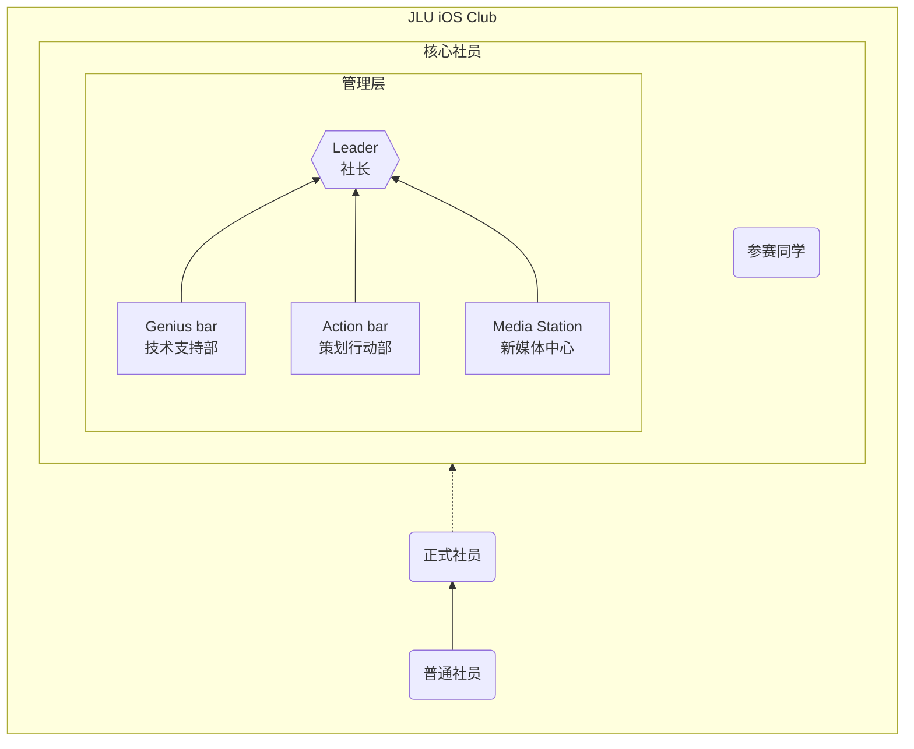

# 加入我们

> 社团纳新即将到来……
> 
> 敬请关注百团纳新～

[//]: # (## 社团福利)

## 组织架构

JLU iOS Club 设有社长1名，副社长2~3名，并可兼任其中一部门的部长。

社团下设3个部门，分别为技术支持部、策划行动部、新媒体中心，与社长共同组成社团管理层。

管理层成员连同参赛同学，均为我社核心成员，享有更多的关注与资源支持。

### 技术支持部 _5~10人_

技术支持部 是 iOS Club 核心中的核心，整个社团的顶梁柱。我们认为，无论你是熟悉编程，还是擅长美工设计，亦或是善于商业策划，都是闪闪发光的技术人才。只要你有一腔热情，都可以为其他社团成员提供技术支持，iOS Club 也会优先为技术支持部的同学提供各种机会与支持，我们一起取得更辉煌的成就！

**只要你有“一技之长”，对 iOS Club 充满热情，我们都欢迎！**

但限于纳新需要，我们仍然列出了一些技术要求，满足要求的同学优先考虑，但仅供参考：

1. 熟悉或正在学习 Swift & SwiftUI 开发，或了解 App 开发流程的同学；
2. 擅长使用 Photoshop/Sketch/Figma 等设计工具，或有美工功底的同学；
3. 来自商管专业，了解并熟悉商业策划、市场调研的同学；
4. 非常了解 Apple 产品，对其软硬件产品具有独到见解的同学。

### 策划行动部 _3~5人_

活动是 iOS Club 的灵魂所在。我们通过定期举办活动，提高社团关注度，维持社团活力。在这里，你可以：

- 提出新的活动主题，成为活动主讲人，切身了解主导策划一场活动的过程；
- 参与组织分工，在小组讨论中分享自己的想法，体会团队合作办项目的经历；
- 协调分配社团内外的各项资源，熟悉社团组织运作的整个流程。

### 新媒体中心 _3~5人_

目前社团内正在运营的宣传平台有：QQ群、微信公众号、社团网站
 正在考虑筹备上线运营：哔哩哔哩、抖音、小红书

其中，社团网站托管在 [Github](https://github.com/AQiu-2003/JLUiOSClub_Web/)，目前还处于项目前期阶段，亟需熟悉前端开发的同学。此外，新媒体的同学还会参与到活动宣传海报、印刷物料的设计当中，制作各种果味文案😉。

因为我社与安诺希校园体验中心有合作，日常也会写一些推广文案，参与的同学也可以得到一定报酬。

## 成为普通社员

关注我们的公众号，并加入QQ群，即可参与到社团活动中来~
 以及… 收藏我们的官网不迷路：[jluios.club](https://www.jluios.club/)

<dualQRCode/>

## 成为正式社员

### 途径1：百团纳新

在每年四月份中旬的**百团纳新**当天，来我们的摊位上参与互动问答，并与我们沟通。经过我们的认证即可正式加入 iOS Club，成为正式社员，享有社员专属福利。

### 途径2：在线答题

您可以在任意时间参与我们的**线上答题**活动（就像b站入站答题那样😉），并留下您的联系方式。经过我们的认证即可正式加入 iOS Club，成为正式社员，享有社员专属福利。

> 入社答题页面仍在建设中……敬请期待~